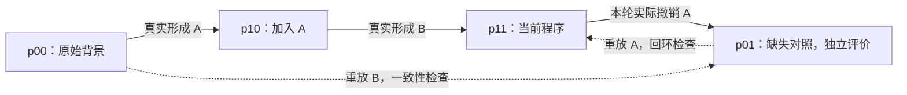

# TraceAAD V10.14：轨迹条件化修订与局部重验

**Trace-Conditioned Revision with Local Revalidation**

设计整理与实现日期：2026-09-27。本文记录 V10.14 的机制选择、推理依据、执行协议和验证计划。状态为**已完成代码实现与机制检查，真实 LLM 搜索效果待验证**。第 1—18 节保留设计推理，第 19 节记录本次实际冻结的实现口径；运行方式见 [V10.14 实现说明](../../experiments/traceaad_v10_14/README.md)。已有正式实验机制仍见 [V10.13 机制设计](TraceAAD-V10.13-机制设计.md)，不能把旧版成绩归给新实现。

> 把真实算法改进脉络转化为有适用边界的决策证据；在关键处补做一个真实局部对照，检验过去的改进经验在当前程序中是否仍然成立；再依据这些证据，继续发展一项连贯的修改。

## 1. 设计来源与阅读口径

本文依据本次提供的两份《TraceAAD：轨迹条件化修订与局部重验》粘贴材料整理。两份文件逐字节相同，按一个来源处理；同时结合仓库内已有的种群、算子、输出协议和初始化设计，说明版本衔接。

记录时区分三个层次：

- **本版设计决定**：材料明确选择的主线、约束和默认参数，作为 V10.14 的设计基线。
- **协议细化或建议**：为消除实现歧义而补充的字段、统计口径和验证步骤；不视为已经实现或实测有效。
- **尚未确定的任务配置**：行为探针、质量门槛、随机重复数等，须在正式实验前填写并冻结，不能把未给出数值的方案称为完整实验预注册。

原材料含不可在本文直接解析的会话引用，以及另一个会话中的 Markdown、ZIP 下载地址。此次附件仅提供粘贴文本，没有提供那些文件的内容。材料称其最小参考程序已通过 12 项合成测试；本文保留这一来源陈述，**不将其写成本仓库已核验的测试结果**。文献对比同样保留来源边界，正式新颖性主张还需要逐篇原文核对。

## 2. 核心问题：历史经验何时仍然适用

### 2.1 从“保存历史”推进到“检查历史判断”

TraceAAD 的原始出发点是：算法搜索不应只保存独立代码与分数，还应利用真实修改及其结果，理解当前程序如何形成、哪些尝试已经失败、下一步值得修改什么。

但是，“把历史放入提示”过于宽泛。派生图、局部与全局记忆、语义增量以及围绕假设连续开发，都已有近邻工作。仅增加历史长度、摘要层或调度模块，无法自然形成独立贡献。

V10.14 将问题收敛为：**一项修改在旧程序中有过支持，当前程序加入其他结构以后，这份支持是否仍然成立？在有限预算下，何时值得补做对照，如何让结果影响下一次修改？**

这一问题的优化对象仍是固定资源下得到的最终算法质量，尤其是独立测试表现。历史利用率、图规模、重验次数、行为覆盖和模型解释，只用于诊断机制，不替代真实目标。

### 2.2 一条路径不能确定缺失对照

设真实形成路径为：

$$
p_{00}\xrightarrow{A}p_{10}\xrightarrow{B}p_{11},
$$

其中 $A$、$B$ 是实际代码修改束；下标分别表示是否包含两项修改。为统一表述，$q$ 约定越大越好。最小化任务须预先确定质量转换及数值尺度。

考虑以下**合成例子，不是实验结果**：

| 程序 | 代码背景 | 质量 |
| --- | --- | ---: |
| $p_{00}$ | 原程序 | 100 |
| $p_{10}$ | 原程序加入 $A$ | 104 |
| $p_{11}$ | 再加入 $B$ | 107 |
| $p_{01}$ | 保留 $B$、不含 $A$，需要补测 | 110 |

原有路径只能说明 $A$ 在旧背景下的观测差分为 $104-100=+4$。补测后，$A$ 在含 $B$ 的背景下的差分却为 $107-110=-3$：早期有益组件可能在后续改变后成为负担。反向情况也可能出现，即原先退步的修改在新组合中变得有用。

只知道 $q_{00},q_{10},q_{11}$，一般不能唯一确定 $q_{01}$。例如，同样三个已知结果，既允许 $q_{01}=103$，也允许 $q_{01}=110$；前者支持当前保留 $A$，后者支持考虑删除 $A$。LLM 可以预测未知结果，但这种预测不能替代执行证据。

因此，历史不能被压缩为“$A$ 曾成功，所以以后应永久保留”。更合适的表达是：“$A$ 在特定源码和评价条件下得到过支持；当前背景已经变化，其现时作用尚待验证。”

### 2.3 程序状态与设计决策状态

同样的代码在相同输入、依赖、执行环境和随机性协议下，不会因形成故事不同而改变执行含义。历史改变的是生成者掌握的信息，以及后续实验选择。

将开发决策状态写为：

$$
s_t=\bigl(p_t,E_t(p_t),\ell_t,B_t\bigr),
$$

其中 $p_t$ 是当前真实程序，$E_t(p_t)$ 是具有来源与适用范围的证据，$\ell_t$ 是正在检验的修改和未解决事项，$B_t$ 是剩余资源。这里的 $B_t$ 是资源状态，与前文代码修改 $B$ 区分。

这是工程和研究上的状态定义，不宣称它是严格充分的 Markov 状态。同一源码可以对应不同 AnchorState，但只有真实证据差异改善后续开发时，保留这些状态才有研究价值；不能仅靠节点数增加证明历史有用。

## 3. 主张、近邻工作与设计收敛

### 3.1 相关工作对主张的约束

下表保留原材料对近邻方法的概括，作为研究定位线索，不表示此次重新完成了论文核验。

| 近邻工作 | 材料指出的已有内容 | 对本版贡献表述的约束 |
| --- | --- | --- |
| PathWise | 派生图记录理由、父代与表现，组织规划、生成与反思 | 形成关系作为状态并非充分的新颖性主张 |
| MEMOIR | 分支内执行记忆与跨分支摘要，用于修复和改进 | 保留成功、失败及局部／全局记忆不足以区分本方法 |
| DeltaEvolve | 多分辨率语义增量参与后续生成 | 用修改增量替代全代码历史本身不够 |
| Arbor | 假设树与固定假设下的实现、评价和修复 | 保持假设、多轮开发也需进一步区分 |
| delta debugging 等 | 通过测试隔离相关变化 | 消融、回滚和局部对照不是本版发明 |

本版的创新候选是：**由真实形成脉络选择影响当前决策的历史修改，在当前代码背景下完成有成本上限的局部对照，并让比较证据进入后续修订。** 这需要与近邻方法和简单基线比较，不能仅凭有限资料宣布“全球首次”。

### 3.2 一个核心闭环与四类承载设施

核心闭环为“历史提供依据 → 历史指出值得补做的实验 → 新证据指导后续改进”。四类设施服务于这一闭环：

| 承载设施 | 作用 | 不能代替的证明 |
| --- | --- | --- |
| 事实图与证据记录 | 保证来源、源码、评价和实际请求可追溯 | 保存历史不等于有效使用历史 |
| 冠军／挑战者前沿 | 限制近重复占位，保留不同开发起点 | 覆盖增加不等于终局质量提高 |
| 预算与连续试用 | 控制利用、探索、信息获取的投入 | 获得更多机会不等于证明轨迹机制 |
| 生成契约与交付协议 | 将决策落实为可评价的修改 | 算子名称、解析成功不等于机制执行成功 |

本版不增加多层 UCB、未经可靠样本支持的长期潜力值、多 agent 全局调度、全部提示的在线共同进化、无限增长的全局经验上下文或不可靠的自动语义移植。事实档案可持续保存，但不因此把全部事实注入提示。

## 4. 核心机制：历史干预闭合 Trace Closure

### 4.1 从三个真实程序补齐局部方格

对已观察路径 $p_{00}\xrightarrow{A}p_{10}\xrightarrow{B}p_{11}$，尝试构造缺失的 $p_{01}$：

$$
p_{01}=B(p_{00}),\qquad A(p_{01})=p_{11}.
$$

同时检查原路径与逆向重建：

$$
A(p_{00})=p_{10},\qquad B(p_{10})=p_{11},\qquad A^{-1}(p_{11})=p_{01}.
$$



图中虚线是重建一致性关系，不代表过去真实发生过的生成。若本轮实际从 $p_{11}$ 撤销 $A$，新状态的主父代就是 $p_{11}$；不得为凑齐方格伪造从 $p_{00}$ 生成它的历史。若实际选择另一条构造路径，则如实记录该路径。

这里的等号指**完整源码或程序快照精确相等**，不能以模型判断“语义差不多”代替。固定文件表示与依赖身份后再比较；不能在检查时随意规范化、删代码或替换依赖。

### 4.2 首版允许什么修改束

首版只处理可精确定位、原子应用并通过回环检查的修改束。$A$ 可以是一次真实修改中的多个相关编辑，但不能事后随意拆成几个“思想贡献”；$B$ 对应之后的实际背景变化。首个实现可先限制到相邻两次修改；扩展为多步 $B$ 的组合属于后续协议配置。

**协议细化建议**：由真实前后快照提取修改束，保存基底哈希、匹配范围、旧文本、新文本、编辑顺序和修改束哈希。每个定位必须满足固定适配器的唯一匹配要求，多处编辑先全部校验，再在临时快照上整体提交；任一失配时拒绝整个束，不保留部分应用结果。

完整代码输出也可以在事后提取修改束，但并非每份 diff 都可重放。大范围重写、重命名、重叠编辑以及强依赖修改会导致闭合失败。此时记录原因并保持未知，继续正常搜索；不能让 LLM 额外重写一个近似程序，再把它当作“只去掉 $A$”的对照。

必须区分三个检查：精确回环保证构造身份；语法和接口检查保证可执行条件；任务评价检查合法性与表现。前者不推出后两者，文本可交换也不表示算法语义独立。

### 4.3 真实执行与交互对比

四个程序须在同一评价版本、实例集合、依赖环境、随机性协议和求解资源约束下比较。已有结果只有在这些身份一致、符合预先规定的缓存规则时才可复用，否则重新评价并计费。

定义：

$$
\Delta_A^{\mathrm{old}}=q_{10}-q_{00},\qquad
\Delta_A^{\mathrm{current}}=q_{11}-q_{01},
$$

$$
I_{A,B}=\Delta_A^{\mathrm{current}}-\Delta_A^{\mathrm{old}}
=q_{11}-q_{01}-q_{10}+q_{00}.
$$

在前述合成例子中，$\Delta_A^{\mathrm{old}}=4$、$\Delta_A^{\mathrm{current}}=-3$、$I_{A,B}=-7$。这个交互对比描述特定代码束、评价条件和质量尺度下的效应变化，不是抽象算法思想的普适因果系数。质量尺度的非线性变换也会改变其数值解释。

对于随机评价，建议保存逐实例、逐种子结果，按冻结的配对协议估计差分及不确定性；同一个种子不保证不同程序消耗完全对应的随机流，随机性控制仍需按任务检查。只有噪声范围外的结果才适合表述为有方向的支持；近零或波动大时保留“不明确”。重复次数、容差和统计判定在实验前确定。

任一程序不合法，比较即未成立。无效程序可以保留失败事实，但不得填入 0 分或任务失败罚分，继续计算所谓组件贡献。为了让无效对照运行而追加 Repair 会引入新的修改，修复后的程序可以作为普通候选评价，不能自动沿用原局部对照身份。

### 4.4 重验结果如何进入后续修订

| 观察 | 当前可支持的判断 | 对后续生成的影响 |
| --- | --- | --- |
| $A$ 在当前背景仍有稳定正向差分 | 当前条件下有保留依据 | 以保留为起点，仍允许有理由地再检验 |
| 旧背景正向、当前背景负向 | 旧支持不能直接迁移 | 允许删除、替换或重组相关机制 |
| 旧背景负向、当前背景正向 | 可能出现有益组合 | 提供组合条件，避免无条件传播失败标签 |
| 交互明显但两次差分同号 | 作用强弱依赖背景 | 不把交互等同于符号翻转或必须删除 |
| 对照不合法、无法构造或结果不确定 | 当前没有足够比较证据 | 记录未知或失败，不虚构因果解释 |

下一份请求明确列出历史实际修改、原始前后结果、当前背景变化、本轮补测程序、匹配的评价条件、观测结果和结论边界。模型据此选择保留、修正、删除或重组。

对照程序若更好，直接成为真实搜索成果；若更差，也可能防止后续误删有效组件。但必须分别检验：**对照作为一个新候选带来的直接收益**，以及**比较证据改善后续 LLM 决策的收益**。前者成立不能自动证明后者。

### 4.5 何时值得重验

重验候选须同时满足：历史证据正参与当前保留／移除判断；之后发生了背景变化；修改束可精确重建；没有可复用的同一局部对照；剩余预算足够覆盖整个会话。

“参与当前决策”应由实际证据包引用、活动假设或待解决事项体现，不能仅因事件在数据库中存在就认定。先优先处理高质量但停滞的路线，或试用中正在决定保留／移除的修改；再以历史效果绝对值、符号／函数范围相关性和近期性排序。这是启发式，不是最优信息价值估计。

首版不遍历全部历史做消融，也不因一次背景变化立即重验所有祖先。筛选、重建、缓存查询及探针有实际计算成本，应纳入成本记录；修改束、背景与评价协议相同的失败或已完成检查不应反复无记录地重做。

## 5. 数据模型：不可变事实与活动机会分离

### 5.1 七类核心对象

以下字段是支持本文机制的最小语义说明，不是声称仓库已有对应实现。

| 对象 | 必须表达的事实 | 建议关联字段 |
| --- | --- | --- |
| `ProgramArtifact` | 不可变、完整、可执行源码及依赖身份 | artifact ID、源码／快照哈希、文件与环境引用 |
| `AnchorState` | 程序在一条真实形成历史中的具体状态 | artifact ID、真实主父代、形成 attempt、活动假设引用 |
| `AttemptRecord` | 生成、编辑、重验、修复、重复与失败的实际过程 | 类型、来源锚点、请求、原始输出、候选、状态、成本、会话 ID |
| `EvaluationRecord` | 某程序在某评价协议下的执行结果 | artifact ID、协议／实例／种子身份、有效性、分数、行为、耗时 |
| `RequestRecord` | 模型实际看到的内容 | 完整请求、模型配置、证据 ID、截断记录、token、输出协议 |
| `RevisionEvidence` | 一项历史修改的观测与当前适用范围 | 前后 artifact、修改束、原始评价、目标锚点、适用性状态、解释 |
| `LocalComparison` | 实际构造并执行的局部对照 | 四个 artifact、编辑哈希、回环检查、评价引用、差分、不确定性 |

建议将 RevisionEvidence 的“原背景已测”“当前背景未测”“当前背景已测”“构造失败”“比较无效／不明确”分别记录。未知不等于负面，失败也不等于组件有害。解释字段是可更新假设，不能覆盖原始观测。

### 5.2 事实不变量

1. 程序退出活动前沿，不删除对应源码、低分结果、失败尝试或引用资格。
2. 相同源码允许多个真实历史状态；程序可复用存储和合法缓存，历史与请求身份仍分别保留。
3. 相同代码的多个状态不能按节点数量获得多份选择权重。机会首先分配给有限活动代表，具体历史状态再按固定政策选择。
4. 主父代关系、donor 参考关系、局部对照关系分别记录，不把参考使用伪造成实际形成，也不把一致性检查伪造成历史边。
5. 保存了证据不等于模型读到了证据。请求必须记录实际纳入和被裁掉的内容。
6. 每次发生的调用、评价和修复都有成本归属；缓存省掉的只是未发生的执行，不撤销已经发生的生成费用。

### 5.3 事实、证据视图与请求的三层结构

事实层完整保存；证据视图按当前问题提取、合并和压缩；请求层记录最终送入模型的准确内容。证据摘要可以缩短文字，不能把“相关”“旧背景成立”升级为“已证明当前成立”。

同理，保存 `RawResponse`、`EvaluatedSource`、`ContextView` 三种不同对象：原始响应用于交付审计，实际执行源码用于重放与评价，展示视图用于控制上下文。不能拿压缩后的展示代码冒充被评价程序。

## 6. 活动前沿：冠军与挑战者

默认最多 8 个固定分区，每区保留 1 个冠军 AnchorState 和至多 1 个挑战者 AnchorState，活动容量上限为 16。分区数与初始化根数不是同一个参数，数值同为 8 不代表两者一一对应。

参考点从已经计入成本的初始化探针中确定，随后冻结。分区距离、参考点选择、平局处理、缺失探针处理须在任务配置中固定；不通过不断拆区、改名或迁移给同一开发过程刷新探索额度。有效根较少时不强行填满 8 区。

行为探针优先比较共同状态上的动作、排序、接受决策等。只有逐实例成绩可用时，应称为**表现分区**，不能把它包装成已经捕获真实算法行为或完整语义。行为相似也不保证后代收益相似，不据此直接共享长期生产力估计。

冠军承担主要利用；挑战者承担有限连续试用；其余状态进入休眠事实库。挑战者须满足有效性、预先规定的质量门槛和真实差异要求，模型自称“有潜力”不构成准入。具体准入与同区替换规则属于待冻结任务配置。

这一结构的目标是抑制近重复程序数量对预算的隐性放大，同时保留不同继续开发起点。它不是主要创新，也不依赖一个能识别所有算法机制的完美描述器。若简单按代码去重的质量前沿同样有效，应收缩行为分层的复杂度。

## 7. 预算：利用、连续试用与历史重验

### 7.1 先区分候选、评价和实际成本

令 $B_{\mathrm{search}}$ 表示初始化结束后预先确定的搜索候选额度。候选既可由 LLM 生成，也可由精确重建产生。无效输出、重复、no-op 和内容修复均消耗其候选机会，不能无限免费重试。

同时记录模型请求及输入／输出 token、评价调用及重复执行、重建和探针计算、墙钟时间等真实成本。候选额度不等于评价次数；一次随机复评可能增加多次执行而不产生新代码。**现行 E1000 不能直接解释成 V10.14 的 1000 个候选。** 对照须统一生成上限、评价上限和恢复口径，并报告实际用量。

预算份额的分母固定为初始化后的计划搜索候选额度，不随局部失败或提前停止反复重定义；小预算缩减计划应在正式搜索前完成。

### 7.2 三种用途与会话长度

| 通道 | 搜索候选额度 | 默认完整会话 | 目的 |
| --- | --- | --- | --- |
| 主干利用 | 其余全部预算 | 1 个候选 | 发展已有高质量路线 |
| 假设保持的连续试用 | 最多 20% | 最多 3 个候选 | 给一个结构假设有限的发展机会 |
| 历史重验及直接后续 | 最多 10% | 1 个缺失对照＋1 次后续生成 | 检查历史经验并将证据用于修订 |

20% 和 10% 是上限，不要求花满。无合格对象或剩余额度不足兑现完整会话时回到主干。历史重验的直接后续计入重验账户，不在试用与重验之间重复记一份候选；它若关联已有试用假设，仍须显式保持原会话身份和额度约束。

默认两候选的重验会话只有在已有三点评价可复用时才便宜。若需重评旧程序、增加随机重复或生成修复，必须另外预留相应评价和真实成本；不满足资源约束就不启动，不能用“仅补一个点”掩盖实际开销。

### 7.3 事件概率不等于候选份额

若通道 $j$ 的目标份额为 $\rho_j$，会话长为 $L_j$，初始事件采样权重按：

$$
P(\text{event}=j)\propto\frac{\rho_j}{L_j}.
$$

当三类会话都合格且完整花费时，取 $\rho=(0.7,0.2,0.1)$、$L=(1,3,2)$，事件概率约为 $(85.71\%,8.16\%,6.12\%)$，对应长期候选份额为 $(70\%,20\%,10\%)$。这是固定长度的换算示例，不是有限运行中自动保证上限的定理。

会话提前停止或长度变化时，实际份额由账本决定。每次启动先预留完整候选额度及相应执行资源；每次消费结算；只释放未执行的预留，已发生的失败费用不返还。串行协议先保证这一不变量，并发实现再增加原子预留，不能让多个会话分别看到同一份余额。

### 7.4 主干父代选择

令 $r_g$ 为区域冠军的质量排名，$F_g$ 为区域主干自最近实质进展检查点以来、连续无实质推进的已完成候选数：

$$
P_{\mathrm{main}}(g)\propto r_g^{-2}
\max\left[0.25,\left(1+\frac{F_g}{8}\right)^{-1/2}\right].
$$

先选择区域，再从该区冠军的具体 AnchorState 开发。质量决定主要投入方向，停滞只进行有限降权。0.25 是乘法折扣下限，不是区域拥有 25% 的选择概率。该式不是统计置信界，也不宣称估准长期潜力。

实质推进用预先定义的 $\delta_{\mathrm{task}}$ 判断。应相对检查点累计小进展，不能每次略有上涨就清零，也不能因新节点 ID、同分复制或重写摘要重置 $F_g$。内容失败、重复和无效候选属于无实质推进；服务故障与算法失败分开。

同分排名、跨区导入成果如何更新检查点、并发提交顺序属于实现前必须冻结的细节。原材料没有给出完整规则，不在本文伪装为已完成配置。需要检查停滞是否仅反映尝试次数多或评价噪声，不能先验当作路线枯竭。

### 7.5 试用机会与开发票

连续试用保护的是一个真实开发过程，最多 3 个候选，典型过程为“提出结构变化 → 修正相关问题 → 校准或进一步检验”，但不强制每票恰好执行这三个动作。

已有挑战者时直接发展它；没有挑战者但决定创建新方向时，从有效锚点发票，首次 Pivot／Synthesize 就消耗第一步。票内修复、重复和无效输出同样扣额。新子节点、换动作、跨分区或更新假设都不自动续票。

可沿用已有种群设计中的**候选调度建议**：对合格区域按 $P_{\mathrm{trial}}(g)\propto(1+T_g)^{-1}$ 分配，$T_g$ 为该区域累计已消耗的试用候选数。这是控制试用份额的启发式，仍需与均匀试用比较，不是本次附件新提出或已证实的生产力模型。

开发票建议保存：唯一 ID、来源区域与锚点、当前工作锚点、最近有效锚点、票内最好程序、结构假设、支持和反证记录、未解决事项、失败尝试引用、发票时冻结参照、预留／已支出／剩余额度及停止原因。

为允许穿过暂时退步状态，票内可按冻结规则推进到最新有效且非重复的子代，同时单独保留最好程序。失败时保持最近有效工作锚点；修复需读取失败源码与真实诊断。假设遭遇反证可以修订或放弃，保持假设不等于拒绝更新认识。

### 7.6 收益归属不奖励退步回弹

延续已有开发票设计，发票时冻结来源路线和可比区域的质量参照，结束时计算新有效程序超过该参照的净收益，单独记录对全局最好值的推进。例子 $100\to70\to90$ 中，最后一步提升 20，但没有越过来源参照 100。

同一程序被重复发现不再算一次新发现；donor、祖先、主父代和修改标签不同时获得完整重复信用。重验程序本身的直接收益与随后生成的增益分开记账。局部票级收益之和也不能冒充全局最好值增量。

## 8. 算子：修改范围与参考方式分离

### 8.1 一个共同生成器、两维契约

生成器统一使用任务契约、当前代码与证据；动作规定本轮开放哪些修改自由度，不扮演不同人格或固定 agent 角色。

| 维度 | 取值 | 修改含义 |
| --- | --- | --- |
| 修改范围 | Tune | 在明确参数自由度内校准，不把任意重写称为调参 |
| 修改范围 | Refine | 围绕一项连贯机制增补、替换、删除或协调逻辑 |
| 修改范围 | Pivot | 重新考虑核心评分原则、表示或流程 |
| 参考方式 | None | 不提供外部 donor，利用当前状态与相关轨迹 |
| 参考方式 | Transfer | 保留主结构，迁入有依据且适配的参考机制 |
| 参考方式 | Synthesize | 允许重组主程序与参考程序之间的组件关系 |

两维分开不意味着全部九种组合都应默认开放。主干具体动作按 **Refine:Tune:Transfer = 2:1:1** 设置固定权重，移除不合格动作后归一化。Transfer 可落实为以 Refine 范围为主、参考方式为 Transfer 的组合；实现中须记录两个维度，避免重新混成互斥标签。

Tune 需要真实参数自由度；Transfer 需要合格且兼容的 donor；Refine 默认可用，不要求先知道一个已被证明的故障。Pivot／Synthesize 主要用于新结构发现与试用；首版不立刻叠加在线算子信用学习，因为动作的起点质量和任务阶段不同，平均收益容易混杂。

Repair 是恢复流程，Backtrack 是锚点选择，TRACE_RECHECK 是信息获取动作。它们与“修改范围”“参考方式”不是同一维度，不放进同一张互斥算子排行榜。

### 8.2 契约要作用于实际代码

旧组件得到当前重验支持时，模型有保留依据，但没有永久保留义务。出现负向作用时，Refine 可以删除逻辑，不应总是继续叠加补丁。组合效应应连同背景条件进入下一步，不能变成无条件的好思想／坏思想标签。

请求 Tune 却得到有效结构修改时，记录契约偏离，并按统一协议评价程序；不为维护标签一致而丢弃好结果。后续分析依据实际 diff、行为变化和执行结果，允许 mixed／unknown，不能仅使用模型自述判断发生了 Pivot。

### 8.3 donor 的角色与限制

默认至多一份 donor，用于回答当前明确的迁移或重组问题。参考程序的质量、兼容性、对应机制和来源需可追溯；被引用不意味着实际采纳，更不意味着已确认贡献。

没有合格 donor 时移除 Transfer 等依赖参考的动作，回到合格动作集合。首版不依赖“精确理解全部算法语义”的检索器，donor 的具体资格和选择规则须与任务配置一起冻结。跨分支参考不能覆盖本路线的真实问题和失败条件。

## 9. 上下文：把有条件的证据交给下一步

### 9.1 统一请求骨架

```text
任务目标、接口、合法性与执行资源约束
当前准确源码、当前表现及评价口径
少量与本次修改有关的决策现场

真实形成事件
当前锚点的直接尝试
当前背景下的局部重验结果
可选外部参考

正在检验的修改、依据、反证与未解决事项
本次允许改变和希望保留的范围
输出契约：一份完整可执行代码，短注记可选
```

“希望保留”是一项可修订判断，不是禁止改动的硬约束；任务接口与合法性则属于硬约束。两者在请求里需要明确区分。

### 9.2 最小证据单位

```text
来源类型与可核查记录 ID：形成 / 直接尝试 / 外部参考 / 局部重验
实际修改：前后源码身份、代码差异、涉及符号
评价条件：版本、实例、环境、随机性与执行预算
观测：有效性、表现、诊断与实际行为
适用范围：只在原背景测试，或当前背景也已经测试
可选解释：目前假设、替代解释、未解决问题
```

需要一直保留三个区别：“改了这段代码”不等于已隔离这段代码的作用；“在别的版本失败”不等于当前也会失败；“模型引用过”不等于机制已落实或贡献已确认。

### 9.3 检索、合并与容量

优先级依次为：当前未解决错误及正在检验的实际修改、刚完成的局部对照、当前锚点的直接尝试、真实形成路径中的相关事件。相关性先由涉及函数／符号范围和近期性近似；它不等于可靠识别抽象算法机制。

默认额外证据不超过 **4,000 token、最多 6 个合并事件、至多 1 个 donor**。任务约束、当前完整代码和输出空间另行保证。合并事件要保留来源 ID 和条件，不能把不同背景下的结论混成一个无条件摘要。

容量不足时先删减低优先级附加材料，保留本次重验结论和当前准确代码；donor 放不下时取消相应参考动作，不能悄悄截去关键代码。若必要任务契约与当前代码本身无法容纳，应按预配置适配器处理或明确停止该请求。

材料未单独规定 donor 完整源码是否计入 4,000 token；**协议细化建议**是将全部额外证据（含 donor）计入同一上限，避免隐藏上下文成本。若采用另一口径，应写入冻结配置，并在对照中保持一致。

### 9.4 请求记录与机制审计

保存最终请求、纳入的事件、裁剪和合并方式、模型与采样参数、输入／输出 token。检查新证据是否进入请求、生成代码是否作出相应改变、改变是否影响实际行为，最后才看收益。

即便模型照着重验结果写出解释，也不能直接推断其理解了因果机制。可证伪的证据应来自固定预算下的实际后续开发差异。

## 10. 交付、错误恢复与膨胀治理

### 10.1 默认输出协议

首版主要实验固定为一次生成一份完整代码，可附一至两句修改注记。代码是硬交付，说明是可缺失元数据。不得因缺少漂亮解释而拒收完整有效程序，也不因为有解释就接受不完整代码。

较长程序可采用任务预配置的原子编辑适配器。Full 与 Edit 的选择及切换条件在运行前确定并记录；输出后端不是额外的语义动作。完成状态、载荷歧义、编辑唯一匹配和原子提交需独立检查。

不默认每步额外调用 planner、critic 或事后描述模型，自由多轮 agent 不进入本版核心。复杂依赖确需工具会话时，只能在同一账本内购买有界会话，其收益需要与同费用独立采样比较。

### 10.2 错误分层与恢复计费

| 层次 | 记录与处理 | 不能作出的解释 |
| --- | --- | --- |
| 服务／传输故障 | 单独记录基础设施恢复及实际费用 | 不能伪装成算法质量失败 |
| 截断、载荷歧义、补丁失配 | 交付失败，不猜测缺失内容、不部分提交 | 不能认定该算法方向没有潜力 |
| 语法、接口、运行、可行性错误 | 保存失败代码与真实诊断，允许有限 Repair | 不能将模型声称“修好”当作已解决 |
| 有效但退步 | 正常搜索结果，交由前沿和试用机制处理 | 不能自动触发免费修复或排除失败事实 |

主干一次只授权一个候选，同一事件内没有免费再修一次。错误可成为待办；来源有效锚点下次按正常规则被选中时，再用新预算完成一次修复，并引用实际失败候选。

三步票内修复消耗原票额，一个错误的恢复链最多追加一次内容修复。失败子代改名或换动作不能重新获得恢复额度。服务重试次数和费用口径另行冻结，不能无限占用资源。

重验默认预留的后续生成用于证据驱动修订；若它用于恢复或对照没有成立，应如实标记会话未完成预期机制，不能仍计为一次有效证据修订。修复改变干预身份时，原四点比较保持未成立。

### 10.3 四类膨胀分别治理

| 类型 | 处理思路 |
| --- | --- |
| 冗余说明 | 压缩解释和注记，不要求长反思 |
| 执行结构 | 通过新候选检验冗余组件能否删除 |
| 求解计算量 | 固定运行资源约束，记录实际耗时与超时 |
| 上下文历史 | 有限事件与 token，按当前问题检索 |

不默认在 fitness 中减 LOC 惩罚，不在评价前偷偷删除可能影响执行的源码。真正的语义简化须作为新候选重新评价。

历史重验可自然服务于简化：早期增加的组件在后续结构出现后可能已冗余。但并非长代码一定差，也不保证每次删除都有益；重点是检验组件当前的实际作用。

## 11. 初始化、完整运行与最终选择

### 11.1 有界初始化与首批形成证据

默认执行 **8 份初始化 proposal**，不无限重试直到得到 8 个有效根。重复、无效和失败都消耗额度。对每个有效且唯一的根，最多再做一次 Refine bootstrap，建立最早的真实形成事件；默认初始化最多 16 份候选，小预算任务提前缩减。

所有有效程序入档，再由已付费探针构建前沿并冻结参考点。bootstrap 若失败也保留尝试事实，但不能声称形成了有效改进链；只有根与一个子代还不足以形成三程序闭合路径，局部重验需要后续再积累背景变化。

材料未规定八次 proposal 的独立／参考比例。为兼容已有初始化研究，**可选的衔接建议**是前四次独立、后四次参考此前已有的有效根，但这是按尝试序号切换，不能与“前四个有效根、后四个有效根”混同。是否沿用混合比例须在实验配置中明确，不视为附件已冻结的内容。

若没有任何有效根，应按运行前冻结的任务基线回退或终止本次运行，不能临时无限重试。是否存在回退基线及其成本需要预先声明。

### 11.2 搜索主循环

```text
冻结任务、模型、评价、探针、输出、资源及数据隔离协议
执行有上限、计成本的初始化与 bootstrap
构建事实图和活动前沿，冻结分区参考点

while 总预算及执行资源允许:
    检查主干、连续试用、历史重验的合格对象
    根据会话长度和通道额度选择事件
    预留整个会话的候选与执行资源；不足则回主干或停止
    固定来源锚点、会话身份、质量参照与修改假设

    主干：
        按区域质量和有界停滞折扣选择冠军
        选择合格契约，构造证据请求，生成一个候选

    连续试用：
        发展已有挑战者，或用第一步发现新方向
        在原票额内围绕同一可修订假设继续开发

    历史重验：
        选择历史修改束及当前背景
        精确重建并验证回环，独立评价缺失对照
        比较成立时，将观测与边界纳入直接后续生成
        比较未成立时，记录原因并按冻结规则结束或回退

    对每份实际候选：
        保存原始输出、实际源码、请求和来源
        检查合法性，评价或按协议复用缓存
        记录真实成本，更新事实、前沿和原会话状态
        不因新子代、迁区或恢复自动增加额度

    结算会话，释放未执行预留，记录停止原因

冻结候选名单，进行选择集评价
确定最终程序，仅以独立测试集报告最终表现
```

这是一份控制流设计，不是可执行实现。预算耗尽、无法继续合法执行或达到预定义停止条件时结束；不得看到结果后临时扩大票额或搜索预算。

### 11.3 搜索、选择与测试分离

| 数据角色 | 允许用途 | 边界 |
| --- | --- | --- |
| 搜索集 | 在线评价、行为探针、重验和生成反馈 | 所有适应性搜索在这里发生 |
| 选择集 | 搜索结束后，在冻结的至多 5 个候选中选择 | 看过选择结果不再恢复搜索 |
| 测试集 | 报告最终程序的独立表现 | 不决定父代、续票、机制参数或最后候选名单 |

最终候选从全部有效已评价事实中按预定规则产生，不局限于仍活跃的前沿，也不把最后工作目录中的版本当作最好版本。选择候选的具体排名、去重和并列规则须冻结；选择与测试的执行费用另列，比较方法时使用相同协议。

## 12. 默认配置与尚待冻结项

### 12.1 原材料明确选择的设计基线

| 项目 | V10.14 设计值或规则 | 解释 |
| --- | --- | --- |
| 核心机制 | 条件化修订证据＋Trace Closure＋直接后续修订 | 三个环节需要分别审计 |
| 初始化 | 8 次 proposal；每个有效唯一根至多 1 次 bootstrap | 最多 16 候选，不保证 8 个有效根 |
| 活动前沿 | 最多 8 区；每区 1 冠军＋至多 1 挑战者 | 分区参考点初始化后冻结 |
| 主干质量项 | $r_g^{-2}$ | 用区域冠军排名 |
| 停滞项 | $\max[0.25,(1+F_g/8)^{-1/2}]$ | 有界降权，无实质推进不因改名清零 |
| 连续试用 | 搜索候选额度最多 20%；每票最多 3 候选 | 首次发现及恢复均计费 |
| 历史重验 | 搜索候选额度最多 10% | 默认缺失对照＋直接后续共 2 候选 |
| 主干动作 | 合格 Refine:Tune:Transfer = 2:1:1 | 固定权重，资格过滤后归一化 |
| 额外证据 | 最多 4,000 token、6 个合并事件 | 保留必要源码与交付空间 |
| 外部参考 | 至多 1 个 donor | 需要当前用途和兼容性 |
| 输出 | 完整代码必需，1—2 句注记可选 | 长代码适配器按任务预配置 |
| 内容恢复 | 每条错误恢复链最多 1 次 | 消耗已有或重新获得的正常预算 |
| 最终选择 | 搜索结束后至多 5 个冻结候选 | 选择集与测试集分离 |

这些数值是为首轮设计提供明确起点，不是理论最优值或已经验证的超参数。未来调整应形成新的配置身份，避免把不同实验混为一个版本。

### 12.2 正式实现与实验前必须补全的配置

下表记录设计阶段识别的待定项。本次实现已经给出可运行的默认协议，具体见第 19 节及运行说明；正式科学实验的效应阈值、统计样本量与跨任务稳健性仍需独立冻结和检验。

| 未定项 | 为什么不能省略 |
| --- | --- |
| 各任务质量尺度、$\delta_{\mathrm{task}}$、同分与噪声处理 | 决定停滞重置、晋升和作用符号的可信度 |
| 探针状态、距离、参考点选法及分区映射 | 决定前沿实际上保留什么差异 |
| 挑战者准入、替换、休眠与再激活规则 | 避免机会隐性增发和事后挑选 |
| 历史锚点及 donor 选择、相关性排序与并列规则 | 决定真正使用哪些历史证据 |
| 精确编辑适配器、可重放范围、缓存身份 | 决定局部比较能否成立和复用 |
| 初始化比例、无有效根回退、小预算缩减 | 避免将原协议与新预算口径混用 |
| 总候选／模型／评价／时间上限，服务重试政策 | 候选份额不能保证等真实成本 |
| 试用内工作锚点推进、跨区成果与检查点更新 | 决定是否真实保护过渡、是否刷新停滞 |
| 随机重复数、实例划分、主要指标、最小关心效应 | 决定统计检验与泛化结论的范围 |
| 重验失败后的会话结束政策、最终候选筛选规则 | 防止结果驱动的临时回退与选择 |

这些是协议细化任务，不是新加一层智能控制器。先固定最简单、可审计的规则，再判断是否值得增加复杂性。

## 13. 相对 V10.13 的变化与继承

下表中的 V10.13 依据现有版本说明，V10.14 对应本文设计与随后完成的独立版本实现；历史实验记录仍按原有版本解释。

| 方面 | V10.13 | V10.14 |
| --- | --- | --- |
| 研究中心 | 质量抽样、四动作与不同材料 | 历史支持的条件边界、局部重验与修订闭环 |
| 初始化终止 | 获得 8 个评价有效根，失败不推进根序号 | 8 次 proposal 上限，再对有效唯一根做一次 bootstrap |
| 父代选择 | 全档案 softmax，ESS 目标 8，混入 12.5% 均匀 | 有限分区冠军的排名质量＋有界停滞折扣 |
| 活动与存储 | 全部有效节点参与父代档案 | 完整事实图与有限冠军／挑战者前沿分离 |
| 生成动作 | Refine、Tune、Pivot、Fuse 等概率 | 范围／参考两维契约；主干合格动作固定权重 |
| 历史使用 | Refine／Tune 提供短形成步骤和同父试验 | 按当前问题组织、明确适用范围、增加局部比较 |
| 信息获取 | 主要通过生成新程序获得结果 | 可先精确重建缺失对照，再进行直接后续生成 |
| 连续开发 | 每轮一个候选，无本文开发票 | 少量三步票保护同一结构假设 |
| 预算 | E1000 评价调用预算，解析失败不消耗评价次数 | 候选额度、评价及实际成本分别核算，失败无免费机会 |
| 失败恢复 | 无额外模型修复回合 | 有限且计费，主干需要下次正常获得机会 |
| 最终选择 | 按已测质量取最好程序 | 冻结至多 5 个候选，经选择集后只报告独立测试 |

保留的原则包括真实评价决定质量、当前完整代码优先、说明为软元数据、实际修改区别于模型意图、相同代码允许不同真实历史。版本比较同时改变多个环节，不能将完整 V10.14 的差值全归因于 Trace Closure；必须通过后面的隔离实验判断。

## 14. 可证伪假设、竞争解释与关键实验

### 14.1 三项候选贡献及其证明责任

| 候选贡献 | 必须证明什么 | 会显著削弱主张的结果 |
| --- | --- | --- |
| C1：条件化轨迹决策状态 | 同一当前代码上，真实关系与适用范围提高后续开发质量 | 去掉关系的同事件集合表现相同，或一般材料同样有效 |
| C2：历史驱动局部重验 | 历史选择的对照值得其机会成本 | 同成本普通新样本、随机历史删除或质量搜索更好 |
| C3：证据进入后续修订 | 比较信息在相同候选集合之上带来额外收益 | 只把对照程序入档就取得全部收益 |

“有交互”“能删除组件”本身不等于三项贡献成立。即使找到少量作用翻转案例，若覆盖率极低或重验挤占更有价值的生成，也未必适合进入默认搜索。

### 14.2 实验一：固定代码，改变历史表示

固定当前源码、当前质量、当前错误反馈、模型、输出与后续候选预算，从预先抽取的一批真实锚点出发比较：

| 条件 | 模型可见材料 | 识别的问题 |
| --- | --- | --- |
| 无形成历史 | 当前程序与反馈 | 当前反馈本身能解释多少收益 |
| 真实轨迹 | 真实事件及形成关系 | 路径组织是否有信息增量 |
| 事件集合 | 同一批事件，去掉关系组织 | 收益是否只来自一般经验或额外内容 |
| 条件化修订证据 | 同一批观测，显式区分背景、支持与未知 | 适用边界表示是否优于一般轨迹叙述 |

对关系消融尽量匹配事件内容和 token，防止删去关系时同时删除成绩或修改信息。代码片段仍可能泄露可推断的关系，应记录这一不完全干预边界。无历史组天然更短，可增加等长度无关材料对照，并同时报告真实成本。

本实验的条件化证据不能额外加入其他组未获得的新重验结果，否则混入信息量差异；新增重验的价值由实验二及其扩展单独检验。

看固定后续额度内的净进展、有效修改与对应行为，结合重复间差值和不确定性。若事件集合与真实关系无可分辨差异，且区间足够窄，应收缩“形成关系本身有效”的主张；若区间很宽，只能判断证据不足。

### 14.3 实验二：相同对照程序，是否提供比较证据

从同一锚点预先执行相同局部重验，再分叉出两组：一组仅让新程序与分数入档；另一组额外向下一次生成展示有组织的局部比较。两组共享相同程序、相同评价费用、相同后续起始锚点和候选机会，避免前沿变化或父代不同成为混杂。

后续起点规则预先固定，例如两组都从同一规则选择的当前程序或更优对照出发。对照程序本身的提升作为分叉前已有收益单列，评价证据组是否在此基础上取得额外净进展。长提示带来的 token 增量也应报告，并补充等真实成本分析。

若比较证据没有带来额外收益，机制可能只是一种有效回滚／删除搜索动作，尚不能证明它帮助 LLM 利用形成证据改进决策。

为检验 C2，再增加同成本普通生成、随机历史删除与历史定向重验的对照。随机删除宜从相同可精确重建集合抽样，并匹配合法性与执行成本，避免让对照组承受额外构造失败。即使合格子集有效，仍需报告全体历史上的重验覆盖率与失败原因。

### 14.4 实验三：相同探索预算，是否保持修改假设

固定历史策略、输出后端、修复上限和总候选成本，对比一张最多三步的连续开发票与相同数量的分散改进。区分从已有挑战者开始和从第一步 Pivot／Synthesize 发现方向开始，后者的发现成本不能藏在票外。

另可用“每步重新 Pivot”对照，隔离假设连续性。票级收益使用发票时冻结参照，避免把退步后的回弹当成突破。同步记录有效性、重复、行为变化、最终测试及费用。

若连续票只增加局部超父率，却没有越过冻结参照或改善最终表现，应削弱“保护形成过程有价值”的解释，而不是直接延长票额。

### 14.5 机制链检查与总体评价

逐段检查“上下文 → 模型修改 → 实际代码行为 → 评价结果 → 后续开发 → 独立泛化”：

| 环节 | 必须观察的事实 |
| --- | --- |
| 选择 | 重验是否针对当前明确判断，有哪些对象因何不合格 |
| 构造 | 编辑定位、原子性、完整快照回环是否通过 |
| 执行 | 四点是否都合法、协议可比，缓存或复评是否合理 |
| 注入 | 比较证据是否真实进入后续请求，有无裁掉关键条件 |
| 修订 | 实际 diff 是否保留、移除或重组相关组件，行为是否改变 |
| 收益 | 直接候选收益与后续证据收益是否分离，成本是否配平 |
| 泛化 | 最终独立测试是否改善，有无只适应搜索集的结果 |

机制未实际执行时先判断实现或干预失败，不能直接当作理论无效；机制执行成功但收益不成立时，也不能靠更多解释文字挽救性能主张。

主指标为最终独立测试表现与真实成本；次指标包括固定预算的净进展、运行时间、有效率和重复间波动。闭合覆盖率、作用翻转比例、重验使用率和案例用于解释，不能代替主指标。

完整评测应在可复现且成本匹配的条件下比较 PathWise、DeltaEvolve、MEMOIR、MCTS-AHD，以及强简单基线：质量选择＋统一 Improve、仅短历史、仅新增删除／回滚动作等。本文列出比较目标，不宣称这些方法已经在本项目复现。

### 14.6 冻结、重复与停止条件

正式验证前固定任务、锚点抽样、模型和温度、每锚点生成重复、实例与种子配对、总预算、主要终点及最小关心效应。具体样本数应根据探索性方差和预算确定，目前材料没有给出，不杜撰一个已冻结数字。

区分独立搜索运行、同一锚点多次生成、同一程序在多个实例上的评价；它们不是可任意互换的独立重复。按适当层级报告配对差值、效应大小与区间，不只展示最好一路，也不把大量相关实例当作大量独立搜索。

预算或预定样本数耗尽即停止；基础设施异常按事先定义规则恢复或标记，不因效果不理想临时加跑。探索中发现的参数和案例可用于提出新假设，但需另留验证条件，不能重新使用测试集调参。

## 15. 设计的归纳偏置、失败边界与收缩条件

| 当前假设／偏置 | 可能失败的原因 | 对判断的影响 |
| --- | --- | --- |
| 历史修改有部分可精确重放 | 真实 LLM 大改写和强依赖使闭合覆盖率过低 | 即使合成验证正确，也可能不适合真实主循环 |
| 关键组件在短历史内仍可辨认 | 同一修改束包含多个机制，后续变化难以隔离 | 结论局限于代码束，不能升级为思想因果贡献 |
| 小额重验有信息价值 | 下一次普通生成更便宜、更可能改进 | 应减少或关闭重验，而非强行花满 10% |
| 比较信息可改善 LLM 修订 | 模型忽略证据、过度相信摘要或已能从代码推断 | 可能只保留对照搜索动作，撤回 C3 主张 |
| 三步足以显露部分结构价值 | 真正有益路线需要更长的低分过渡 | 短票有适用边界，延长须证明机会成本合理 |
| 行为分区能抑制无效重复 | 探针不稳定或不代表任务，区域内生产力不同 | 改用更简单前沿，不能把区域当作完美语义类 |
| 历史效果可支持优先级 | 早期涨幅受噪声、选择偏差或赢家诅咒影响 | 配对重验和独立验证，不能只挑成功翻转案例 |
| 搜索侧证据能迁移到未见实例 | 反复重验和选择逐渐过拟合搜索集 | 测试不升时不能声称泛化改进 |

一个关键张力是：严格重建提高比较可信度，却可能排除最重要的强耦合修改。因此必须同时报告“合格集合内是否有用”和“真实搜索中多少机会合格”，不能只在易闭合的小修改上成功，就声称解决了任意算法经验迁移。

另一个张力是信息与行动的机会成本。即使重验结果是真实的，它也可能不改变下一步决策；若更好的对照程序已经直接解决问题，后续证据收益可能很小。默认预算上限是保护措施，是否值得保留重验仍由配平成本的结果决定。

## 16. 实现顺序与最小关键验证

建议按能够尽早否定关键假设的顺序推进，不先把所有承载设施一次性重写。

1. **打通事实和请求身份。** 保存不可变源码、真实 diff、评价协议、实际请求与成本，明确失败和重复。验收标准是任一声称的修改或重验都能追溯到实际程序和输入。
2. **实现受限 Trace Closure 内核。** 在合成快照上验证精确匹配、原子应用、原路径重放、逆向回环、失配拒绝、无效比较、预算预留与失败计费。这一步只证明协议正确，不证明算法收益。
3. **在真实已存轨迹上检查可用性。** 统计多少三程序路径可提取、可闭合、能合法执行，记录重命名、重叠和依赖失败。若覆盖率和成本已经不支持在线使用，先收缩范围或停止扩展。
4. **优先做相同对照、不同证据的后续分叉实验。** 直接判断核心新增信息能否改变固定额度内的开发结果；再检验历史定向选择相对普通生成和随机删除的价值。
5. **验证条件化表示及连续试用。** 用固定代码和配平预算隔离机制，确认收益后再接入有限前沿与完整调度。
6. **开展端到端与 held-out 比较。** 冻结配置、完成必要重复，报告效应、成本、失效任务和机制覆盖，而不只展示成功案例。

第一项高信息价值检查是**真实轨迹中的闭合覆盖与合法性**；第一项直接检验核心科学主张的实验是**相同重验程序和费用下，比较证据能否带来额外后续收益**。二者分别检验“能否实际经常执行”和“执行以后信息是否有价值”。

## 17. 当前证据状态与最终设计判断

| 项目 | 当前证据状态 |
| --- | --- |
| 机制形式化、默认参数与限制 | 已形成设计和可运行默认配置；实验超参数有效性及统计方案仍待验证 |
| 历史经验可能随背景改变 | 由四程序对比说明的机制可能性，不是任务上的发生率证据 |
| 缺失对照无法由三点唯一确定 | 在不增加结构假设时成立的识别限制 |
| 原材料称 12 项合成协议测试通过 | 仅来源陈述，本次未获得和复核其程序、输出 |
| 任意 LLM 重写可自动可靠重放 | 不承诺；首版只接受精确可验证的修改束 |
| V10.14 本仓库实现与真实任务收益 | 已完成代码、机制测试及五任务小规模执行；未运行真实 LLM 搜索或建立质量收益证据 |
| 相对近邻方法的新颖性与优势 | 待正式文献核查与公平实验，不能预先确立 |

我在这一版选择把研究中心固定在**形成脉络—局部检验—下一步决策**。历史的价值不仅是给模型更多内容，还在于指出哪些设计判断有依据、哪些依据已经跨越了未经检验的适用边界，以及下一份有限预算值得测什么。

这一选择仍然可能被实验削弱：若精确闭合极少成立，若普通生成更划算，或若比较证据没有超出直接回滚候选的收益，就应收缩对应主张和模块。选定本版机制是研究路线决策，不是性能最优结论。

## 18. 资料衔接与来源存档说明

- [V10.13 机制设计](TraceAAD-V10.13-机制设计.md)：现行实验机制与版本比较依据。
- [种群管理机制调研](../05-相关工作/LLM-AAD中的种群管理机制调研.md)：事实图、冠军／挑战者、停滞折扣、开发票与收益口径。
- [算子设计与上下文组织调研](../05-相关工作/LLM-AAD中的算子设计与上下文组织调研.md)：两维契约、共同生成器、假设连续性与请求记录。
- [输出模式与生成执行协议调研](../05-相关工作/LLM-AAD中的输出模式与生成执行协议调研.md)：完整交付、原子编辑、恢复计费与源码身份。
- [初始化机制设计说明](../03-机制探索与验证/2026-09-26-初始化机制设计说明.md)：此前有效根与混合初始化协议；其终止口径不直接沿用于本版。
- [正式版本平均结果](../02-实验结果/01-正式版本平均结果.md)：已完成版本的性能证据，不能作为 V10.14 结果。

本次两份原始输入均为 `Pasted text.txt`，附件目录标识分别为 `5c828c62-fc84-4bfa-b82f-a2f6ed43c71e` 和 `4202d092-047a-46fc-8a15-62402b72eab8`。二者均为 26,678 字节、695 行，SHA-256 相同：`23e433abe48f038eb441fd610f404b2ab6723c84e2b64189bdf7c378e67f5b60`。原材料的会话引用序号及跨会话下载地址不作为可核查文献链接沿用；其关键设计内容已在本文归并，原始测试与正式文献证据需取得对应资料后补齐。

## 19. 本次实现、检查与新发现

### 19.1 最小实现结构

实现放在独立的 [traceaad/v10_14](../../traceaad/v10_14/) 包，复用已有模型客户端、安全评价器、JSONL 持久化原语及通用实验调度，不继承 V10.13 的评价次数搜索循环。

| 文件 | 机制职责 |
| --- | --- |
| [config.py](../../traceaad/v10_14/config.py) | 默认参数、合法性约束和小预算初始化缩减 |
| [edits.py](../../traceaad/v10_14/edits.py) | 原子编辑、受限修改束提取、精确闭合、完整输出检查及实际修改范围 |
| [state.py](../../traceaad/v10_14/state.py) | 七类事实记录、不可变身份与整会话资源预留 |
| [evaluation.py](../../traceaad/v10_14/evaluation.py) | 训练公共状态、评价身份、先设种子再加载源码、独立行为观测 |
| [frontier.py](../../traceaad/v10_14/frontier.py) | 固定参考分区、冠军／挑战者、停滞折扣和有依据的再激活 |
| [prompts.py](../../traceaad/v10_14/prompts.py) | 共同生成器契约、条件化证据、token／事件上限和实际可见性记录 |
| [traceaad.py](../../traceaad/v10_14/traceaad.py) | 初始化、主干、连续票、重验与直接后续、修复、恢复及最终选择 |

运行入口为 `experiments.traceaad_v10_14.run`，批量入口复用 `experiments.launch --method traceaad_v10_14`。监控和 held-out 产物读取已衔接。

### 19.2 设计中的未定项怎样落地

首版将并发机制收缩为串行整会话。主干同分使用中秩；冠军同分保留较早状态；挑战者默认允许相对冠军 `0.1 × max(abs(q),1)` 的质量差距，要求公共状态描述距离至少 0.01 且非零。停滞实质进展和局部比较容差默认均为 `1e-6`，这是显式起点，不是数据驱动的可靠性结论。

行为探针来自训练实例上的固定共同决策现场，距离为有限描述向量的不同比例。初始化后用质量最好点起步，再取最远参考点，最多八区。描述失效单独记录，不伪造新行为；无任务适配器时明确退化为单个质量区域。

重验只接受最近相邻两次真实修改，原子编辑要求同一基底、唯一匹配、不重叠及精确正反回环。大范围重写、歧义和依赖冲突直接拒绝。当前冠军和挑战者可竞争重验，历史修改必须能进入当前决策证据包。重验后，两种比较反馈消融使用相同的“当前程序与对照择优、同分保留当前”起点规则。

上下文中 donor 也占 4,000 token 上限，完整当前源码不能被裁掉。最新局部比较装不下时明确记录该机制未执行；不会静默改成无证据后续生成。匹配当前源码的既有比较可在以后继续检索；原背景观测、当前比较、失败诊断和可选解释分别展示。算子偏离用保守的语法变化诊断记录，不把语法标签当作算法思想分类。

默认评价种子面板仅含 730241，多个种子可配置且逐次计费。成功的精确源码／协议面板可复用；失败不填分、不缓存为成功。先在隔离进程中设种子再加载候选源码，防止模块顶层随机初始化脱离协议。候选自带的外部熵仍不保证被控制。预算包括尝试失败，token 缺少 usage 时使用保守上界，服务错误不等同于算法停滞。

初始化按尝试序号执行混合协议；有效唯一根最多开发一次；无有效根则停止。程序、模型、配置或评价身份变化时拒绝续用旧运行。外部调用结果不确定时不自动重放；已提交候选和会话的后处理可从记录恢复。

最终从全档案冻结至多五份不同源码。ACO 使用 `val_50` 并按实例数调整选择评价超时；其他三任务使用独立种子 20260927、训练规模配置。测试集仍只在选择结束后由 held-out 入口读取。程序化 API 未配置选择集时标记 `search_complete`，不宣称最终选择已完成。

完整参数、错误层次、恢复边界和产物结构见[实现说明](../../experiments/traceaad_v10_14/README.md)。新增机制均有显式记录，未引入额外 planner／critic 调用或语义反事实修补器。

### 19.3 检查证据及其范围

本次实际运行了新的机制测试，以及五任务小规模真实评价／公共状态探针／独立选择集的集成检查。全仓库回归为 **273 项通过**；新增实现和相关入口通过 Ruff、编译及 diff 格式检查。测试使用确定响应替身，没有访问真实模型端点。

可核查的机制例子包括：精确重建出 $q_{01}=110$，得到历史差分 +4、当前差分 −3、交互 −7；对照的主父代保留为当前程序；下一份实际请求含比较及适用边界；无效对照不填零分；修复占原票额；退步子代仍得到有限续试；同代码复制不刷新权重；中断后不重复发根或免费重放未知评价；最终选择能够选择训练分并非最高的程序。

这批仓库测试与原附件所称的十二项测试是不同证据。它们支持实现协议的正确性，不证明真实模型会使用证据，也不证明最终质量提高。

### 19.4 真实旧轨迹暴露的覆盖率问题

本次另对 V10.13 正式批次每任务 `rep1` 的前 100 条有效相邻三程序路径进行只读精确重建检查：

| 任务 | 检查路径 | 精确闭合 | 重建源码可编译 |
| --- | ---: | ---: | ---: |
| TSP | 100 | 0 | 0 |
| CVRP | 100 | 0 | 0 |
| OP | 100 | 1 | 1 |
| 在线装箱 | 100 | 4 | 4 |
| VRPTW | 100 | 0 | 0 |
| 合计 | 500 | 5 | 5 |

这是旧生成政策下按时间取样的探索性诊断，不是随机代表性样本，也不是 V10.14 在线闭合率估计。没有执行这五份对照的任务评价，所以只能说明精确身份与编译条件成立。拒绝主要发生在唯一匹配／背景重放，另有十二条空修改束。

结果说明严格干预身份与实际覆盖率之间的张力已出现在真实材料中。实现保留严格条件，并要求生成时尽量保留无关源码，不为了提高闭合率允许近似重写。没有合格对象时预算交回主干。下一步应先在新提示政策下观察真实闭合率、合法率和成本，再决定重验是否值得作为默认通道；不能仅凭合成例子通过，就跳过这一可用性检查。
