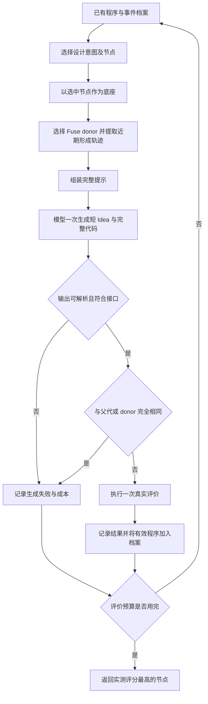

# TraceAAD V10.8 方法报告（历史版本）

## 摘要

TraceAAD V10.8 在有限算法评价预算下，反复选择一个已有程序，利用其近期形成经历指导大语言模型生成新程序，再通过真实评价更新搜索档案。系统由三个相互衔接的机制组成：以程序节点为单位分配生成机会；将真实父子转移组织为可核验的历史上下文；通过 Refine、Pivot 和 Fuse 三类设计意图产生一个完整候选。每轮使用一次模型生成；通过解析与重复检查后执行一次算法评价，随后重新选择下一次设计任务。本文依次说明搜索对象、分配规则、轨迹构造、提示组织、评价与更新，并以一个教学案例走完闭环。模型权重在搜索过程中保持固定，经验通过上下文影响后续生成。

**阅读路径。** 第 1–2 节建立整体图景；第 3–6 节解释各模块；第 7 节串起一个完整例子；第 8 节给出可对照实现的算法；第 9 节说明怎样验证它。首次阅读可暂时跳过公式推导和附录。

## 1. 问题定义：系统输入什么，最后输出什么

### 1.1 设计任务与优化目标

一次运行接收四类输入：任务描述、待设计函数的接口、预训练大语言模型，以及真实算法评价器。评价器将模型生成的函数放入既定求解流程，在固定设计实例上运行，返回标量 fitness。系统内部统一采用“越高越好”的方向；对于路径长度等最小化指标，实验接口会将它转换为相应 fitness。

例如，TSP 构造任务让模型设计“下一步访问哪个节点”的函数；ACO 任务让模型设计供蚁群求解器使用的边先验矩阵。模型修改的是约定接口内的算法，完整求解与评分由任务评价器完成。

设真实评价预算为 $B$，$\mathcal A_B$ 是在该预算内得到的有效程序档案。运行最终返回其中评分最高的代码实现：

$$
x^\star=\arg\max_{x\in\mathcal A_B}f_x,
\qquad
\max\;\mathbb E\!\left[\max_{x\in\mathcal A_B}f_x\right].
$$

这里 $x$ 表示档案中的程序节点，$f_x$ 是该节点的实测 fitness。搜索使用设计实例，最终选出的程序在独立测试集上评价。

### 1.2 搜索中的三个执行者

| 执行者 | 负责的决策 | 接收什么 | 产生什么 |
| --- | --- | --- | --- |
| 搜索器 | 选哪个程序、执行哪种设计意图、提供哪些历史与 donor | 已有档案、评分、机会次数 | 一份完整生成提示 |
| 大语言模型 | 根据提示具体修改或重新设计算法 | 任务、当前代码、形成轨迹、设计指令 | 一段短 Idea 和一份完整代码 |
| 评价器 | 执行并评估候选 | 生成的完整代码、固定评价实例 | 有限 fitness，或超时/错误等失败结果 |

搜索器使用固定的抽样规则；模型通过生成代码提出设计；评价器只返回实际执行结果。三者的职责分开，便于理解每一步的依据。

### 1.3 两种“步数”要分开

**一次设计尝试**是组织提示并请求生成一个候选；**一次真实评价**是候选进入正式评价器。解析失败或重复拒绝计为一次设计尝试，评价预算增量为零。候选进入评价后，每次调用消耗一个评价名额，包括超时和出错。

V10.8 的“多步”指提示中可以包含多条过去的形成转移。每轮生成一个候选，然后重新选择下一次设计任务。

## 2. 总体框架：先看一轮，再看整场搜索

### 2.1 从初始化开始

系统从头生成并评价程序，直到获得 8 个有效根节点。根节点由初始化提示直接生成，提示包含公共任务与输出要求。初始化评价同样计入 $B$；系统以得到有限有效评分的节点数判断初始化是否完成。

随后反复执行下面的闭环：



图中 donor 只在 Fuse 时使用；错误与恢复等运行细节见第 6 节。健康运行持续到预算用完；若发生无法安全续行的故障，则保存明确状态后停止。

### 2.2 一次机会由三个部分确定

将一次正常设计任务写为

$$
a_t=(v_t,o_t,d_t),
$$

其中 $v_t$ 是选中的真实程序记录，$o_t$ 是 Refine、Pivot 或 Fuse，$d_t$ 是 Fuse 所需的可选 donor。以此构造上下文 $C_t$，模型生成新程序 $x'_t$：

$$
H_t\xrightarrow{\text{选择任务}}a_t
\xrightarrow{\text{组织形成证据}}C_t
\xrightarrow{\text{LLM}}x'_t
\xrightarrow{\text{评价并归档}}H_{t+1}.
$$

理解这个流程时，可以始终追问：**本轮从哪份程序出发，模型看到它怎样形成，本次被要求做什么，生成之后记录了什么？** 后面的模块分别回答这些问题。

## 3. 搜索档案与机会分配：本轮从哪里出发

### 3.1 程序节点与形成边

每个有效程序节点 $v$ 保存完整代码、原始 Idea、实测 fitness $f_v$、评价编号、父节点、生成算子和可选 donor。父指针组成程序形成树。对于 Fuse，新程序仍只有一个结构父节点，donor 以额外引用保存。真实父子边 $u\to v$ 是构造历史证据的基本单位。

### 3.2 按个体分配机会

每个节点独立参与选择，使用自己的实测 fitness 和已发起的父代扩展次数 $c_v$。选中节点后，系统使用它的代码、评分和形成历史构造生成提示。

### 3.3 先选算子，再选节点

当前实现先按固定概率选择请求算子：

$$
P(\mathrm{Refine})=0.50,\quad
P(\mathrm{Pivot})=0.15,\quad
P(\mathrm{Fuse})=0.35.
$$

之后在可用节点中抽样。可用意味着该节点能容纳完整的无历史 Refine/Pivot 底座提示。历史内容随后按剩余容量加入。

Refine 和 Fuse 使用相同基础分布：

$$
p_0(v)=
\frac{\exp[\beta(f_v-f_{\max})]/\sqrt{1+c_v}}
{\sum_u\exp[\beta(f_u-f_{\max})]/\sqrt{1+c_u}}.
$$

直观上，质量较高的实现更容易被选中；已接受较多设计尝试的实现会受到温和的次数衰减。$\beta$ 控制质量偏好的集中程度，由有效样本量 ESS 自动校准，细节见附录 A。

Pivot 使用一半基础分布、一半均匀分布：

$$
P(v\mid\mathrm{Pivot})=\tfrac12p_0(v)+\tfrac{1}{2N},
$$

其中 $N$ 是可用节点数。均匀部分扩大换向起点的覆盖。

选中的节点直接作为本轮底座 $v_t$，提示使用它自己的评分与真实形成历史。

当完整提示构造成功并形成待执行请求时，底座节点的尝试次数加一。计数对象是作为底座发起的完整请求，包括生成失败和重复拒绝；同一请求在传输重试或中断恢复时沿用原计数。

## 4. 轨迹构造：把怎样的历史交给模型

### 4.1 一条形成转移包含什么

对于真实父子关系 $u\to v$，历史块提供：

$$
e_{u\to v}=\bigl(o_v,\ f_u\to f_v,\ \Delta(x_u,x_v),\ \text{是否有历史 donor}\bigr).
$$

这里 $o_v$ 是当时实际执行的算子，$f_u,f_v$ 是两条真实记录的实测分数，$\Delta$ 表示完整代码变化。它告诉模型“当时做了什么修改、随后得到什么结果”。

历史上下文由代码转移、算子和实测评分组成。每次生成的 Idea 随节点保存，供后续查阅和分析；代码中的普通注释和 docstring 随代码视图展示。

### 4.2 用完整差分或完整前驱代码表示变化

当前底座完整代码始终展示。对历史每条边，构造器比较两种表示的 token 成本：

- **完整 source-to-target 差分**：标明删除和新增的代码行，包含全部修改块及其必要邻近行。
- **完整前驱代码**：直接给出修改前的程序，结合后续转移和当前底座理解变化。

选择更短的一种，相同长度时选择差分。若前后提示代码视图相同，则用“代码未变化”简写，并保留真实前后评分。

例如，一条差分可能包含：

```diff
-    penalty = 20.0
+    penalty = 10.0
```

这行差分记录参数从原值变为新值。该次修改的整体效果由转移前后的实测评分描述。实际提示保留完整 diff；上面截取一行变化帮助理解符号。对于极短的程序，完整前驱代码可能反而更省 tokens。

底座、祖先与 donor 使用同一代码视图规则：移除引用旧临时提示编号或特定临时角色的 Python 注释，保留可执行代码、字符串和其它注释。档案保存原始代码，日志保存原文与提示视图各自的哈希。

### 4.3 选择最近、连续、以当前底座结束的父链

从当前底座向上回溯最多 8 条父子边，再按从旧到新的顺序展示。例如：

$$
x_0\to x_1\to x_2\to x_3\quad\text{（当前底座）}.
$$

这里“连续”指父子边首尾相接。系统在两条边之间可能评价其他分支的程序，因此父链上的全局评价编号可以间隔。链上的进步、持平和退步转移都按真实形成顺序保留。

这段历史沿当前程序的父指针向前追溯，解释它从哪些前驱程序、经过哪些修改形成。

### 4.4 历史容量与完整性

历史有两个约束：最多 8 条边，历史文本最多 8192 tokens；同时，整个提示还受完整输入上限约束。构造器先取最近完整后缀，超限时从最老一条边开始整条删除。

若上例只能容纳两条边，就展示 $x_1\to x_2\to x_3$。保留下来的两条边首尾相接，每条边的代码变化表示完整。

底座是根节点或最近一条边超过容量时，系统使用完整底座和设计指令生成；Fuse 还包含本轮 donor。日志记录实际边数以及减少或省略历史的原因。

### 4.5 历史 Fuse 与本轮 Fuse 要区分

一条历史边可能由 Fuse 产生。此时历史块标注额外 donor 的参与，日志保存其完整身份。这条边的成绩变化描述当次多输入生成的整体结果。

**历史 donor**属于过去某次转移；**本轮 donor**是本轮 Fuse 额外提供的一份完整程序。日志分别用历史边的 donor 字段和本轮请求的 donor 字段记录二者。

## 5. 条件化生成：三种设计意图怎样使用同一框架

### 5.1 Refine、Pivot 与 Fuse 的具体区别

| 设计意图 | 模型看到的程序材料 | 本轮要求 |
| --- | --- | --- |
| Refine：继续改进 | 当前底座＋它的近期形成轨迹 | 围绕一个主要改进假设继续修改，尽量保留无关计算 |
| Pivot：尝试另一主要方法 | 当前底座＋它的近期形成轨迹 | 理解现有主要假设，尝试另一种有竞争力的主要决策方法 |
| Fuse：借鉴并改进 | 当前底座＋它的近期形成轨迹＋一份完整 donor | 从 donor 中选取有用计算，形成连贯实现，争取超过较强输入 |

三类算子通过提示词表达设计目标。模型据此决定具体修改，输出一份完整程序，再由统一评价协议检验结果。

Refine 围绕主要改进假设进行连贯修改；Pivot 尝试另一种主要决策方式，并可复用已有计算；Fuse 由模型选择怎样吸收 donor 的计算。“超过较强输入”是 Fuse 的生成目标，实际入档依据是评价得到有限有效评分。

### 5.2 本轮 donor 怎样选

只有抽到 Fuse 才选择 donor。候选来自全档案中除底座自身以外的节点，包括底座所在分支和其他分支。

donor 抽样先看不同实测 fitness 水平，再看水平中的节点。设从低到高有 $L$ 个不同水平，第 $j$ 个水平有 $m_j$ 个不同节点，则初次尝试中每个节点的权重为：

$$
P(v\text{ 作为 donor 候选})
=\frac{j}{\sum_{\ell=1}^{L}\ell}\cdot\frac{1}{m_j}.
$$

例如，三个水平的总权重为 $1/6,2/6,3/6$；如果最高水平有两个实现，每个获得 $1/4$。每个评分水平先获得总份额，再由该水平的节点均分；较低分节点也有机会参与。

按这些权重无放回抽取 donor 节点，检查完整底座与 donor 是否能共同放入提示。容量不合适时继续尝试其他节点，最多 32 个。这个公式描述候选尝试的起始分布，容量筛选后的实际 donor 分布可能不同。

所有 donor 容量尝试均失败时，系统以已选底座执行一次 Refine。日志同时保存请求算子与实际执行算子。

### 5.3 一份完整提示的顺序

```text
公共任务说明与目标函数接口

Current Implementation
    当前底座的真实 fitness
    当前底座完整代码

Recent Formation Transitions（有可容纳历史时）
    连续真实转移，从旧到新
    每条：历史实际算子、前后 fitness、完整代码变化表示

Donor（仅本轮 Fuse）
    donor 的真实 fitness
    donor 完整代码

Design Task
    本轮 Refine / Pivot / Fuse 指令

Output
    一段自足的短 Idea
    一个包含完整实现的 Python 代码块
```

容量分配先保证公共任务、完整底座、输出要求，以及 Fuse 的必要 donor，再容纳历史。donor 在提示中显示于历史之后，容量分配时优先预留它所需的空间。

默认总窗口 32768，输出预留 16384，安全余量 256，故完整聊天输入上限为

$$
32768-16384-256=16128\text{ tokens}.
$$

8192-token 历史区包含在完整输入上限中。系统精确计算提示的 token 数，并缓存代码与转移表示的计数结果。

### 5.4 模型具体输出什么

输出协议为以下两部分：

````text
Idea: <100 words 以内，独立说明结果算法的主要决策规则与关键计算>
```python
<包含必要导入和辅助函数的完整实现>
```
````

Idea 用独立、自足的文字说明结果算法的主要决策规则，提示建议长度为 100 words 以内。Code 部分提供包含必要导入和辅助函数的完整可运行实现。

## 6. 评价与更新：这一轮结束后改变了什么

### 6.1 生成、评价、入档是不同阶段

| 本轮结果 | 消耗模型调用与尝试机会 | 消耗真实评价预算 | 档案更新 |
| --- | --- | --- | --- |
| 输出解析、接口或编译检查失败 | 是 | 否 | 保留失败事件与原始响应 |
| 与本轮父代或 donor 的代码完全相同 | 是 | 否 | 保留 `duplicate_code` 事件与匹配角色 |
| 进入评价后超时、崩溃或返回无效结果 | 是 | 是 | 保留评价收据与失败事件 |
| 得到有限 fitness | 是 | 是 | 新增真实程序记录，保留代码、Idea、评分与关系 |

表中是正常返回的生成请求；网络传输异常由 pending 请求和恢复协议处理。

解析通过后，系统使用 SHA-256 哈希和字符串相等检查重复。比较对象是本轮父代、donor 的归档原文及实际提示视图。代码外层空白沿用解析器的 `strip()` 处理，内部文本按原字符比较。匹配成功时记录拒绝事件，结束本次尝试；通过检查时进入评价。初始化候选直接进入评价。凡得到有限有效评分的程序都加入档案，包括评分持平和退步的候选。

每次重复拒绝计入生成次数、token 成本和父节点扩展次数，评价预算增量为零。下一轮重新调度。连续 50 次解析失败或重复拒绝时，系统终止运行并保存错误状态。

失败尝试保存在事件档案中。下一轮搜索器依据有效程序档案和更新后的尝试次数重新选择任务。

### 6.2 新节点、当前最好和最终输出

新增节点后，系统更新程序树与累计最好值。新程序可能成为以后某轮的底座，也可能作为 donor 被其他程序借鉴；下一轮按照更新后的选择分布抽样。

选择、提示、父子增量、前沿和最终输出统一使用节点自己的实测评分 $f_v$。全档案最佳程序是实测 fitness 最大的有效节点。

### 6.3 超父、超上下文与前沿分别是什么意思

对实测有效子代，超父代比较 $f_{\mathrm{child}}$ 与本轮底座的 $f_{\mathrm{parent}}$；超上下文比较它与实际展示材料中的最好实测评分。历史祖先也可能是当前上下文中最强的实现，因此两个指标分别记录。

若请求前最好值是 $F_t$，新子代的实测评分为 $f_{\mathrm{child}}$，则

$$
\texttt{frontier\_delta}=f_{\mathrm{child}}-F_t,
\qquad
F_{t+1}=\max(F_t,f_{\mathrm{child}}).
$$

`frontier_delta` 可以为负；累计最好值的真实增加是 $F_{t+1}-F_t$。前者描述候选与已有最好值的差距，后者描述本轮搜索的实际进展。画预算曲线时使用事件中的 `best_so_far`，横轴使用真实 `evaluation_id`。

预算用完后，返回全档案中节点实测评分最高的程序。

## 7. 一个完整示例：沿着当前程序走完一轮

以下是**教学示例**。代码变化和评分均为便于讲解而设定的示例值。假设初始化已经完成，已有一条装箱评分函数的形成链：

| 记录 | 父节点 | 当时算子 | 主要评分计算 | 假设实测 fitness |
| --- | --- | --- | --- | ---: |
| A | 无 | Init | `-slack` | 10.0 |
| B | A | Refine | `-slack - 20 * small_gap` | 12.0 |
| C | B | Refine | `-slack - 10 * small_gap` | 11.0 |

其中 `slack = bins - item`，`small_gap = (slack > 0) & (slack < item)`。各程序的类型转换与接口处理相同。假设其余已归档程序均不超过 12.0，当前全局最好是 B。

### 第一步：本轮选中 Refine 和记录 C

搜索器先抽到 Refine，再按质量与次数分布选中节点 C。虽然 C 的评分低于 B，它仍在选择分布中拥有一定概率。

本轮执行 Refine，输入由底座 C、形成历史和设计指令组成；当前全局最好程序是 B。

### 第二步：取出 C 的形成经历

沿父指针得到 `A → B → C`。在历史和总输入容量都足够时，两条边均被保留：

```text
第一条转移：Refine，10.0 → 12.0
    从没有小间隙惩罚，改为惩罚系数 20。

第二条转移：Refine，12.0 → 11.0
    惩罚系数从 20 改为 10。
```

这段文字是中文释义，实际提示使用完整差分或完整前驱代码。第二条退步边按照真实顺序保留，帮助模型理解 C 怎样从 B 形成。

### 第三步：模型看到当前代码、两条转移与 Refine 指令

当前完整代码可写为：

```python
import numpy as np

def priority(item: float, bins: np.ndarray) -> np.ndarray:
    b = np.asarray(bins, dtype=float)
    slack = b - item
    small_gap = (slack > 0) & (slack < item)
    scores = -slack - 10.0 * small_gap
    return np.where(b >= item, scores, -1e15)
```

模型可以把前后结果作为继续设计的依据。例如，它可能考虑更强的惩罚、平滑惩罚或其他修改；模型结合当前代码与转移证据选择具体修改。

### 第四步：生成 D 并评价

假设模型输出一段自足 Idea，以及将系数改为 15 的完整程序 D。系统只作一次生成调用，随后作一次真实评价。假设 D 得到 11.5：

- D 超过本轮底座 C 的 11.0。
- D 的 11.5 低于 B 的 12.0，全局最好仍为 B。
- D 是有效程序，仍然入档，父节点记为 C，历史算子记为 Refine。
- 若 D 是新代码，`frontier_delta = 11.5 - 12.0 = -0.5`，`best_so_far` 仍为 12.0。

### 第五步：重新选择下一次实验

如果下一轮选中 D，其形成路径可包含 `A → B → C → D`；如果选中其他记录，就组织对应的形成路径。

这个例子把整个机制连接起来：**分配规则决定从 C 出发，轨迹提供 C 怎样形成的事实，Refine 指令规定设计方向，模型决定具体修改，评价决定结果，档案保留 D 并供下一轮选择。**

## 8. 完整算法与默认配置

```text
输入：任务接口、固定模型、真实评价器、评价预算 B
档案：有效程序树、全部尝试事件、评价收据与选择次数

1. 从头生成并评价，获得 8 个有效根；初始化评价计入 B。
2. 在评价预算仍有剩余、运行状态允许时：
   a. 抽取 Refine / Pivot / Fuse。
   b. 按该算子的质量与次数分布抽取一个可用节点作为底座。
   c. 使用该节点自己的实测评分与形成历史。
   d. 若为 Fuse，尝试选择 donor；不可用时改为 Refine。
   e. 提取底座最近的连续父子形成边。
   f. 选择每条边的完整表示，并按容量从最老端整边删减。
   g. 构造完整提示；记录请求、随机状态与本次机会计数。
   h. 一次生成短 Idea 和完整代码。
   i. 解析通过后检查是否原样返回父代/donor；重复则拒绝，否则评价并将有效程序加入树。
   j. 保存全部尝试事件、实际评价收据、节点评分及累计最好值。
   k. 返回 a，重新决定下一次任务。
3. 返回按节点实测评分选出的全档案最佳程序。
```

以上是健康运行的主流程；预算用完时若有效根少于 8 个，系统以“初始化未完成”状态结束。

| 配置项 | 默认值 | 对机制的含义 |
| --- | ---: | --- |
| 有效根记录数 | 8 | 初始出发点记录数 |
| 真实评价预算 | 1000 / 路 | 包含初始化、超时和评价失败 |
| Refine / Pivot / Fuse | 0.50 / 0.15 / 0.35 | 请求算子概率；Fuse 回退会影响实际执行比例 |
| Pivot 均匀混合比例 | 0.5 | 扩大节点起点覆盖 |
| 历史形成边数 | 最多 8 | 连续父链长度上限 |
| 历史文本 | 最多 8192 tokens | 包含在完整输入内 |
| 总上下文 / 输出预留 / 安全余量 | 32768 / 16384 / 256 | 默认完整输入上限 16128 tokens |
| donor 容量尝试 | 最多 32 个不同节点 | 有界、按权重无放回尝试 |
| 模型输出 | 短 Idea＋完整 Code | 一次调用、一个候选 |

模型端点、任务规模、实例种子、评价限时等由公共运行入口与各路 `run_config.json` 记录。正式 CLI 固定首发历史机制；历史深度与表示对照通过独立实验构造器执行。

## 9. 实验验证：每组比较对应哪个机制问题

本节描述当前机制的验证安排。此前启动的 5 任务×3 重复对应调整前的版本，其结果保存在历史实验记录中；当前机制的效果由下列对照检验。

| 机制问题 | 对照方式 | 要观察什么 |
| --- | --- | --- |
| 形成历史有没有增量，多步是否必要？ | 共同个体调度与重复拒绝规则下的 code-only、单边、最多八边 | 完整搜索曲线、终局质量，以及历史实际边数和输入成本 |
| 代码转移表示是否优于短描述？ | 固定同一快照、底座、算子和 donor，对照代码转移与短原始 Idea/Result/Fitness | 采用两臂共同可容纳的最近后缀，记录实际 tokens，多次采样比较 |
| 真实关系本身是否有增量？ | 相同真实程序及评分，明确先后关系与未声明关系的参考集合 | 保持程序、评分和真实关系一致，分别检验关系标注与表示成本的作用 |
| 重复拒绝是否节省评价？ | 固定生成样本核查父代/donor 匹配；完整搜索同时报告生成成本 | 拒绝次数、实际评价次数、模型调用与 token 消耗 |
| 方法整体是否值得保留？ | 与独立冻结 V10.7R 基线等比较 | 相同评价预算的终局质量、独立测试及全部调用成本 |

固定状态实验观察生成端作用；完整搜索实验观察作用能否随搜索过程兑现。生成试验的统计分母包含全部输出。完整搜索需报告独立重复、预算曲线、预定终局、最终未见实例表现、模型调用与输入/输出 tokens、评价及总耗时。

各实验报告实际输入长度，以独立搜索运行作为重复单位。分别分析多边相对单边、代码转移相对短描述的增量，并结合固定状态下的生成效果与完整搜索的终局质量判断机制价值。

## 附录 A：选择分布的数学细节与评分口径

### A.1 ESS 如何控制质量集中程度

先仅对质量权重归一化：

$$
\pi_\beta(v)=\frac{e^{\beta(f_v-f_{\max})}}{\sum_ue^{\beta(f_u-f_{\max})}},
\qquad
\operatorname{ESS}(\pi_\beta)=\frac{1}{\sum_v\pi_\beta(v)^2}.
$$

如果概率均匀分布在 $N$ 个节点上，ESS 为 $N$；越集中，ESS 越小。默认名义目标为

$$
E=\min\{N,\max(0.1N,2)\}.
$$

实现求 $\beta\ge0$，使质量分布的 ESS 尽可能接近目标。如果最高分有 $k$ 个并列节点，质量分布的 ESS 下限为 $k$，因此记录可达目标与实际 ESS。全同分时质量权重均匀。

随后再加入 $1/\sqrt{1+c_v}$ 次数修正，得到正文的 $p_0$。日志分别记录质量校准、次数修正和 Pivot 混合后的 ESS，用于观察各阶段的概率集中程度。

### A.2 节点计数与实测前沿

每个节点独立维护已发起请求数。作为底座的完整请求选定后增加一次，生成失败与重复拒绝均包含在内。同一请求的传输重试与断点恢复沿用原计数。

节点保留自己的 `fitness`。`best_so_far` 是所有有效节点的最高实测分数；`frontier_delta/frontier_improved` 比较新子代实测分数与请求前最好值。重复事件的评价编号为空，最好值沿用上一轮的结果。

## 附录 B：执行、日志与恢复

完整事实档案与当前模型输入分开维护：有效节点树保存程序与形成关系；事件和调用日志还保存没有入树的失败、原提示、响应与成本。当前输入只包含本轮选定的材料。

| 文件 | 主要内容 | 阅读用途 |
| --- | --- | --- |
| `tree_state.json` | 节点、随机状态、计数、已用预算和机制身份 | 查看档案与恢复状态 |
| `llm_calls.jsonl` | 完整 Prompt、响应、模型调用及 usage | 看模型实际收到了什么、输出了什么 |
| `evaluations.jsonl` | 真实评价编号、结果与耗时收据 | 核对评价预算 |
| `events.jsonl` | 底座/donor、请求与执行算子、节点概率、真实边、视图哈希、容量原因、`duplicate_code` 与 `duplicate_matches` 等结果 | 串起一次设计尝试 |
| `tokenizer_calls.jsonl` | 未命中缓存的计数请求及耗时 | 理解上下文构造成本 |
| `logs/run_summary.json` | 运行状态、最佳节点、真实评价与扩展步数 | 查看最终交付与异常 |

提示、选定材料和随机状态在请求前持久化。中断恢复复用同一个 pending 请求及其计数；评价结果未知时保留状态并停止。评价预算按实际进入评价器的次数累计，包括评价失败。

方法身份为 `v108`，检查点版本 `1081`，上下文策略为 `verified_formation_suffix_v1`，选择策略为 `individual_quality_count_v1`，去重策略为 `exact_parent_donor_raw_and_view_v1`。检查点核对源码、机制、评价配置和后端，全部匹配后恢复运行。

## 附录 C：历史设计依据与待验证问题

下列内容记录当前设计的研究依据与后续问题。

| 已有认识或观察 | 对 V10.8 的具体影响 |
| --- | --- |
| parent-path 在固定锚点上有改善生成分布的证据，完整搜索并非跨任务一致获益 | 保留形成经历，并分别验证生成与终局收益 |
| 直接子代尝试未显示稳定额外增益 | 使用当前节点的真实形成后缀 |
| 二次摘要有局部纠错，也会漏判实际行为 | 以代码转移事实表达历史 |
| 固定多步开发、max-backup 和潜力代理存在历史风险 | 每轮依据当前档案与次数重新选择底座 |
| 原 V10.7 程序参考存在编号污染、材料角色与行为重复问题 | 统一代码视图，以真实转移表达设计过程 |
| V10.7R 已提供直接关系与角色清理 | 保留为独立基线；V10.8 进一步检验多步代码形成证据 |

原设计记录的两项历史校验如下：

- 2026-08-21 父代来时路完整搜索结果页汇总存在内部不一致。按逐 seed 数据重算，CVRP 的 PP=8.9703、CO=8.8801，越低越好，应为 CO 均值更好且 CO 2:1；OP 的 PP=14.773333、CO=14.772667；原汇总记为 CO=14.4393。
- E2-B′ 的 9 个 experienced 锚点只有一个 PR 相对 RR 的正例，且收益发生在第一步；没有 Pivot continuation 增加 Q1。这一观察支持每轮重新选择设计任务的安排。

仍需验证的问题包括：多步比单边的增量、差分比短描述的作用、历史是否造成保守依附、同成本终局收益，以及低分程序是否得到足够开发。实验需要进一步观察模型怎样使用转移证据，以及哪些历史信息能改善生成。

后续训练可分别学习历史条件化的程序修改策略与实验选择策略。当前保存的真实请求、动作、上下文来源、评价和成本，可为后续训练数据构建提供依据。

## 附录 D：来源定位

原设计来源为用户提供的 `TraceAAD_V10_8_design.md` 与 2026-09-09 研究讨论，来源稿审查基点为 `52fd74fd4ea4c2fdb7bfb41ce46c19f1452349af`。下表保留该稿的资料定位；历史材料只支持各自记录时点和实验范围。当前 V10.8 实现见附录 E。

| 编号 | 路径 | 用途 |
|---|---|---|
| S1 | docs/01-主线版本/TraceAAD-V9.0-机制设计.md | 原始问题与真实形成历史 |
| S2 | docs/04-研究认识与构想/2026-09-18-生成上下文与历史证据.md | 单步与完整搜索边界、失败子代经验 |
| S3 | docs/04-研究认识与构想/2026-09-18-预算分配与评价资源.md | 代理、回传和重决策频率教训 |
| S4 | docs/04-研究认识与构想/2026-09-18-核心研究认识.md | 历代机制的证据边界与收益形成结构 |
| S5 | docs/03-机制验证/01-提示与上下文/2026-08-21-父代来时路搜索/README.md | 逐 seed 数值和汇总纠错 |
| S6 | docs/03-机制验证/04-算子动力学与两步价值/2026-09-07-E2B-Pivot两步选择价值/README.md | 两步价值与恢复收益区别 |
| S7 | docs/01-主线版本/V10.6/二次Idea配对核查/结论.md | 二次摘要的局部收益与错误 |
| S8 | docs/01-主线版本/TraceAAD-V10.7R-机制设计.md | V10.7R 前置基线及验证状态 |
| S9 | llm4ad/method/traceaad_v10_7/traceaad.py | V10.7R 的单候选执行流程 |
| S10 | llm4ad/method/traceaad_v10_7/sampling.py | 直接边优先级与 donor 抽样 |
| S11 | llm4ad/method/traceaad_v10_7/prompts.py | 角色、输出协议、提示视图清理 |
| S12 | llm4ad/method/traceaad_v10_5/traceaad.py | 被继承的 node-ID 质量/次数分布 |
| S13 | docs/01-主线版本/V10.6/机制运行核查/README.md | 旧 V10.7 归因与冻结状态 |

来源稿列出的相关研究线索包括 ReEvo（arXiv:2402.01145，反思指导进化）、PathWise（arXiv:2601.20539，有状态轨迹记忆与规划）和 AHD Agent（arXiv:2605.08756，多轮工具使用与 RL）。这些条目保留为待独立核验的文献线索。

## 附录 E：工程落地与验收记录

### E.1 当前实现与历史验收记录

- 方法：`llm4ad/method/traceaad_v10_8/traceaad.py`，独立 `TraceAADV108`；复用 V10.7R 的单候选生成、解析、评价及日志循环。
- 轨迹：`llm4ad/method/traceaad_v10_8/trajectory.py`。统一复用 V10.7R 的临时提示引用注释清理规则，底座、祖先、donor 均保留可执行代码、字符串和普通注释；历史块展示代码转移及实测评分。记录原始与视图代码 SHA-256、移除注释数、真实 source/target/evaluation/donor ID 及表示类型。无末尾换行的差分保留标准 no-newline 标记。
- 调度：先采样算子，再按节点实测质量与该节点的扩展次数选择父代；donor 也按节点抽样。记录节点概率与扩展前计数。
- 重复拒绝：解析之后、评价之前匹配父代/donor 原文和提示视图。重复事件保留代码哈希与匹配角色，随后结束本轮尝试；评价预算增量为零。
- 最终输出：使用节点实测评分，前沿增量统一为子代实测分数减去请求前最好值。
- 容量：底座资格仅检查无历史的完整 Refine/Pivot 提示；donor 先试至多 32 个不同实现，再加入最近完整边。根、零边消融、最近边超限分别记录原因，保留连续完整的最近后缀。所有完整聊天输入做精确计数。
- 身份：检查点版本 `1081`、方法 `v108`、上下文 `verified_formation_suffix_v1`、个体调度 `individual_quality_count_v1`、去重 `exact_parent_donor_raw_and_view_v1`，并记录实际使用的历史参数、源码及评价配置指纹；恢复时核对检查点版本及全部指纹。
- 运行：`experiments/traceaad_v10_8/run.py`，默认 8 根、1000 评价、最多 8 边/8192 历史 tokens。独立结果目录为 `experiments/traceaad_v10_8/results/`。CLI 使用当前机制默认值；机制消融从独立实验构造器注入 0/1/8 条边。
- 验证：`tests/method/test_traceaad_v108.py`，覆盖轨迹与容量、节点分布、实际记录一致性、失败预算和恢复；同时执行被复用的 V10.5/V10.6/V10.7R 回归测试。通过测试仅说明工程契约成立，机制收益仍待第 9 节的实验。

以下数字记录机制调整前的历史验收，当前验收见 E.4。

2026-09-09 本地验收：V10.8 的 21 项测试与 V10.5/V10.6/V10.7R 相关回归合计 **129 passed**；入口 `--help` 正常。差分由标准 `patch` 工具正向及逆向重建，覆盖多个修改块和末尾无换行。生成使用测试替身，微型评价器执行真实 Python 候选。

以下为历史启动记录。初次交付为设计与实现；2026-09-09 后续按用户授权启动 15 路正式搜索，见启动记录。该批运行对应机制调整前的版本，记录了当时的调度和生成过程。表示与历史深度对照另行验证。

### E.2 正式运行前审查修正（2026-09-09）

当时针对 `b2544452` 的用户审查意见作了以下修正：

1. 当时修正了前沿评分口径。该旧口径现已被第 6 节统一使用节点实测评分的规则替代。
2. 先构造最多 8 条真实近期边，再检查完整历史与完整聊天输入；超限才从最老端整边删除。缓存未命中且 8 条不同转移均可容纳时，计数替身测得从 33 次减少到 18 次（16 次表示比较、1 次历史、1 次 chat）；历史缓存后更换 donor 仅新增 1 次 chat 计数。该统计量为计数接口调用数。
3. 独立固定锚点构造器补齐短原始 Idea/Result/Fitness 与代码转移对照。两臂使用相同快照、底座、算子、donor、输入上限和共同可容纳的最近边集合，各自记录实际输入长度；原始 Idea 使用既有临时引用与 256-token 提示视图约束。

本地工程回归 131 项通过（含上述前沿反例与计数检查）；固定锚点表示收益尚待实际生成实验。15 路正式搜索是 V10.8 多边机制在 5 任务、3 重复上的运行；表示效果由独立对照检验。该批运行状态与服务分配见实验目录启动记录。

### E.3 主文与代码的对应入口

| 报告模块 | 实现入口 |
| --- | --- |
| 节点选择、重复拒绝、donor 与本轮调度 | traceaad.py：`node_distribution`、`_duplicate_inputs`、`select_donor`、`_schedule` |
| 转移表示、连续后缀与完整提示 | trajectory.py：`transition`、`build`、`assemble` |
| 单候选生成、解析、评价与归档 | 复用的执行循环：`_advance` |
| 历史深度与表示对照 | ablations.py |
| 参数与运行说明 | run.py、运行说明 |
| 原始启动事实与服务分配 | 2026-09-09 启动记录 |

本次同步调整机制说明、搜索实现、运行入口与测试。重复拒绝的评价预算增量为零，生成与父代扩展次数各增加一次。旧启动批次和上面的验收数字保留其历史时点。

### E.4 本次机制调整验收（2026-09-09）

当前修改的相关回归共 166 项通过，覆盖 V10.8、复用的 V10.5/V10.6/V10.7R 执行与抽样、启动入口及共享监控。重点核查个体分布、父代与 donor 的原文/提示视图匹配、拒绝后的预算与次数、重复事件断点恢复、连续重复终止、旧检查点拒绝，以及新旧监控评分口径。入口 `--help`、文档本地链接与 `git diff --check` 通过。验收使用测试替身与微型评价器，验证执行流程与工程契约；搜索性能由第 9 节的正式实验评价。
