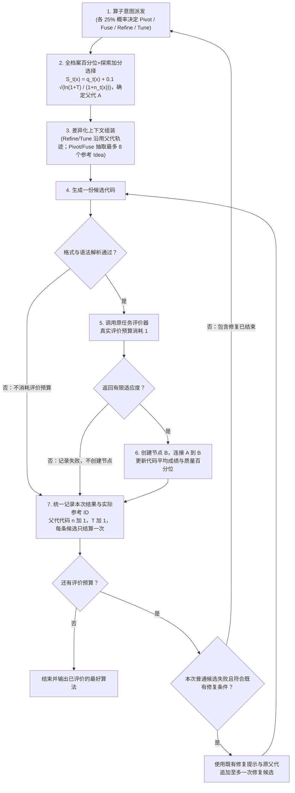

# TraceAAD V11.0：全档案百分位探索加分调度与算子条件化参考上下文
V11.0 以 V10.11 generic 为基线，在预算分配和经验组织两个系统维度推进 TraceAAD。预算分配改为唯一代码的质量百分位加有限探索分数；Pivot/Fuse 共享最多 8 个参考节点的 Idea 与实测适应度。Refine/Tune、四算子均分、单亲树、任务契约、一次有界修复、8 根 sequential informed initialization、双 token 档和持久化规则保持一致，并加入断点恢复契约。正式批次采用五任务、五重复和每路 1000 次真实评价。

## 研究出发点

高质量算法的收益形成受四类机制驱动，且在同一任务中交织出现：寻找有效实现骨架（Pivot 对应）、互补信号组合（Fuse 对应）、连续协调改进（Refine 对应）、决策边界与参数校准（Tune 对应）。V10.11 四组 15/15 完赛对照（共 60 路）实证了核心判断：五个任务的收益形成方式不同，偏好的历史证据不同，不存在全任务通用的历史结构。VRPTW 的短形成轨迹在全部聚合预算点（第 100~900 次评价）领先；TSP 在第 100 次评价处无轨迹批均值更好（主批被 generic rep1 单路早期离群拉低所致，其余两路无实质差距），短轨迹优势在后续预算点才显现——两者共同支持"骨架出现后沿谱系持续开发"，同时提示前期探索阶段或需不同上下文（动态切换仅是待验假说）；CVRP-ACO 的质量偏置跨分支档案大幅领先，其机制更接近"优质算法族的精英传播"而非多样思想碰撞；OBP 存在路径外参考思想实质进入生成代码的微观证据（Node 786 的 residual-myopic 诊断被 Node 789 落实为 `reusable = r >= sz` 决策边界并触发全场最优）；OP 是上下文敏感性的边界案例。同时，档案组更高的 Pivot 局部父代改进率并不等于全局前沿推进，算子与上下文的最佳配对仍属假说。

由此确立 V11 的组织原则：上下文按算子意图条件化装配，$C_t = g(o_t, x_t, H_t)$——算子意图 $o_t$ 决定信息需求类型，当前程序及其状态 $x_t$ 决定具体接口，历史库 $H_t$ 决定提取哪些材料。**不引入全局阶段识别器**：阶段属于具体算法路线的微观生命周期而非全局物理时钟，第 800 步 Pivot 出的新骨架对该路线仍是新生期，按全局早晚切换上下文会错配；算子由系统 25% 等概率抽取，标签反映本次生成的行动意图而非对路线生命周期的评估；早期少给参考由候选池规模与窗口容量自然决定，不设外部门槛。父子连边的本质是搜索扩展因果而非代码物理血缘：系统以节点 $A$ 为原点分配评测预算并生成 $B$，$A \to B$ 即真实扩展历史。因此完整保留单亲树与 `parent_id` 拓扑，只解除提示词中的继承语言绑架。

V10.11 现状与这一原则有两处错配。其一，ESS Softmax 按节点聚合质量：重复副本扭曲质量分布，开发次数不进入分配，"探索产生的新方向能否获得后续开发"没有系统的表达。其二，Pivot/Fuse 仍携带父代形成轨迹（Pivot）或单一 donor 代码（Fuse）：Pivot 需要弱化祖先锚定以摆脱当前路线定势，Fuse 需要多来源视角而非单 donor；两者需要把证据来源从单一谱系扩展到全档案。V11 分别以百分位＋探索加分调度和共享参考上下文回应，两项联合构成一次机制演进。

## 相对 V10.11 的修改

| 维度 | V10.11 现状 | V11.0 实际变化 | 设计意图 |
| :--- | :--- | :--- | :--- |
| 父代分配 | ESS 校准的 Softmax 质量抽样 | 质量百分位＋有限探索加分打分 $S_t(x)$ 取最高 | 彻底移除 ESS 与二分查找 |
| 分配单位 | 单个历史节点 | 唯一代码（Unique Code Key） | 相同代码共享开发次数与有效评分，再选历史节点 |
| Pivot 选父 | 50% 质量抽样 + 50% 均匀抽样 | 与其他算子共用统一分配规则 | 取消单独的 50% 均匀抽样 |
| Pivot/Fuse 上下文 | 父代形成轨迹（最多 8 代）＋Fuse 额外 donor 代码 | 最多 8 个参考节点的 Idea＋实测适应度 | Fuse 取消额外参考代码，彻底去除长祖先链 |
| 参考选择 | Fuse donor：50% ESS 质量抽样＋50% 均匀；Pivot 无独立参考 | Pivot/Fuse 共用倒数排名权重 $1/r$ 无放回抽样 | 代码去重，同分中秩 |
| 算子指令 | 原指令（Pivot 无参考，Fuse 为双算法融合） | Pivot 加入参考思想的使用；Fuse 改为多来源选择性组合 | 自然陈述，解除主从绑架 |
| 断点恢复 | 既有停止恢复流程 | 断点恢复契约：评价结果复用、每候选单次提交、日志领先可补结算 | 修复重复评价与重复建节点缺陷 |
| 保留不变项 | Refine/Tune 提示词与祖先轨迹规则、四算子 25%、单亲树拓扑（无回传）、任务契约与评测管线 | 完全保留不动 | 稳定基准；评测预算消耗规则严格一致 |

## 预算分配：全档案百分位＋有限探索加分

初始化 8 个有效根（sequential informed initialization 原样）后，每轮普通迭代：等概率抽取算子（Refine / Tune / Pivot / Fuse 各 25%）→ 全局统一选择父代 → 按算子组织上下文 → 生成一个候选 → 评价并更新调度统计 → 重新决策。四种算子共用父代分配规则，区别只在生成意图与上下文。

**分配单位与去重标识。** 对代码库中每份不同代码维护统计，代码标识沿用 V10.11 的 AST 表示 `ast.dump(ast.parse(code), include_attributes=False)`（保留文档字符串，缓存复用）；需要落盘的键基于该表示计算摘要。调度聚合与参考抽样去重使用同一标识，不存在两套代码等价规则。相同代码的多条生成节点及其树状拓扑完整保留，但共享调度统计。

每份代码维护两个量：

- $q_t(x)$：当前质量百分位，$[0,1]$，越高越好。相同代码的多次有效评价取平均成绩 $\bar f_t(x)$，百分位在**不同代码之间**计算，同分取中秩。设 $M$ 为不同代码数，$L_x$ 为平均成绩严格低于 $\bar f_t(x)$ 的代码数，$E_x$ 为等于它的代码数（含 $x$ 自身），则
$$q_t(x) = \frac{L_x + (E_x - 1)/2}{M - 1} \quad (M > 1); \qquad q_t(x) = 0.5 \quad (M = 1).$$
全部同分时该式返回 0.5。四份代码平均成绩 $[1,2,2,4]$ 的百分位为 $[0, 0.5, 0.5, 1]$。平均成绩仅用于调度；提示中的实测分数仍取所选历史节点的原始记录。
- $n_t(x)$：从该代码直接发起的累计生成尝试次数，含无效输出、超时、报错和退步。新代码入池时 $n=0$；重复生成已有代码沿用既有统计，不得通过重复生成重置。

**选择规则。** 设 $T$ 为初始化完成后累计完成的生成尝试次数，每轮取
$$S_t(x) = q_t(x) + c \sqrt{\frac{\ln(1 + T)}{1 + n_t(x)}}, \qquad c = 0.1$$
最大的代码；并列时均匀随机。若该代码对应多条形成历史，再从这些历史节点中均匀选择一个作为本次扩展原点（父代）。质量项支持持续深挖已证明竞争力的骨架；探索项让尝试较少的算法获得额外机会并随开发次数迅速衰减。该公式受 UCB 启发，是启发式打分而非置信界：探索加分上限 $c\sqrt{\ln(1+T)}$ 增长极慢（$T=500$ 时约 0.249，$T=1000$ 时约 0.263），在给定步数下有限。

**尝试结算。** 结算单位是候选（`candidate_id`）：每条具有父代的候选在结果落盘时统一结算一次，父代代码 $n$ 加 1、$T$ 加 1；服务调用重试与断点恢复不重复计数；初始化尝试不计入。

- 解析失败（invalid_output）或不合规输出：$n, T$ 各加 1，不调用评测器，不消耗评价预算；
- 评价失败（超时、运行错误、非法结果、非有限适应度）：消耗一次真实评价预算并记录失败，不创建节点；$n, T$ 各加 1；
- 有效：创建节点并连边（单亲），消耗一次评价预算；新代码以 $n=0$ 入池，重复代码并入既有统计；
- 重复生成已有代码不自动跳过实际评价，保留既有评价管线行为；
- **一次修复**：沿用 V10.11 修复条件与修复提示。普通候选出现可修复失败时，在预算允许下追加至多一次修复候选，沿用原父代，不重新抽取算子、父代或参考节点；修复是单独一次候选尝试，完成后另计一次 $n, T$；只有实际调用评价器才消耗评价预算；修复结束后恢复正常决策，不递归修复；
- 参考节点的出现不计开发次数，不获预算信用；
- **无回传**：子代凭自身质量参与下一轮竞争，后代最好成绩不回传为祖先的调度分数。

基础设施异常与服务中断按下文"持久化与检查点"的断点恢复契约处理，不以"沿用 V10.11"带过；评价进行中崩溃且无收据的未知评价结果继续阻断；连续 50 次不可评价输出熔断保留。

## 上下文组装

### Refine / Tune：完全沿用 V10.11 稳定基准

提示词原文不动（Refine 聚焦计算与组织的针对性精炼；Tune 聚焦保持计算结构下校准影响实际决策的关键参数）。上下文保持严格父代形成链：任务契约 → `Fitness: higher is better.` → 当前完整代码＋实测适应度 → 最近最多 `traj_gens=8` 条真实祖先形成事件（每步为算子、前后适应度与生成时 Idea）→ 算子指令 → 输出契约。形成步数受 `traj_gens` 与上下文窗口双重限制，整段超容时从最旧一步起逐条削减；仅剩任务契约与当前代码仍超容时报错。Fuse 语义下的 donor 代码段不复存在。

### Pivot / Fuse：共享参考上下文（核心改革点）

两者共用完全一致的上下文组织结构与参考抽样体系，差异仅由算子指令驱动。组装顺序固定：

1. 任务说明（与 V10.11 使用同一版本）；
2. `Fitness: higher is better.`——适应度方向声明四算子统一保留，最小化任务的分数为负值时避免被误读为原始成本；
3. 当前算法完整代码与实测适应度（`# Current Algorithm`，渲染规则与 V10.11 相同）；
4. 最多 $K=8$ 个参考节点的 Idea 与适应度，按适应度从好到差陈列，统一引导语：
   ```text
   These reference nodes were evaluated earlier in the search and are listed from best to worst fitness. Use their recorded ideas as design references.
   ```
   每条条目为 `Reference i | Fitness: f` 加该节点生成时的 Idea（空白规范化，与形成路径同规则）；**不展示完整代码，不附带祖先链**；
5. 算子指令（下文两条新指令）；
6. 输出要求（与 V10.11 完全一致）。

**参考节点抽样规则（倒数排名 $1/r$ 无放回）**：

- 候选池为已完成评价、适应度有效且记录有非空 Idea 的历史节点；
- 排除与当前算法 AST 代码完全相同的候选；同代码仅保留最近一份记录作为代表，同分异构代码全部保留；
- 候选按适应度从好到差排序（同分取中秩得排名 $r_i$），赋权 $w_i = 1/r_i$，无放回抽取最多 $K=8$ 个；抽取中保留原排名与权重，对剩余项重新归一化。

抽样不排除当前算法的祖先节点，也不判断参考思想与当前算法的差异：参考是**全档案性的，可包含路径外节点**，也可能命中同谱系节点。跨分支与互补不是抽样保证，而是由算子指令在模型使用层面引导判断。

**算子指令**（自然陈述，解除主从绑架）：

- `Pivot`：
  ```text
  Identify a limitation of the current approach in relation to the task, using the reference ideas where helpful. Develop and implement a competitive alternative based on a different main idea that addresses this limitation.
  ```
  意图：以当前算法为基准定位局限，适当借鉴参考思路，设计并实现采用不同主思路的替代方案；不强制使用参考，亦不要求与所有参考全异。
- `Fuse`：
  ```text
  Compare the current algorithm and the reference ideas to identify useful ideas that can complement one another. Adapt and combine selected ideas into a coherent algorithm that aims to improve performance on the task.
  ```
  意图：从当前算法与多个参考思想中选择性提取互补机制有机综合；目标从"超过两个输入"扩展为"改善任务表现"，当前算法不强制作为组合主体。

**边界与回退**：回退判定以**容量裁剪后实际保留**的参考条目为准。参考池为空（如搜索初始阶段），或抽到的参考因容量限制被全部削减时，Fuse 均回退为 Refine：改用 Refine 的算子指令与祖先形成轨迹重新组装（`requested_operator` 记 Fuse，`operator` 记 Refine 并记 fallback 原因）；回退后容量规则与 Refine 相同——形成步从最旧起削减，仅剩任务契约与当前代码仍超容则报错。Pivot 不回退：参考为空或被全部削减时，仅凭当前算法与任务说明生成替代方案。上下文容量受限时，按适应度从低到高逐条削减参考条目，优先保护任务契约与当前算法代码完整性。实际进入该次 Prompt 的参考节点 ID 按展示顺序完整记录在候选元数据（`reference_ids`）中：容量削减后只记保留者，Fuse 回退后记空列表，修复候选记空列表（修复提示不含参考，来源经 `repair_of` 追溯原候选）。`reference_ids` 仅用于离线因果追踪，不向树结构注入多亲连边。

### 算子与改进模式的对应

| 算法改进模式 | 算子 | 承载意图 | V11 上下文组织 |
| :--- | :--- | :--- | :--- |
| 寻找有效实现骨架 | Pivot | 替换主要计算逻辑，寻找新的可开发方向 | 全档案参考 Idea（可含路径外节点）、当前实现与实测适应度；弱化祖先细节 |
| 组合互补机制 | Fuse | 从当前算法与参考中提取互补计算有机整合 | 当前算法＋多参考 Idea 选择性组合 |
| 连续协调改进 | Refine | 保留决策骨架，协调相互关联的机制 | 形成链、最近修改与前后评价变化（不变） |
| 决策边界与参数校准 | Tune | 保持计算结构，校准促使实际决策改变的参数 | 形成链、最近修改与前后评价变化（不变） |

Init 属前置生成，Repair 属工程恢复，均不是算法改进模式。设计意图（生成前行动请求）与实际发生（生成后代码事实）严格解耦：不能凭算子标签判定改进模式成立，核验须脱离标签直接比对 AST 结构与决策行为。

## 执行闭环

初始化完成后的普通搜索与一次修复如下；所有结果统一计数，只有返回有限适应度的候选创建算法节点。



## 与 rand_ctx 对照组的区别

V10.11 的 `rand_ctx` 消融使用排名 Softmax（$\tau=8$）抽取最多 8 个节点的 Idea 与适应度，四算子全部替换形成路径，且 Fuse 保留额外 donor 代码。V11 沿用其"参考信息形式"（Idea＋适应度、无代码、无顺序结构），但二者不是同一配置：

| 维度 | rand_ctx 对照 | V11.0 |
| :--- | :--- | :--- |
| 适用算子 | 全部四算子（`traj_gens=0`） | 仅 Pivot/Fuse；Refine/Tune 保留形成轨迹 |
| 抽样分布 | 排名 Softmax，$\tau=8$ | 倒数排名 $1/r$ 无放回 |
| 去重 | 仅排除父代节点自身 | 排除与当前算法 AST 相同的候选；同代码仅保留最近记录；同分中秩 |
| Fuse 额外参考代码 | 保留 donor 完整代码 | 取消 |
| 父代分配 | V10.11 ESS Softmax（Pivot 50% 均匀混合） | 百分位＋有限探索加分，四算子统一 |

## 科学边界与检验重点

1. **联合演进归因**：调度改变后 Refine/Tune 接收到的父代及其演化历史随之改变，V11.0 检验的是预算分配与算子上下文的联合效果，不能孤立归因为算子上下文的单因素贡献。
2. **头部集中风险**：探索加分有限——$T=1000$ 时若存在百分位 1 的顶尖代码，百分位低于约 0.737 的代码即使从未被开发（$n=0$）总分也无法胜出；且取消了 Pivot 原有 50% 均匀抽样，低分新分支的直接开发机会可能减少。这是把各算子统一纳入竞争体系的实际取舍，不能在实测前宣称已解决头部垄断。
3. **局部改进 ≠ 全局推进**：事件流保留 `parent_improved` 与 `frontier_improved` 双口径，沿用"局部父代改进率 vs 全局前沿推进"的区分统计。
4. **最终产出**严格按原始评价器实测最好成绩结算，探索加分不参与最终排名。
5. **改进模式核验**脱离算子标签：以 AST 结构与决策行为比对确认 Pivot/Fuse 是否真正吸纳参考机制，避免循环论证。

重点检查：top 代码的尝试份额与新代码首次获得直接开发的中位延迟（集中度与延迟收益）；参考 Idea 进入生成代码的证据强度（结合 `reference_ids` 离线因果追踪）；任务分化是否与 V10.11 认识一致（CVRP 式精英传播 vs TSP/VRPTW 谱系开发）；held-out 跨规模泛化与三重复方差。若集中度恶化且终局变差，应修正分配机制，不把调度统计当成功指标。

## 持久化与检查点

沿用 V10.11 单份持久化原则，仅扩展调度状态：

- `nodes.jsonl`：每节点一次追加（code、idea、fitness、evaluation_id、parent_id、operator）。`donor_id` 字段保留但恒为空——V11 的 Fuse 不再有单一 donor，参考关系记录在事件流；
- `events.jsonl`：唯一事件流（含 `best_fitness`、失败 traceback）。新增 `reference_ids`（实际进入该次 Prompt 的参考节点，按展示顺序；容量削减后只记保留者，Fuse 回退与修复候选记空列表）与 `selection` 统计（所选代码的平均成绩、百分位、开发次数、加分、总分、并列组规模）；
- `llm_calls.jsonl`：记录调用 ID、响应、token 使用和耗时；
- `tree_state.json`：保存机制配置、rng 状态、$T$、按完整 AST 表示索引的开发次数表与既有计数。**追加日志是真身**：代码平均成绩与百分位由 `nodes.jsonl` 重放推导，不单独持久化；$n/T$ 可由 `events.jsonl` 重放核对；检查点落后于日志时以日志为准修正。

**断点恢复契约。** 每个候选经 `pending_candidate.json` 跟踪阶段 `selected → responded → evaluating → evaluated`，结算完成即清理 pending 并推进检查点。恢复按阶段精确续跑，满足三条不变量：**评价结果只测一次**、**节点与事件与 $n/T$ 每候选只提交一次**、**日志领先于检查点时可补齐结算**。日志末行写半（无换行结尾的残缺记录）视为未写入：读取时忽略末尾残缺记录、恢复时先截断再以 pending 补写；日志中段损坏仍报错。

1. `selected`：尚未取得模型响应，重新发起生成；`responded`：响应已入 `llm_calls.jsonl`，按 `call_id` 找回后从解析继续，不重复调用模型；
2. `evaluated`：评价结果已随 pending 落盘，直接复用该结果续走结算，**不得再次调用评价器**——评价器调用次数与预算计数保持一比一；
3. `evaluating`：评价器调用进行中、既无事件收据亦无 pending 结果时，沿用 UnknownEvaluation 阻断，不据此重复评价或启动修复；
4. 结算幂等以追加日志为真身：恢复时 `nodes.jsonl` 已含该候选的节点则不再创建——候选与节点经 `evaluation_id` 一一对应（每次真实评价至多产生一个节点），判重不依赖内存 `next_id` 重新发放；`events.jsonl` 已含该 `candidate_id` 则不再追加，只补齐检查点推进与 pending 清理（先保存检查点、再清理 pending，两步之间再次中断不丢失最新随机状态）；`tree_state.json` 落后于日志时，代码聚合表、$n/T$、`budget_used`、`completed_attempts` 一律由日志重放修正。

V10.11 现有恢复路径存在已知缺陷：`evaluated` 阶段恢复会重复调用评价器，节点日志领先时会重复创建节点（已用假评价器复现：实际评价 2 次、预算只记 1 次）。V11 不得照搬上述行为，恢复不变量以专项测试强制。

机制配置变更（METHOD、prompt_policy、调度参数 `exploration_c=0.1`、`n_references=8`、`reference_weighting=reciprocal_rank`；移除 `quality_ess_target`、`pivot_uniform_probability`、`donor_uniform_probability`）意味着 V10.11 检查点不兼容：新版本使用独立目录与检查点，不能拼接既有批次进度。五任务问题说明、模板与种子/数据配置沿用 V10.11；每路 1000 次真实评价的预算口径（含初始化、评价失败与修复后的评价）与 V10.11 完全一致。

## 实现范围

V11.0 的实现和运行入口已从当前源码树移除；本页与历史结果工件保留其机制定义和实验事实。
