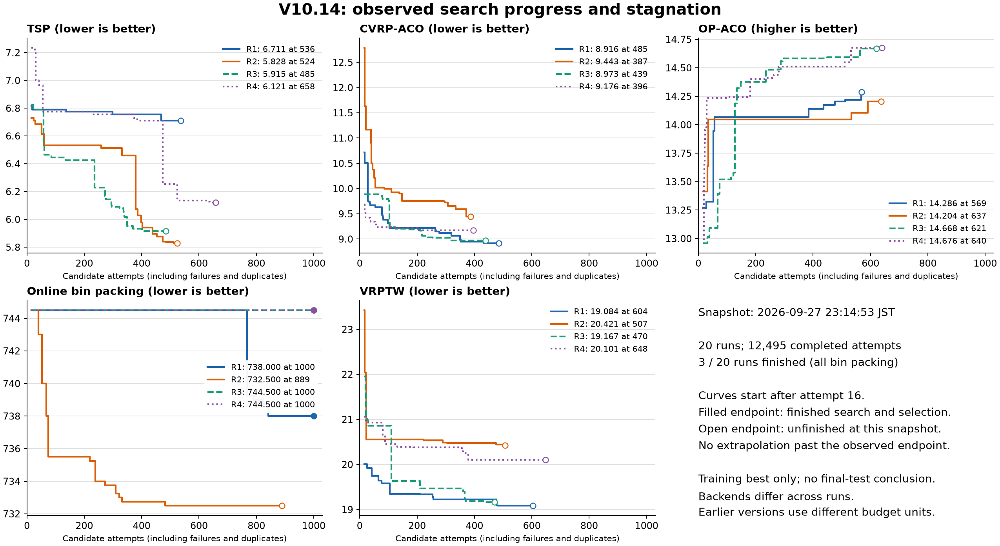

# V10.14：搜索停滞、跨路差异与历史强版本的机制诊断

## 判断与证据边界

当前主要问题是：**搜索尚不能稳定地发现可开发的算法结构，也没有可靠地把同分或暂时退步的结构送入后续开发。** 质量冠军、有限行为探针、保结构迁移和短试用相互作用，使大量预算留在已有决策方式附近。局部重验目前覆盖很低，尚未承担起推进全局纪录的作用。与此同时，Idea 提取和传递确有信息损失，生成代码也有局部集中的运行错误；但现有证据不支持把整体停滞归因于服务故障或辅助函数被统一丢弃。

这是对一次进行中批次的探索性诊断，不能当成完整版本排名或机制因果消融。以下严格区分日志事实、可复现的实现行为和待验证解释；没有修改运行中的策略、提示或评价器，也没有新增模型调用。

### 快照与可复核材料

- 批次：`20260927_v1014`，五任务各四路。
- 快照边界：**2026 年 9 月 27 日 23:14:53（Asia/Tokyo）**，固定每份 `search.jsonl` 的读取字节数；只读取该边界内完整 JSON 行。
- 主计数使用不可变 `attempt`，不重复计入 `candidate` 兼容投影；票级统计只使用已结束 `session`。
- 共 **12,495 次已完成候选尝试**。此时仅装箱 Rep 1、3、4 完成搜索及选择；其他路次尚未完成。训练历史最好值不等于最终独立选择结果，更不等于 held-out 成绩。
- 本地复核工件：[快照清单](../../experiments_result/traceaad_v10_14/analysis_20260927_diagnosis/manifest.json)、[逐路统计](../../experiments_result/traceaad_v10_14/analysis_20260927_diagnosis/summary.json)、[细节检查](../../experiments_result/traceaad_v10_14/analysis_20260927_diagnosis/details.json)、[统计脚本](../../experiments_result/traceaad_v10_14/analysis_20260927_diagnosis/audit.py)。原始结果目录按仓库惯例仅保存在本机。

## 1. 现象确实存在，但要区分阶段差异与终点差异

下表为原始任务目标值；OP 越高越好，其他任务越低越好。括号内为已完成候选数。

| 任务 | Rep 1 | Rep 2 | Rep 3 | Rep 4 |
|---|---:|---:|---:|---:|
| TSP | 6.710856（536） | 5.827686（524） | 5.915243（485） | 6.121429（658） |
| CVRP | 8.915846（485） | 9.442604（387） | 8.972848（439） | 9.176368（396） |
| OP | 14.286（569） | 14.204（637） | 14.668（621） | 14.676（640） |
| 装箱 | 738.00（1000，完成） | 732.50（889） | 744.50（1000，完成） | 744.50（1000，完成） |
| VRPTW | 19.083912（604） | 20.420536（507） | 19.166523（470） | 20.101175（648） |

用户提到的 TSP“582/671”和装箱“7445”，在日志中对应约 **5.82/6.71** 与 **744.5**。装箱后两路从候选 1 开始就是 744.5，到候选 1000 没有一次严格刷新纪录，确实不是曲线显示遗漏。



图从候选 16 起画，保留之后的全部突破；空心终点表示尚未完成，实心终点表示已完成。没有把未完成曲线延伸到 1000。

TSP 的差距也不只是进度不同：对齐到候选 300，四路分别为 **6.754435、6.513255、6.090923、6.754435**。但这仍不是同质后端的四次重复：TSP Rep 1 为本地 GGUF，Rep 2 为 server3，Rep 3/4 为 server3b。后端、量化、采样随机性和搜索轨迹相互混杂。不能仅凭四路的极值差把全部波动归给控制器；本地后端的装箱 Rep 2 反而是当前四路最好，也不支持“本地模型普遍更差”的简单解释。

比较历史版本还需统一两项口径：旧版主要计评价调用，V10.14 计候选尝试，失败与重复也占预算；V10.14 的 ACO 包装器把 `aco_seed=1234` 加上面板种子 `730241`，实际求解器种子起点变为 **731475**。旧版的 1234 与本版不是同一评价随机流，ACO 原始训练成绩应在同一面板重评后再用于严格比较。实现见 [SeededEvaluation](../../traceaad/v10_14/evaluation.py) 与 [共享任务配置](../../experiments/infra/base.py)。

## 2. 装箱停滞已经能定位到具体闭环

### 2.1 大量代码变化没有离开原有决策

装箱 Rep 3 的初始冠军含：

```python
leftover = bins_f - item
score = -leftover - 1e-6 * bins_f
```

对固定物品，等价于按 `item - (1 + 1e-6) * bins_f` 最大化，仍选择可行箱中剩余容量最小者。修改这种正比例权重或添加不改变排序的项，不能改进实际装箱选择。Rep 4 的初始冠军 `-(b-item) + 1e-9*b` 同样如此。

实际并非所有子代都行为等价，但平台占比很高：

| 路次 | 有分数候选 | 其中仍为 744.5 | 主干父代使用 | 明确 Pivot 请求 |
|---|---:|---:|---|---:|
| 装箱 Rep 3 | 982 | 881 | 789 次主干全部来自节点 1（401 次）或 15（388 次） | 46/1000 |
| 装箱 Rep 4 | 964 | 844 | 节点 1 被使用 462 次；另有 246 次来自节点 418 | 50/1000 |

Rep 3 的 334 次 donor 使用全部在节点 1 与 15 之间切换；其余档案并没有通过参考通道打破主导方式。Rep 1 的 792 次主干中，也有 468 次来自最初的节点 1，直到较晚才出现改善。

### 2.2 同分保留最早冠军，与挑战者门槛合成了通道堵塞

[Frontier](../../traceaad/v10_14/frontier.py) 的实际规则是：

1. 只有严格高分子代才能替换冠军，同分保留更早程序。
2. 挑战者需要不同源码、足够接近冠军的质量、非零探针距离，并且源码没有用过试用机会。
3. 主干只从区域冠军出发；普通退步子代不会成为下一次主干的工作程序。
4. donor 排除相同探针向量；试用出现过的各步源码会记入 `tried`。

这些规则各自有动机，但组合后的结果是：**一个同分、探针相同、内部结构不同的程序，不能成为冠军、不能成为挑战者，也不能作为该父代的 donor。** 它还在档案里，却可能失去后续发展通道。[最小复现](../../experiments_result/traceaad_v10_14/analysis_20260927_diagnosis/microchecks.json)确认，不同源码、同分、同描述向量的节点 2 入档后，冠军仍为节点 1，挑战者为空。

这不是自动要求保留所有中性变化。同分程序有的只是格式变化，有的可能提供后续改进接口；当前表示没有可靠区分两者。只依据前几个公共状态判为“没有行为新意”，可能提前排除后续才显效的变化。

### 2.3 有界停滞折扣不能自动让同分平台重新开放

主干权重为质量秩的平方反比乘 `max(0.25, (1+f/8)^-0.5)`。停滞计数达到 120 后，折扣不再下降。装箱 Rep 3 两区最后的停滞数为 401 与 388，冠军质量又同为 744.5，因此两区再次近乎等权。它会继续在这两个起点之间抽样，不能据此期待“投入越久、越会主动换结构”。

初始化后区域参考固定，四路装箱都只形成两个区域，后续不会因为新程序出现而扩成八个。这个事实本身不是失败；问题在于两个区域是否代表值得持续发展的不同决策方式，以及是否还存在其他可靠入口。

## 3. 行为探针存在双向失真，已经影响准入与信息流动

### 3.1 装箱：箱索引差异被当成算法差异

装箱探针记录前若干名的**数组索引**。对 Rep 3 的冠军 1 与 15，在本版原有 16 个公共状态上重新执行：

- 48 个排序索引中有 **33 个不同**，距离为 **68.75%**；
- 16 次第一选择对应的剩余容量完全相同；
- 16 组前三名对应的剩余容量也完全相同。

结果见[原探针回放](../../experiments_result/traceaad_v10_14/analysis_20260927_diagnosis/obp_probe_replay.json)。在这些状态上，系统把相同容量箱的不同身份、平局次序看成了很强的差异。这不能证明两个程序在所有输入上等价，却足以说明该距离包含与装箱资源状态无关的差异。随后两者长期相互做 donor，说明这个表示问题确实进入了搜索闭环。

探针只取 best-fit 轨迹前 32 个物品中的四个时点，每个状态使用 128 个箱；训练任务则含 1000/5000 个物品。大量空箱平局与对后期孔洞状态的覆盖不足，是同一个观测设计的两个限制。

### 3.2 ACO：相同排序不等于相同采样行为

ACO 使用 prior 的数值比例影响采样，而当前描述只保留每行前三名的排序。例如 `[1,2,4]` 与 `[1,4,16]` 排序相同，归一化权重却从约 `[0.143,0.286,0.571]` 变成 `[0.048,0.190,0.762]`。最小复现确认当前 `describe_decision` 将它们表示成同一个向量。

实际日志也有强反例：CVRP Rep 2 的相邻候选 **152 与 153** 探针向量完全相同，训练目标值却从 **24.234046 改善到 9.778494**。真实 diff 主要移除了压缩数值对比度的 tanh 混合归一化，恢复均值归一化。这个实例不能把全部差异解释成一个普适因果系数，但同一评价协议上的巨大差距说明：排序描述并未测量 ACO 关心的全部行为。

高分候选 153 仍能通过质量门槛入选，所以不是说这种改进被一律拒收。问题是，同排序候选若暂时没有提高总分，会被挑战者和 donor 门槛排除；当前硬门槛所依赖的等价关系不成立。

### 3.3 TSP：早期状态看不到精确尾部求解的变化

TSP 探针只覆盖四个训练实例的前三步，即约 49、48、47 个未访问节点。`n <= 12` 等精确尾部模块不会在这些状态激活。以这种描述向量判断尾部算法“是否不同”，证据不足。实际训练分数仍能接纳立刻提高成绩的尾部修改，但不能据同探针结果排除它们作为中继或互补参考的价值。

因此当前更准确的结论是**行为测量与门槛职责不匹配**，不能笼统归结为“行为多样性没用”。先校准描述的任务含义，再决定哪些位置允许把它作为硬准入条件。

## 4. 试用投入不等于新结构覆盖，也不等于全局突破

### 4.1 显式探索入口比历史版本窄很多

[生成合同](../../traceaad/v10_14/traceaad.py)只在“本次试用没有现成挑战者、需要发现方向”的第一步调用 Pivot。已有挑战者直接进入 Refine/Tune/Transfer；另外两步也是开发动作。主干不调用 Pivot。

因此，即使试用达到最终候选预算的约 20%，全部试用都用于发现，三步票也只允许约 **6.7%** 候选显式执行 Pivot；一部分票用于已有挑战者后，比例继续降低。当前实际为 **503/12,495，4.03%**。V9.14 的 Explore 合同占 30%，V10.11 的 Pivot 占 25%。这些比例差异是实现事实，但算子语义不完全相同，不能直接解释为效果差异的因果估计。

尤其要注意：Refine 也允许结构修改，TSP 当前的关键突破就来自 Refine。这里衡量的是**明确要求重新考虑核心结构的机会**，不是把所有实码结构变化都归到 Pivot。

### 4.2 当前票级改善大部分没有跨过全局前沿

900 张已结束试用票中，318 张超过发票时的区域／祖先参照，只有 **32 张至少一次刷新当时全局纪录**。不能用 318/900 代替全局突破率。

装箱最明显：259 张已结束票消耗 777 个候选，18 张有局部净收益，**没有一张产生全局纪录**。Rep 4 的一些“成功票”把区域参照从 3000 箱恢复到 744.5；这是局部真实改善，但没有超过第一轮就已有的全局最好。

这说明试用并非没有运行，也不是统计代码把局部回弹伪称全局突破；实际已经分别记账。它暴露的是机会分配目标与有限预算收益之间的张力：低质量区域能产生很大的局部进步，却可能永远到不了竞争前沿。

反例也必须保留：TSP Rep 2 的候选 512 正是试用中的 Transfer，把候选 377 的尾部精确求解与 donor 484 的强结构结合，刷新到 5.827686。因此不能据低总体命中率直接删除全部连续试用；需要比较同预算替代方案，并找出哪些入口值得获得后续机会。

### 4.3 算子标签不能代替机制执行证据

1516 次 Tune 请求中，922 次被现有诊断标记为“产生结构语法变化”。这个 **60.8%** 不是语义层面的违规率：新增辅助赋值或调整 docstring 也可能触发。但它足以说明，不能把 Tune 日志直接当成“只做数值校准”的干净处理臂。

显式数值赋值检测也不能判断某个常数是否真正控制决策：`eps`、初始化计数和有效机制参数可能同时进入提示。若要比较便宜、保结构的参数精炼，需要实际限制改动对象或做语义相关检查，而不是只更换动作名。

## 5. 局部重验目前不是推进搜索的主要动力

| 任务 | 已完成比较 | 不可精确重建的不同检查 |
|---|---:|---:|
| TSP | 4 | 232 |
| CVRP | 10 | 249 |
| OP | 18 | 279 |
| 装箱 | 0 | 116 |
| VRPTW | 6 | 231 |
| 合计 | 38 | 1107 |

重验与直接后续一共消耗 **76 个候选，占全部已完成尝试 0.61%**。38 次已结束重验会话中，9 次对照优于当前程序，12 次直接后续优于其实际父代，但**没有一次在这两步内刷新全局纪录**。后续更远的间接贡献尚未做谱系归因，不能据此说全部重验证据永久无用。

1107 是对活动状态、证据可装入等前置条件成立后的不同失败检查数，不是全部可能路径的分母。不能据此计算总体可闭合率。所有这些拒绝都记录为唯一文本匹配失败；完整代码重写、交叠修改、同一行反复调整都会使精确交换困难。

目前没有发现重验失败仍偷偷消耗了预留的完整 10% 候选预算；无可用对象时机会回到其他通道。问题主要是**核心研究机制的可用性和决策价值**：多数搜索并未真正得到重验证据，因而不能把完整版本成绩称为充分检验了“轨迹条件化局部重验”。

还有适用范围的收缩：当前只检查活动冠军／挑战者最近相邻两次修改，无法直接覆盖经过多步开发后才失效的早期组件。严格对照身份有必要保留，但不能指望它替代结构发现或普遍解决长平台。

## 6. Idea 的问题不止长度，还有存储与后续可见性

用户的历史记忆有依据。提交 `7a4c6404`（2026-09-14）把 V10.11 的 Idea 从最多 200 词改为短机制摘要，并使用 tokenizer 检查 **500 token** 上限；更早的 V10.10 修订 `c3850bdb` 也曾放宽说明表达空间、取消说明作为有效代码的准入门槛。

当前实现存在四个分开的限制：

1. **生成提示**要求可选 Idea 为一两句，见 [prompts.py](../../traceaad/v10_14/prompts.py)。
2. **提取**只匹配 `Idea:` 所在第一行，随后截为 1000 **字符**，不是 500 token，见 [edits.py](../../traceaad/v10_14/edits.py)。多行机制描述后半部分不会进入 `idea`。
3. **格式**不识别常见的 `**Idea:**`。本快照有 152 次归档 Idea 为空、原始响应却含这种加粗标签；另有 51 次保存的 Idea 到达 1000 字符截断边界。空 Idea 共 1952 次，其中有些确实没有说明，不能都算解析缺陷。
4. **传递**：普通当前程序标题只显示锚点和分数；形成事件传递 diff、前后分数、符号和协议，不含原始 Idea。试用假设才读取候选 Idea，且只取前 600 字符。源码注释可能保留部分意图，但这不等于有稳定的显式意图通道。

最小回放已确认：两行 Idea 只保存第一行；相同文本换成加粗标签则存为空；有效代码仍能执行。属于**可复现的信息提取／保真缺陷**。单纯把生成提示改成 500 token，不会修复后续丢失。

我支持把表达空间恢复为“足够说明机制，最多 500 token”，而不要求填满。可让摘要说明：改变哪个计算、为什么可能改变真实选择／采样、保留什么、关键成本或失败条件是什么。历史材料仍需注明意图未经验证，并与实码和成绩分开。

但历史好成绩不证明长度的因果效应。V10.11 同时具有不同的选父、动作比例与短形成历史；其 `idea_code` 臂比较的是历史中是否提供完整代码，不是长短 Idea。需要分别检验“当次生成多写一些是否有用”和“后续完整读到前次意图是否有用”，不能把二者混成一个文本长度开关。

## 7. 辅助函数、错误与工程实现：已确认什么，未确认什么

### 7.1 没有复现辅助函数被模板剥离

当前 Full 解析保留完整代码块，仅显式补任务 imports；评价器在独立命名空间执行整份源码。这与早期只抽取目标函数再塞回模板的风险不同。

离线对照原始单代码块与实际提交源码，发现 **18 份含多个顶层函数／类定义的响应，未发现定义名称被丢掉**。最小例子中 `score(x)` 调用顶层 `helper(x)` 也正确返回。历史上确实有 `f6b0b148`（2026-07-25）这样的修复，允许合法辅助函数并保留任务导入；不能据“以前修过”就假定本次故障仍是同一环节。

本次检出的 19 条 `name ... is not defined`，相应名称没有在原始响应中作为函数定义出现。已逐例检查的典型问题是生成源码自身残留未定义变量／伪代码，例如 `i_placeholder`、`curr_a_idx`、`v_u_plus_dest` 和 `residuals`。若模型把 helper 放进第二个代码块，当前协议会明确拒绝多块响应，而不是默默保留主函数后漏掉 helper。这也是交付失败，但应单独分类。

因此，当前能给出的判断是：**完整性检查仍不充分，但未证实整模块交付回归为丢辅助函数。** 若后续有特定失败样本，应按“原始回复 → 解析后源码 → 评价源码 → 导出／展示”逐段比较，不能仅凭 NameError 定位问题。

### 7.2 整体错误不高，TSP 的局部损失很重

全部尝试中有 116 次交付失败、350 次评价失败、3 次服务错误，合计 **469/12,495，3.75%**；794 次重复源码另计，为 6.35%。整体仍不支持大面积基础设施故障导致停滞。

但 TSP 四路失败合计 **235/2203，10.67%**。Rep 2 有 **105/524，20.04%** 失败，其中 54 次评价超时；Rep 3/4 也各有 30/34 次超时。这是实质性的预算损失。101 次交付失败则是未满足“唯一闭合 Python 块”的契约，不能全部解释成模型完全没有生成可用计算。

重要反例是：错误最多的 TSP Rep 2 反而质量最好；失败很少的装箱后两路完全停滞。因此修复错误能提高有效预算，却不能单独解释、更不能保证解决结构停滞。复杂结构本身更容易超时，失败与潜力有关联；需要用离线隔离重评区分程序复杂度和并发资源竞争，而不是统一调大超时或把所有失败方向降权。

还有 35 次装箱 Rep 4 的有效评价在公共探针阶段报告非有限输出，训练分数仍保留、描述向量置空。候选 418 即包含 `-inf`。这是实际评价器与探针有限性条件的差异，也会影响挑战者资格，应与运行失败分开记录。

## 8. 历史强版本如何取得优势

主要依据已有的[五任务强结果形成路径](2026-09-09-强结果形成路径.md)，并重新核对相关实现历史与本版关键突破源码。这里的“强版本”指仓库协议下的已观测强结果，不宣称某个版本在所有任务、规模和资源约束下都是 SOTA。

| 任务与代表结果 | 已观测的有效结构与开发过程 | 对当前诊断的意义 |
|---|---|---|
| TSP，V9.14 | 三路最终程序在选点函数内部构造剩余路径并做 2-opt，再返回第一步；多起点、插入与扫描策略提供精炼空间。Rep 2 在评价 24 发现关键结构、28 到 5.8654，211 到 5.7378。 | 需要从局部评分进入更强的剩余子问题求解结构。进入后仍需持续精炼。 |
| CVRP，V9.7 的可复核 Qwen3.6 批 | 需求、反距离、节约、角度与容量信号长期协调。Rep 3 在 173 引入结构、245 到 8.7961、286 到 8.6181、694 到 8.5374；最终变化包括距离条件化角度带宽。 | 有效骨架后的参数与条件响应是实质工作；保留可开发路线比反复组合抽象名称重要。 |
| OP，MCTS-AHD；另见 V10.1 | 最好程序反复组合 prize/distance 幂次、预算余量和奖赏／邻近修正，e2 跨程序迁移与数值精炼共同出现。 | donor 的计算和比例必须真正改变 ACO 采样，不只改变排序或注释。不能单独归功 UCT。 |
| 装箱，CALM w/o GRPO | 固定 seed、LLM 编辑、注入／交叉与 `numeric_refine` 并用；数值修改真实改变幂次和选箱关系。三路最终 724.75/724.25/724.50；含 `score[1:] -= score[:-1]` 的非独立逐箱计算。 | 强程序离开了纯单调 best-fit。便宜的保结构数值搜索值得比较，但此成绩不是 GRPO 的证据。 |
| VRPTW，V9.19 | 迁入容量／时间窗下的多步贪心前瞻，再修正等待与提前终止等评价项。Rep 3 的退步节点 n688 后来继续开发到 18.6257。 | 临时退步结构需要可重新进入开发的通道；不代表每个退步方向都应无条件续跑。 |

“历史好版本总在很早取得效果”需要修正。V9.14 的另外两路分别到评价 **676、844** 才出现关键剩余路径结构，最后最好在 955、848；CVRP、VRPTW 也有很晚的精炼。历史成功的共同点是找到结构后确实继续开发，而非全部早熟。

本版也出现相同的结构分界：TSP Rep 2 在候选 332 时还是 **6.460253**，候选 **379** 把大尾部评分换成剩余路径构造加 2-opt，前沿变为 **6.074910**；后续协调到 **5.827686**。Rep 1 则仍主要发展选点评分和小尾部精确计算。这比单看平均超父率更能解释两路为何分开。

历史 TSP 优势还有一个边界：生成算法内部计算明显变多。应同时报告设计预算和生成算法的求解时间；相同函数接口与统一超时并不等于相同推理计算量。最好链和多版本挑选也有幸存者偏差，不能用它们证明某项调度机制必然有效。

## 9. 问题分级与最小关键检验

| 判断 | 类型 | 当前证据强度 |
|---|---|---|
| 多行／加粗 Idea 丢失，字符截断与预期 token 上限不一致 | 信息提取实现缺陷 | 已复现，有真实响应计数 |
| 正常形成事件不传原 Idea，显式 Pivot 入口大幅收窄 | 设计与历史有效条件的偏离 | 代码与实际请求一致；效果贡献未分离 |
| 探针索引／排序被当成行为等价依据 | 表示与门槛的机制缺陷 | 装箱真实回放、ACO 实例与最小反例支持 |
| 同分早期冠军、固定区域、有限停滞折扣形成反复重访 | 搜索机制不足 | 完整装箱运行直接支持；替代规则净收益待检验 |
| 三步试用大量只恢复局部质量 | 发展机会与全局目标的偏差 | 已按票核算；其他任务有真正成功反例 |
| 严格重验覆盖低、暂未贡献直接全局突破 | 核心机制可用性／价值不足 | 本快照成立；不能推断长期间接收益为零 |
| 辅助函数被统一从模板丢弃 | 尚未证实的故障解释 | 当前对照未复现，不应当作已定位根因 |
| 更长 Idea 一定更好，或局部后端一定更差 | 待检验解释 | 当前证据不足以做因果结论 |

下一轮不宜同时重写全部模块。优先做能区分根因的检验：

**第一步：先完成信息与交付保真的离线检查。** 用本快照的全部 116 份交付失败、152 份空归档但带加粗 Idea 的响应，以及多行和 helper 合成例子组成固定回放集。分清“代码本就缺失”“多份程序有歧义”“无歧义程序只因包装被拒”；解析改进不得擅自替模型选择版本。Idea 按完整说明保存、按 tokenizer 测量，超过展示预算时显式标记裁剪；有效代码不因可选说明格式失效。这一步验证保真，不宣称提高搜索质量。

**第二步：区分结构到达与拿到结构后的开发能力。** 在同一后端上，TSP 固定一个局部评分起点和一个 2-opt 起点，装箱固定一个 best-fit 起点和一个历史非单调起点。每个起点比较现行政策与一个恢复显式结构探索、同分中继机会的简化政策，各用 4 条独立随机流、每条 100 个候选，即两任务共 1600 个候选上限。等候选预算为主分析，同时记录评价调用、token 与墙钟；使用固定评价面板。先冻结历史程序清单，不按后续效果挑选。

主要指标为超过起点与发票时全局参照的成功率、训练最好值曲线面积、到达预定质量门槛的时间，以及冻结后独立选择／测试表现；程序运行成本和无效率单列。若强起点在现行政策下仍能继续改善、弱起点反复失败，则优先解决结构到达；若强起点也无法发展，则优先查生成上下文和保结构开发。四重复只作为筛选，效应不清晰就保持未决，不通过挑最好一条决定升级。

**第三步：把 Idea 的两个作用拆开。** 先在 TSP、装箱各固定 12 个按早／中／晚阶段分层、与后续成败无关的锚点，每锚点两条采样流。做 2×2 对照：当次输出“一两句／最多 500 token”，历史意图“现行投影／完整但有界保留”。固定父代、算子、donor 和其余证据，总计 192 次生成。统计无条件超父／超冻结前沿、无效率、实际决策变化与 token 成本；按锚点聚类估计不确定性，不把候选当独立实验单位。若仅语言更长、相同成本下质量不增，就不继续扩文本。这个试验不与主搜索策略变化捆绑。

**第四步：先校准行为门槛，再测其搜索价值。** 装箱将箱索引映射为所选剩余容量／残余状态，显式处理同容量平局，并补充中后期状态；ACO 加入归一化概率或对比度信息；TSP 补充尾部状态。用冻结程序集检查排序保持变换、平局置换与已知得分差异的反例。对照“原描述硬过滤／校准描述／仅软参考”，但不要让更大描述维数自动取得更高多样性奖励。若校准没有改变错误准入／排除，就先不增加在线成本。

**第五步：重验单独证明信息价值。** 在有精确闭合对象的固定分叉状态上，使用相同对照程序、相同后续起点和相同真实成本，只改变后续是否看到组织化比较；另配同成本普通生成。预先限定直接和后续窗口。若收益仅来自回滚程序本身，就保留回滚能力并收缩“证据改善设计”的主张；若可用机会持续很少，就保持可选通道，而不为让它成为主贡献继续堆设施。

当前最值得恢复的能力是：**能进入强结构，能让有希望的中间态继续发展，能用真实决策变化检验修改，最后以独立测试和资源成本判断成败。** 更丰富的 Idea 与更严谨的历史证据都应服务于这条链，不能用字段数量、局部净收益或重验次数替代它。
