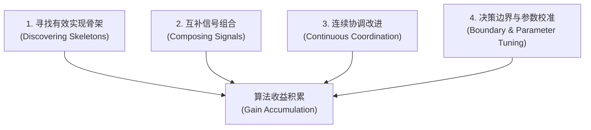
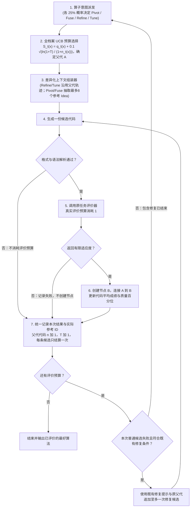

# 算法设计任务的收益形成结构与上下文组织研究认识

**日期**：2026-09-17  
**状态**：核心理论与机制认识文档 / 论文主线沉淀  
**核心研究对象**：大语言模型驱动的自动算法设计（LLM4AD）中，不同任务的算法收益如何形成，以及搜索历史应如何组织以服务于下一次算法修改。  
**关联实验**：TraceAAD V10.11 四组全完赛消融实验（四批 15/15 全部完赛，共 60 路完整实验：`generic` 短轨迹、`no_traj_idea` 无轨迹、`idea_code` 全代码轨迹、`rand_ctx` 随机档案卡）、历史代表性搜索模式（V9.14、V9.7、V9.19、CALM、MCTS-AHD）

---

## 核心论点与科学主张

在大语言模型驱动的自动算法设计（LLM4AD）中，一个根本性的科学问题是：**为什么不同的算法设计任务在利用搜索历史经验时表现出截然不同的响应模式？**

我们提出核心研究判断：
> **不同算法设计任务及不同搜索状态具有不同的收益形成结构。TraceAAD 应根据当前程序怎样影响求解决策、既有收益怎样形成，以及下一次修改需要延续、组合、校准还是替换什么机制，从搜索历史中组织相应证据，并进一步决定新方向是否值得获得后续开发机会。**

回答这一问题需要确立三项认知基石：

1. **区分“程序继承关系”与“算法收益形成机制”**：
   - `Refine / Fuse / Pivot` 描述的是**新程序与已有程序之间的通用继承关系语义**（保留并改进、组合多个来源、更换主要思路）。它们是通用的动作语义，可以在任何任务中被调用。
   - 但通用算子本身不能回答：为什么这个任务上的某些修改容易积累收益？哪些算法思想能够组合？哪些决策变量必须保持协调？什么时候应该放弃当前路线？
   - 答案取决于任务中**候选算法改变求解决策的微观机制**与**高质量算法收益累积的宏观过程**。
2. **大模型的“任务运行直觉与算法决策模型”**：
   - 大模型在生成算法时，依赖其根据任务说明、代码接口和历史实验在内部推测的**任务运行直觉或算法决策模型**：它推测代码中的某行计算会怎样改变下游选择，以及这种选择为什么可能改善最终结果。
   - 例如“距离短好”、“避免超时”、“不要留下小碎片”只是第一层任务语义；真正支撑算法设计的，是进一步理解“距离项与容量项如何竞争”、“返仓阈值怎样改变后续可行性”、“打分公式是否实质改变了 $\arg\max$ 排序”、“权重指数变化如何调节采样集中程度”。
   - 历史上下文的核心价值，就是**帮助模型把这种模糊的任务直觉，转化为对当前算法及其可能修改的更具体判断**。
3. **把任务固定分类转向动态改进需求诊断**：
   - 研究重点不在于给任务贴上孤立、互斥的静态分类标签，而在于**识别当前候选程序正处于何种改进状态，并让搜索历史精准服务于这一次具体的算法修改决策**。

---

## 一、 四类可交织出现的收益形成机制

在自动算法设计中，高质量算法的演化通常受以下四类主要的**收益形成机制（Gain-Accumulation Mechanisms）**驱动。它们不是预设的单向流水线或互斥分类，而是在同一任务的不同演进阶段、不同并行分支中交织出现、共同支撑算法收益的积累：



---

### 1. 寻找有效实现骨架（Discovering Effective Implementation Skeletons）
* **核心机制**：
  - 在开放性较强、缺乏成熟先验的任务中，或者在搜索初期，已有程序尚不存在值得连续开发的核心，或者当前分支已经陷入低效实现的瓶颈。此时的收益产生依赖于**不断尝试不同的数据结构、控制流程或算法实现流派**，直至找到具备进一步开发潜力的基座。
* **实际任务体现**：
  - **Graph Colouring / Max-Cut**：从简单的静态循环贪心，如果不切换到动态饱和度（DSATUR）、冲突边禁忌搜索或破坏重建机制，在原有代码上做细微改动往往难以获得突破；
  - **端到端复杂规划**：探索是将问题建模为数学规划求解调用，还是构建两阶段自适应构造流程。
* **经验需求**：
  - **多样化算法骨架模板、运行约束与已尝试但未产生收益路线的摘要**。此时需要弱化对局部代码细节的记忆，避免思维过度锚定。

---

### 2. 互补信号组合（Complementary Signal Composition）
* **核心机制**：
  - 单一维度的启发式指标存在固有的评价盲区（例如：纯距离导向导致路线交叉，纯几何扫描导致车辆满载率不足）。算法收益的显著跃升依赖于**从不同候选算法中提取具有互补性的计算特征，融合成新的综合决策机制**。
* **实际任务体现**：
  - **CVRP-ACO**：边先验吸引度矩阵通过将相对车场的极角偏度、Clarke-Wright 节约值与容量紧张度非线性项相乘，构成多属性综合引导；
  - **复杂排程与装箱**：将针对解构造的高效启发式（如排序规则）与针对解质量改善的后处理（如局部放置规则）拼装成流水线。
* **经验需求**：
  - **跨分支代表性算法、实际计算逻辑及其表现（Donor Archive）**。单一分支的形成链无法提供盲区之外的视角，需要横向呈现不同分支所挖掘出的机制及其互补收益。

---

### 3. 连续协调改进（Continuous Coordination & Refinement）
* **核心机制**：
  - 关注的是**多个相互依赖、相互竞争的机制怎样保持跨组件的整体协调**。当算法已具备有效基础架构后，后续收益往往来自于围绕该架构微调各决策项之间的动态平衡与交互阈值。
* **实际任务体现**：
  - **TSP Construct**：候选池规模、未访问节点过滤比例以及局部优化的退出阈值之间的联动打磨；
  - **VRPTW Construct**：主批最优程序（如 rep3 优势代码）并非多步前瞻，而是**围绕节约量（Savings）、到达等待时间、时间窗松弛度（Slack Time）以及车辆剩余容量构建的多指标综合评分体系，并配合精巧的返仓判定阈值**。修改其中任何一个权重，都会连锁影响返仓时机与后续违规风险。
* **经验需求**：
  - **形成关系、最近修改内容与前后评价变化（Lineage Trace）**。模型需要理解当前结构为什么演变至此、哪些相互竞争的因素已经被调整过，才能在维持整体协调稳定的前提下推进优化。

---

### 4. 决策边界与参数校准（Decision Boundary Shaping & Parameter Tuning）
* **核心机制**：
  - 关注的是**单个决策函数的行为敏感性：局部公式变化是否真正改变了下游候选选择、排序或采样分布**。
* **关键数学认识与任务体现**：
  - **排序保持性与单调变换**：在 `online_bin_packing` 中，评估器通过 $\arg\max$ 选择箱子。在非负区间内，将残差 $c - s$ 变为幂变换 $(c - s)^p$（$p > 0$）属于严格单调增变换，若无数值溢出，候选排序完全不变，装箱决策亦分毫不变。真正产生突破的，是让残差与物品尺寸或全局容量分布发生**非线性交互**，或者引入**候选间差分项**打破孤立评价的对称性；
  - **下游使用方式决定敏感性**：同一种幂变换，在 $\arg\max$ 决策中毫无效果；但若作为蚁群算法（ACO）的采样权重，则会直接改变采样概率的集中程度（调节探索与利用的偏置）。
* **经验需求**：
  - **局部变化、状态排序/行为变化及相邻失败尝试反馈**。重点反馈代码修改是否实质改变了决策行为，避免大模型在无决策影响的表面代数变换上徒耗预算。

---

## 二、 算法改进需求的四维诊断与上下文证据映射

面对某一次具体的算法演进步骤，搜索系统不应预先假设固定的任务配方，而应针对**当前算法的改进需求**提出四个诊断问题：

1. **连续性（Continuity）**：下一步收益是否依赖理解当前算法的形成过程？
2. **组合性（Composability）**：当前算法是否缺少其他分支已经发现的互补机制？
3. **结构性（Structural vs Parametric）**：现在需要改变主计算结构，还是校准已有公式和参数？
4. **开发性（Exploitability）**：新方向出现后，还需要多少连续修改才能兑现收益？

这四个维度直接决定了上下文应当为模型组织何种历史证据：

| 当前改进需求 | 核心关注点 | 更有帮助的历史经验组织 |
| :--- | :--- | :--- |
| **延续并协调已有机制** | 维持多决策变量的平衡演进 | 形成关系、最近修改内容与前后评价变化（Lineage Trace） |
| **引入互补机制** | 突破单一视角的评价盲区 | 不同分支的算法、实际计算逻辑及其表现（Donor Archive） |
| **校准公式或参数** | 确认代码是否实质改变决策边界 | 局部变化、状态排序/行为变化、相邻失败尝试反馈 |
| **寻找替代实现** | 摆脱低效局部的思维定势 | 多样化算法骨架模板、运行约束、已尝试但未产生收益路线的摘要 |
| **开发刚出现的新方向** | 给予高潜力新结构充分兑现机会 | 新方向的构想来源、后续递进修改机会与累积结果追踪 |

---

## 三、 四批 15/15 完赛实证总对照与任务收益结构

TraceAAD V10.11 的四组全对照（包括 `generic` 短轨迹、`no_traj_idea` 无轨迹、`idea_code` 全代码轨迹，以及 `rand_ctx` 随机档案卡）已全部完成 15/15 完赛（共 60 路完整实验）。

在理论构建中必须确立的首要科学准则为：**严格区分“已经确认的任务差异（事实与实证结论）”与“尚待验证的动态策略（假说与演进设想）”**。

最终实验结果一致支持核心科学判断：
> **五个任务的算法收益形成方式不同，因而偏好的历史证据不同。上下文不是越多越好，也不存在全任务通用的历史结构。形成关系与路径外档案支持不同的算法收益形成过程，适用性取决于当前任务和算法状态。**

---

### 1. 五任务收益形成结构与偏好上下文总表（已确认结论）

| 任务 | 优势算法怎样形成 | 主要改进模式 | 搜索阶段变化 | 当前偏好的上下文 |
|---|---|---|---|---|
| **TSP** | 把单步选点提升为残余路径估计，再逐步优化候选池、2-opt 和计算成本 | 寻找骨架 → 连续协调 → 参数校准，期间仍有 Fuse | 优势谱系存在清楚的“骨架出现后持续开发”过程 | 短形成轨迹 |
| **VRPTW** | 持续协调 savings、等待、slack、容量和返仓规则 | 互补组合 + 连续协调 + 校准 | 没有明显上下文反转，短轨迹从早期到后期都领先 | 短形成轨迹；全代码有高上限但方差大 |
| **CVRP-ACO** | 建立多信号边先验，再传播、组合和校准优质机制 | 互补组合 + 连续精炼 + 参数校准 | 档案早期不稳定，形成优质算法族后开始明显领先 | 质量偏置的跨分支档案 |
| **OP-ACO** | 奖励、距离、预算可行性与空间结构逐步组合并调参 | 互补组合 + 参数校准 | 全代码组三路都在 E500 后继续改善，但泛化优势按规模分化 | 形成历史可能有用；是否需要完整代码尚未定论 |
| **OBP** | 改变 `argmax` 的实际排序边界，偶尔需要替换整个评分骨架 | 决策边界塑形 + 寻找骨架 + 局部校准 | 有晚期 Pivot 突破，也有较早的 Fuse/Refine 路线，不是统一阶段 | 无形成轨迹或档案参考 |

---

### 2. 分任务实证微观解剖与机制真相

#### (1) TSP：确有“发现后精炼”，但不能推出“前期应关闭轨迹”
- **优势谱系与持续开发事实**：
  TSP generic rep1 的优势谱系清晰呈现了高阶决策骨架的连续演化链条：
  $$\text{1-Tree} \longrightarrow \text{Pivot 到残余路径估计} \longrightarrow \text{引入 2-opt} \longrightarrow \text{向量化降低成本} \longrightarrow \text{扩大候选池并调参}$$
  最终优势节点 293（分数 5.790）的提示词中能完整看到最近 8 条形成边（涵盖 Pivot、Refine、Tune、Fuse 及其对应的前后分数）。rep2、rep3 的最终优势谱系也均逐步收敛至“残余路径估计 + 有界 2-opt”的高层决策骨架。因此，**短形成历史支持高上限骨架的持续开发，这不是单条幸运路线**。
- **客观纠偏：关于“前期无轨迹更好”的统计真相**：
  在 E100 聚合数据上，无轨迹批均值（6.2158）看似好于主批（6.4175），但这主要是由 generic rep1 在早期的单路离群（6.824 vs 6.174 / 6.255；而 no-traj 三路分别为 6.194 / 6.191 / 6.262）拉低所致。除 rep1 外，其余两路并无实质差距。并且 generic 自身在带轨迹约束下也独立通过 Pivot 发现了新骨架。
  **科学界限**：现有实验中四组上下文从头到尾是静态固定的，训练曲线在局部的交叉**只能提出“前期是否适合无轨迹探索”的动态切换假说，而绝不能直接证明动态切换策略有效**。
- **轨迹信息的机制边界**：
  当前系统的轨迹展示成功评价并入档的祖先，其中也包含退步和持平版本，但不包含解析失败、超时及其他评价失败的候选。它提供的是**当前算法如何形成、哪些修改曾带来收益或退步**，可以作为后续修改的经验；不能据此认为模型已经看到了运行失败的尝试。运行失败反馈属于另一类上下文，本轮 V11 不增加该机制。

#### (2) VRPTW：形成历史更像是维持多规则协调
- **多规则协同事实**：
  generic 的三条优势谱系均非单一的局部参数微调：
  - rep1、rep2 大量通过 Fuse 引入或重构了节约量（Savings）、时间窗（Time Window）和剩余容量信号；
  - rep3 随后连续调整了综合评分项、返仓判定阈值与容量缩放因子；
  - 最终的搜索 best 分别由 Fuse、Fuse、Refine 产生。
  演化轨迹体现出清晰的闭环机制：
  $$\text{组合有效规则} \longrightarrow \text{保留组合结构} \longrightarrow \text{连续协调和校准}$$
- **实证结论与边界**：
  短轨迹在所有聚合预算点（E100~E900）均领先无轨迹（20.008）和档案参考（20.129），在 held-out 三规模测试上也全面领先或持平。可直接报告的结论是：**本次短形成轨迹方案优于质量偏置档案参考方案**。档案节点与当前算法的相关性尚未测量；形成历史是否通过维持内部多规则协调产生收益，仍需具体代码与行为对照来解释。

#### (3) CVRP-ACO：档案有效，但更像“精英经验传播”，不只是多样思想碰撞
- **实证事实**：
  CVRP 档案组最终三重复训练值达到 8.684 / 8.571 / 8.590，held-out 三规模（8.9799 / 15.2913 / 27.7452）也全面大幅领先于 generic、no_traj 与 idea_code。这一高度的一致性足以排除“只靠单次偶然突破”的轻率解释。
- **机制真相：优质算法族的跨分支传播**：
  深入解剖后期被采样的档案卡发现，它们往往已经演化为同一个优质算法族的近似变体：全部包含距离矩阵、Clarke-Wright 节约值、极角连续性、容量衰减和车场锚定（Depot Anchoring）项。并且最终的三路 best 分别出自 **Refine、Tune、Refine**。
  更准确的机制应当表述为：**档案上下文不仅带来了跨分支机制，更将已发现的优质算法族高效传播到其他并行分支，形成了高密度的反复比较、组合与参数精炼**。
- **科学界限**：
  当前 `rand_ctx` 是按照质量排名（Softmax, $\tau=8$）进行抽样的，并未施加显式的多样性排斥约束。因此它验证的不是“算法库越多样越好”，而是**路径外的高质量精英经验比单线祖先链更适合 CVRP 这类需要多特征集成的任务**。

#### (4) OP-ACO：目前最适合作为边界案例
- **实证事实**：
  全代码轨迹组三路在 E500 之后分别继续提升了 0.118、0.460、0.298，而 generic 仅有 0、0.030、0.058，确实展现出“完整实现细节支撑后期深度开发”的微弱信号。
  但在 held-out 泛化上，全代码组仅在 50/100 规模取得最优，200 规模最优却属于无轨迹组；档案参考组在 OP 上表现最差（三规模最低且方差四方最大 $\pm 4.48$），甚至生成了一个实测复杂度高达 $O(n^3)$ 的病态重型程序（单 unit 评测耗时 4.16 小时）。
- **科学界限**：
  OP 倾向于已有信号结构的组合与精细校准，形成历史可能具有辅助价值；但完整代码是否是必要上下文，现有证据仍不够稳定，故最适宜作为上下文敏感性的边界案例讨论。

#### (5) OBP：存在直接的跨分支经验吸收证据（语义催化）
- **微观个例真相（Node 786 $\to$ Node 789）**：
  在档案参考批 rep1 中，诞生全场最优解（724.75）的第 832 次评价是全批次最清晰的微观证据：
  - 当前父代 Node 743（得分 725.25）仍以 `exp(-residual)` Best-Fit 为主干，仅有弱高斯孔洞加分；
  - 采样的跨分支参考卡中包含此前被评估为次优（725.75）的 Node 786，其 Idea 明确诊断出 **“residual-myopic（残差短视）”** 机制缺陷，并提出 `residual >= item` 的可复用孔洞概念；
  - 新节点 Node 789 复用了该问题诊断，并在代码中真正落实了 `reusable = r >= sz` 与强复用加分项，触发 Pivot 破局成功。
  - **这证实了路径外参考经验不仅停留在 Idea 层面，而且实质进入了生成代码并重构了决策边界**。
- **关键个例与跨重复表现**：
  单次突破确实具有依赖恰好抽到 Node 786 的偶然性。但系统性证据来自另外两路：它们并未复制同一个 Pivot，而是通过 Fuse 与 Refine 分别获得了 726.0 和 725.25，三路整体及 held-out cap=500 均大幅好于带轨迹组。
  **结论**：该个例显示路径外参考中的具体思想可以进入新代码；跨重复结果支持将档案参考作为有价值的经验来源，但尚未直接测量模型吸收有用机制的概率。

---

### 3. 算子是否偏好特定上下文？（局部父代改进率 vs 全局前沿推进）

在已记录的训练过程中，档案组在以下四个任务上的 `Pivot` **局部父代改进率（Local Parent Improvement Rate）**高于短轨迹组：
- **TSP**：档案组 21.8% vs generic 主批 16.1%
- **CVRP**：档案组 19.0% vs generic 主批 9.0%
- **OP**：档案组 23.5% vs generic 主批 11.0%
- **OBP**：档案组 17.8% vs generic 主批 9.5%

#### 核心警惕与科学界限：局部改进 $\neq$ 全局前沿突破
尽管档案组的 `Pivot` 局部父代改进率更高，但**超越当前父代不等于刷新全局最好成绩，也不等于该新方向能够获得持续的后续开发**：
- TSP 和 OP 的档案组虽然局部父代改进率更高，但全局最终表现反而弱于主批；
- VRPTW 档案组的 Refine 和 Fuse 局部改进率亦不低，但可能的解释是缺乏协调主线，终点依然落后。

因此，当前数据支持的可靠结论是：
1. **形成轨迹更有利于维护和深入开发当前算法族**；
2. **档案参考提高了接触路径外机制和传播精英经验的机会**；
3. **这种催化作用可以通过 Pivot、Fuse、Refine、Tune 中任何一个算子发生，而非与某单一算子机械绑定**；
4. **算子与上下文的最佳配对关系，仍需通过后续控制父代、控制算子的专用锚点实验严格确证**。

---

## 四、 算法改进模式与算子设计的映射构思

四类收益形成机制为算子设计提供了分析视角：**现有的 `Pivot / Fuse / Refine / Tune` 可以分别表达寻找替代思路、组合思想、精炼机制和校准参数的意图。保留这些名称，用简洁指令表达意图，并检验差异化上下文的作用。**

在此，我们保持既有框架的基本执行节奏：**每次普通搜索迭代选择一个算子并生成一个候选；候选通过解析后调用评价器，实际调用才消耗评价预算**（算子的具体选择机制暂不在此展开讨论，重点聚焦于意图与上下文的对应）。

| 算法改进模式 | 现有对应算子 | 算子承载的设计意图 | 专用的优先上下文组织 |
| :--- | :--- | :--- | :--- |
| **寻找有效实现骨架** | `Pivot` | 替换当前主要计算逻辑，寻找新的可开发方向 | 多样化算法骨架模板、当前路线的局限、既往失败边界与运行约束 |
| **组合互补机制** | `Fuse` | 从当前算法和其他分支提取互补计算并有机整合 | 当前算法的形成背景、机制互补的跨分支候选及其表现 |
| **连续协调改进** | `Refine` | 保留当前决策骨架，协调其中相互关联的机制 | 当前形成链、最近修改内容、同父代相关尝试与评价增量 |
| **决策边界与参数校准** | `Tune` | 保持计算结构，调整公式、阈值与敏感参数，促使实际决策改变 | 参数变化、实际排序/行为变化、邻近失败尝试 |

> **注**：系统冷启动阶段的初始化 `Init` 属于前置生成，运行时异常处理 `Repair` 属于工程恢复，二者均不属于算法改进模式。

---

### 1. 严格解耦：设计意图（行动请求） vs 实际发生（代码事实）

在系统架构与论文表述中必须严格区分这两个层面：
- **算子表示生成前的设计意图（Pre-generation Action Request）**：系统向大模型委派的任务指令；
- **改进模式描述实际发生的变化（Post-generation Factual Reality）**：生成的代码在语法 AST 与执行行为上真正落实的结果。

执行 `Fuse` 不代表生成代码真正吸纳了 donor 的机制；执行 `Tune` 也可能被模型借机改写了整个控制流。因此，**不能仅凭算子标签判定改进模式成立，必须脱离标签直接核验代码 AST 变化与决策行为**（如 `Pivot` 是否改变控制流骨架、`Fuse` 是否引入外部特征项、`Tune` 是否改变排序与采样分布），彻底避免循环论证。

---

### 2. 早期探索构想：四大算子的生成契约收紧设想（未直接纳入 V11）

> **说明**：此处为讨论初期设想的强契约约束（如强行要求指出失衡点、控制流不变、同父尝试对比等）。在最终确定的 V11.0 规范中，为了保持基准受控并避免过度干涉模型，**Refine/Tune 提示词与上下文完全保持原样不动；Pivot/Fuse 则采取第五节确定的基于参考 Idea 的简洁指令**。本小节作为理论演进记录归档。

* **`Refine` 设想**：保留主决策骨架，明确指出机制失衡点并做局部协调；
* **`Tune` 设想**：保持特征与控制流基本不变，微调敏感参数以改变决策；
* **`Fuse` 设想**：指出当前缺口与参考算法机制，并在指定位置整合；
* **`Pivot` 设想**：改变主要决策依据或骨架，同时保留接口规范。

---

### 3. 上下文差异化组织：从算子意图到证据装配

更准确的上下文组织假说不是简单的“任务 $\to$ 固定上下文”，也不是机械的“算子 $\to$ 僵化硬编码”，而是**算子条件化的证据映射**：
$$C_t = g(o_t, x_t, H_t)$$
其中：
- $o_t$ 为**当前算子意图（Operator Intent）**：决定主要的信息需求类型；
- $x_t$ 为**当前算法及其状态（Current Program & State）**：决定需要修复或扩展的具体代码接口；
- $H_t$ 为**已有搜索经验库（Search History & Archive）**：决定具体提取哪些高相关材料。

> **说明**：下表为探讨阶段根据理论信息需求推导的理想映射，其中同父尝试、行为排序差异核验等机制在 V11.0 中暂不在线实装，仅供离线分析参考。V11.0 的实际装配以第五节定案为准。

| 算子 | 要完成的决策 | 最需要知道什么 | 更可能有效的上下文组织 |
|---|---|---|---|
| **`Refine`** | 在保留主骨架的前提下修复具体不足与失衡点 | 当前机制怎样形成、最近改了什么、收益或退步怎样发生 | 父代形成链（Lineage Trace）、最近修改和前后评价变化、同父代相关尝试 |
| **`Tune`** | 调整公式、阈值或敏感参数，使实际决策更好 | 哪些量敏感、参数变化是否实质改变排序或采样分布 | 局部参数变化、行为排序差异、邻近成功与失败尝试 |
| **`Fuse`** | 把跨分支的互补机制有机整合进当前算法 | 当前算法缺什么、其他分支提供什么、在哪里接入 | 当前算法的短形成背景、机制不同的 donor 代码及其表现 |
| **`Pivot`** | 离开现有主思路，发现具备潜力的新实现骨架 | 当前路线的局限、还有哪些替代思路可尝试 | 路径外多样化算法卡、当前实现瓶颈、运行约束；**弱化冗长祖先细节** |

---

### 4. 关键架构决策：为什么由“算子驱动上下文”，而不引入“全局阶段识别”？

针对“搜索不同阶段是否需要不同上下文”的疑问，我们确立明确的方法决策：**先让上下文随算子意图变化，坚决不引入全局“阶段识别器”**。

这基于以下三项第一性原理认知：

1. **算法只有“微观生命周期”，没有统一的“宏观早中晚”**：
   - 阶段属于某条具体的算法路线，而非全局物理时钟；
   - 第 800 步通过 Pivot 发现的新骨架，对该路线而言就是**“新生婴儿”**，仍需要探索与容错；第 50 步就获得的好骨架，在第 60 步就已经进入了**“精炼期”**；
   - 若用全局“早、中、晚”切换上下文，极易造成严重错配（例如在晚期扼杀新骨架的后续开发）。
2. **按生成意图组织上下文，而非阶段识别**：
   - 四大算子由系统以 25% 等概率随机抽取，算子标签反映的是本次生成的行动意图（尝试精炼、调参、换向或融合），而非系统对该路线当前生命周期的主动评估；
   - 上下文紧跟算子意图进行定制，是为了在给定探索/开发意图下提供最适合的信息材料，不需要也不依赖宏观的阶段分类器。
3. **经验供给遵循可用性与容量边界**：
   - 早期历史较短时，少给或不给参考并非依赖外部复杂的门槛判定，而是单纯由候选池规模（不足 $K$ 个则取实际数量）与上下文窗口容量自然决定。

---

### 5. 核心认知厘清：父子连边的本质是“搜索扩展因果”，而非“代码物理血缘”

在深入讨论算子与上下文时，曾引出一个根本性质疑：“在 Pivot 或 Fuse 这种开放构想中，是否应该彻底取消父代概念与树结构？”

经过辩证思考，我们确立了关键认知：**父代选择与树状数据结构必须完整保留，真正需要解耦的仅仅是提示词（Prompt）中的继承约束。**

1. **父子连边的本质是真实的搜索推演事实（Search Expansion Causality）**：
   - 系统以节点 $A$ 为出发点分配了一次评测预算，围绕 $A$ 检索经验并下发算子指令，最终生成了算法 $B$；
   - 那么 $A \to B$ 就是搜索系统真实发生的扩展关系。不论 $B$ 是局部精炼、机制融合，还是彻底更换了骨架，$A$ 都是孕育 $B$ 的搜索原点，$A \to B$ 的连边真实记录了算法探索的历史轨迹，绝非“虚假血缘”。
2. **完全保留现有树状数据结构与单亲拓扑**：
   - 保持树结构（`parent_id` 单亲连边）不变，不重构成复杂难以回溯的多父超图；
   - 既有的形成轨迹检索逻辑完全通用。
3. **彻底放松提示词中的语言绑架，转向“自然陈述事实”**：
   - 过去的问题不在于数据结构存了 `parent_id`，而在于提示词强行命令模型“必须基于该代码进行改写”；
   - **`Refine / Tune`**：明确要求延续主思想与计算结构，针对失衡点进行精雕细琢或敏感性校准；
   - **`Fuse`**：客观陈述事实——“下面是当前算法及参考算法。请分析其中值得结合的思想，综合设计并实现一个更好的算法。”解除主从绑架；
   - **`Pivot`**：客观陈述事实——“下面是当前算法及已有设计尝试。请结合任务要求，研究有潜力的替代思路，设计并实现新的算法。”解除代码修改定势。

---

### 6. 预算分配机制演进：全档案“质量＋有限探索加分”统一定案

针对质量集中抽样可能造成的重复开发问题，并考虑深层节点直接获得扩展机会的需要，V11 采用**受 UCB 启发的全档案“质量＋有限探索加分”分配规则**：去掉 ESS，在全档案中直接选择父代，继续保留无深度限制的形成树。该规则的收益需要实测，不能仅凭历史集中现象判定 ESS 无效，也不能据此否定逐层树搜索。

#### (1) 每轮执行闭环
等概率选择 `Refine / Tune / Pivot / Fuse`（各 25%） $\longrightarrow$ 全局统一选择父代 $\longrightarrow$ 按算子组织上下文 $\longrightarrow$ 生成一个候选 $\longrightarrow$ 评价并更新调度统计 $\longrightarrow$ 重新决策。
四种算子共用父代分配规则，算子之间的区别体现在生成意图与上下文中。

#### (2) 分配依据与去重统计
对代码库中每份**不同代码（Unique Code Key）**维护两个量：
- $q_t(x)$：当前质量百分位，范围为 $[0, 1]$，越高越好。相同成绩取中秩（Mid-rank），全部同分时为 0.5。沿用评价器已有的“越大越好”方向；
- $n_t(x)$：从该代码直接发起的累计生成尝试次数（包含无效输出、超时、报错和退步）。

调度聚合与参考抽样去重统一沿用 V10.11 的 AST 代码标识：`ast.dump(ast.parse(code), include_attributes=False)`。如需存储哈希，也基于这一表示计算，不能分别使用不同的代码等价规则。

质量百分位在**不同代码之间**计算，避免重复副本扭曲质量分布。相同代码共享调度统计，其多次有效评价的平均成绩记为 $\bar f_t(x)$；所有生成节点及其树状拓扑关系仍完整保留。

设 $M$ 为当前不同代码的数量，$L_x$ 为平均成绩严格低于 $\bar f_t(x)$ 的代码数，$E_x$ 为平均成绩等于 $\bar f_t(x)$ 的代码数（包含 $x$ 本身），则：
$$
q_t(x)=
\begin{cases}
\dfrac{L_x+(E_x-1)/2}{M-1}, & M>1,\\
0.5, & M=1.
\end{cases}
$$
当所有代码同分时，该公式也返回 0.5。例如四份不同代码的平均成绩为 $[1,2,2,4]$ 时，质量百分位为 $[0,0.5,0.5,1]$。这里的平均成绩用于父代调度；提示中的实测分数仍取所选历史节点的原始记录。

#### (3) 父代选择公式
设 $T$ 为初始化完成后系统累计完成的生成尝试次数：
$$S_t(x) = q_t(x) + c \sqrt{\frac{\ln(1 + T)}{1 + n_t(x)}}, \qquad c = 0.1$$

每轮选择 $S_t(x)$ 最大的代码；并列时均匀随机。若该代码对应多条形成历史，再从这些历史节点中均匀选择一个作为本次扩展原点（父代）。

**分工与有限探索加分设计**：
- **质量项 $q_t(x)$**：支持系统持续深挖已经证明具有竞争力的优秀骨架；
- **探索项 $c\sqrt{\dots}$**：让尝试较少的新算法获得额外机会，并随直接开发次数增加迅速衰减；
- **探索加分在给定尝试次数下有限（Finite Bonus under Given Attempts）**：该公式受 UCB 启发，属于启发式打分函数，并无理论置信界保证。其探索加分上限 $c\sqrt{\ln(1+T)}$ 随 $T$ 极为缓慢增长，在给定步数下取值有限：在 $T=500$ 时最大加分约为 $0.249$，在 $T=1000$ 时约为 $0.263$；
- **工程取舍与潜在集中风险**：新分配规则仍可能产生较高的集中度。例如在 $T=1000$ 时，如果存在质量百分位为 1 的顶尖节点，百分位低于约 $0.737$ 的节点即使从未被开发过（$n=0$），其总分（$0.737 + 0.263 = 1.000$）也无法胜出。此外，V11.0 取消了 V10.11 中 Pivot 原有的 50% 均匀抽样，低分新方向获得的直接开发机会甚至可能减少。这是把各算子统一纳入竞争体系的实际取舍，不能在实测前预先宣称彻底解决了“头部垄断”。

#### (4) 候选尝试完成后的记录与更新
初始化完成后，每条具有父代的候选尝试在结果落盘时统一结算：父代代码的 $n$ 加 1，$T$ 加 1。每条候选记录只结算一次，同一候选的服务调用重试和断点恢复不重复增加计数；初始化尝试不计入这两个调度计数。
- **尝试次数与评价预算严格区分**：解析失败（invalid_output）或不合规输出同样使父代直接尝试次数 $n_t(A)$ 加 1、总尝试次数 $T$ 加 1，但此类失败不调用任务评测器，不消耗真实的物理评测预算；
- **评价失败**：候选已调用评价器但发生超时、运行错误或未返回有限适应度时，消耗一次真实评价预算并记录失败，不创建算法节点；该候选的 $n,T$ 仍各增加一次；
- **去重的作用边界**：AST 代码标识用于调度统计聚合与参考节点抽样去重；若大模型重复生成了已有代码，并不自动跳过实际评价（保留既有评价管线行为）；
- 有效的新代码进入候选池，其开发次数初始化为 $n=0$；
- 重复代码沿用已有统计，严禁通过重复生成重置开发次数；
- 失败尝试（报错、超时、不合规）保留日志记录，计入父代的尝试次数消耗，但不产生新的可选代码；
- **一次修复**：沿用 V10.11 的修复条件与修复提示。普通候选出现可修复失败时，在预算允许的情况下追加至多一次修复候选，沿用原父代，不重新抽取算子、父代或参考节点。修复是单独一次候选尝试，完成后另计一次 $n,T$；只有实际调用评价器才消耗评价预算。修复结束后恢复普通决策，不递归修复；
- 新子代仅与本次选中的父节点连边，实际进入 Prompt 的参考节点 ID 作为元数据完整记录入日志，方便离线因果追踪；
- **子代凭自身质量参与下一轮竞争，不把后代最好成绩回传成祖先的调度分数（No Backpropagation）**。

基础设施异常和服务中断沿用 V10.11 的停止与恢复流程。失败不能进入新算法候选池；已有代码的有效评价平均值仅由有效评价更新。

#### (5) 与上下文组织及参考采样的衔接
- `Refine / Tune` 使用当前选定算法及其因果形成轨迹；
- `Pivot / Fuse` 引入路径外参考材料，允许跨分支综合或思路转换；
- **参考节点的出现不计为开发次数，亦不获得预算信用**；
- 彻底废除参考采样的 ESS 校准，需要按质量抽取参考时，采用**倒数排名权重 $1/r$** 无放回抽样；
- 树结构不设固定深度限制，可自然生长至 30、50 代；提示词中展示的形成步数单独受上下文窗口限制。

---

## 五、 下一步演进路线：TraceAAD V11.0 版本设计规范

由于本次在**预算调度机制（全档案启发式 UCB 彻底替代 ESS）**与**经验组织范式（解绑代码血缘、算子条件化与自然陈述）**等维度发生了系统级认知调整，同时**继续保留 V10.11 的单亲树结构与无深度限制拓扑**，本架构已超越 V10.x 系列的局部微调，正式确立为下一代版本 —— **TraceAAD V11.0** 的系统设计规范。

### 1. 相对 V10.11 的核心变动对照

| 维度 | V10.11 现状 | V11.0 实际变化 | 备注/设计意图 |
| :--- | :--- | :--- | :--- |
| **父代分配** | ESS 校准的 Softmax 质量抽样 | 质量百分位＋有限探索加分启发式打分 $S_t(x)$ 取最高 | 彻底移除 ESS 与二分查找 |
| **分配单位** | 单个历史节点 | 不同代码（Unique Code Key） | 相同代码共享开发次数与有效评分，再选历史节点 |
| **Pivot 选父** | 50% 质量抽样 + 50% 均匀抽样 | 与其他算子共用统一分配规则 | 取消单独的 50% 均匀抽样 |
| **Pivot/Fuse 上下文** | 父代形成轨迹（最多8代）＋Fuse额外 donor 代码 | 替换为最多 8 个参考节点的 Idea＋实测适应度 | Fuse 取消额外参考代码，彻底去除长祖先链 |
| **参考选择** | 正式版 Fuse 的额外参考：50% ESS 校准质量抽样＋50% 均匀抽样；Pivot 无独立参考抽样 | Pivot/Fuse 共用倒数排名权重 $1/r$ 无放回抽样 | 代码去重，同分使用中秩 |
| **算子指令** | 原指令（Pivot无参考，Fuse为双算法融合） | Pivot 加入参考思想的使用；Fuse 改为多来源选择性组合 | 自然陈述，解除主从绑架 |
| **保留不变项** | Refine/Tune 提示词与祖先轨迹规则、四大算子 25% 等概率、单亲树拓扑（无回传）、任务契约与评测管线 | 完全保留不动 | 作为稳定基准；评测预算消耗规则保持严格一致 |

**与档案对照组的区别**：V10.11 的 `rand_ctx` 对照使用排名 Softmax（$\tau=8$）抽取最多 8 个节点的 Idea 与适应度，并保留 Fuse 原有的额外参考代码。V11 沿用其参考信息形式，但改为 $1/r$ 抽样、代码去重和同分中秩，同时取消 Fuse 的额外参考代码；二者不是同一配置。

### 2. V11.0 核心设计规范

1. **预算分配：全档案 Percentile UCB 启发式调度（彻底去 ESS）**：
   - 彻底删除二分查找与静态 $\text{ESS}=8$；
   - 采用统一启发式打分公式：
     $$S_t(x) = q_t(x) + c \sqrt{\frac{\ln(1+T)}{1+n_t(x)}}, \qquad c = 0.1$$
   - 调度与参考抽样统一使用第四节第 6 小节定义的 AST 代码标识，按其中的中秩百分位公式计算 $q_t(x)$，结合累计直接开发次数 $n_t(x)$ 进行调度；
   - 每次候选尝试完成后统一记录结果并更新 $n,T$；仅实际评价器调用消耗评价预算。除沿用原父代的一次修复外，每次普通生成前重新全局决策。
2. **拓扑结构：继续保留无深度限制的单亲形成树**：
   - 保持底座 `parent_id` 单亲连边体系不变，真实记录搜索推演的因果扩展历史；
   - 沿用无固定深度限制设定，长轨迹允许深挖；子代独立参与质量竞争，不向祖先做成绩回传（No Backpropagation）。
3. **上下文组装与提示词策略**：
   - **`Refine` 与 `Tune`（本轮保持 V10.11 完全稳定基准）**：
     - **提示词完全沿用 V10.11 原文**：`Refine` 聚焦计算与组织的针对性精炼；`Tune` 聚焦在保持计算结构下校准影响实际决策的关键参数；
     - **上下文完全沿用 V10.11 严格父代形成链**：当前完整代码 + 评测分数 + 最近最多 8 条真实祖先形成事件；
     - **探索构想备忘（未来专项课题）**：此前探讨的人工合成高密度经验（如多来源突破卡）因缺乏客观相似度辨识，本轮不予实装，作为基准保持受控。
   - **`Fuse` 与 `Pivot`（V11.0 上下文与提示词的核心改革点）**：
     - **共享上下文组织与参考展示规范**：两者共用完全一致的上下文组织结构与参考节点抽样体系，差异仅由算子指令驱动：
       1. **上下文顺序**：`任务说明` $\to$ `当前算法完整代码与实测适应度` $\to$ `最多 K=8 个参考节点的 Idea 与适应度` $\to$ `算子指令` $\to$ `输出要求`；
       2. **仅展示 Idea + 适应度**：参考节点只展示原始思路说明与实测适应度，**不展示完整代码**，亦不附带祖先链，避免代码篇幅挤占与注意力失衡；
       3. **参考节点抽样规则（倒数排名 $1/r$ 无放回）**：
          - 候选池为已完成评价、适应度有效且记录有非空 Idea 的历史节点；
          - 排除与当前算法 AST 代码完全相同的候选；同代码保留最近一份记录，同分异构代码全部保留；
          - 候选按适应度从好到差排序（第 1 名起，同分取中秩）；赋权 $w_i = 1/r_i$，无放回抽取最多 $K=8$ 个（抽取中保留原排名与权重，对剩余项重新归一化）；
          - 选出后按适应度从好到差陈列，统一引导语：
            ```text
            These reference nodes were evaluated earlier in the search and are listed from best to worst fitness. Use their recorded ideas as design references.
            ```
     - **`Pivot` 算子指令**：
       ```text
       Identify a limitation of the current approach in relation to the task, using the reference ideas where helpful. Develop and implement a competitive alternative based on a different main idea that addresses this limitation.
       ```
       - 意图：以当前算法为基准定位局限，适当借鉴参考思路，设计并实现采用不同主思路的替代方案；不强制使用参考，亦不要求与所有参考全异。
     - **`Fuse` 算子指令**：
       ```text
       Compare the current algorithm and the reference ideas to identify useful ideas that can complement one another. Adapt and combine selected ideas into a coherent algorithm that aims to improve performance on the task.
       ```
       - 意图：从当前算法与多个参考思想中选择性提取互补机制，进行有机综合，目标从“超过两者”自然扩展为“改善任务表现”，当前算法不强制作为组合主体。
     - **边界与回退处理**：
       - 无可用参考节点时（如搜索初始阶段），Pivot 仍可基于当前算法生成替代方案；Fuse 沿用无可用参考时回退至 Refine 的处理；
       - 上下文容量受限时，按适应度从低到高逐条削减参考节点条目，优先保护当前算法代码与任务契约完整性；
       - 实际进入 Prompt 的参考节点抽样 ID 完整记录在候选元数据日志中，仅用于离线因果追踪分析，不向树结构注入多亲连边，亦不消耗参考节点的开发次数或预算信用。
4. **固定运行边界**：
   - 初始化沿用 8 个独立根；四类算子基准概率固定各 25%；
   - 最终产出严格按原始评价器实测最好成绩结算，探索加分不参与最终排名。

### 3. V11.0 闭环执行架构

下图描述初始化完成后的普通搜索与一次修复。所有结果统一计数，只有返回有限适应度的候选创建算法节点；基础设施异常另按既有停止与恢复流程处理。



需要指出的是，由于预算分配机制改变后，Refine 和 Tune 所接收到的父代及其演化历史也会随之改变，因此 V11.0 评价的是预算分配与算子上下文的联合演进效果，不能孤立归因为算子上下文的单因素贡献。同时，去除了 Pivot 的 50% 均匀抽样后，低分新分支在面对顶尖高分节点时的胜出机会可能减少，新机制是否能有效缓解头部聚集，仍需通过后续实测与消融实验客观检验。
