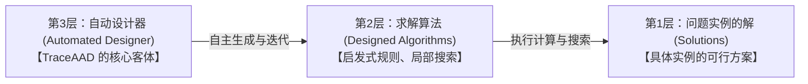
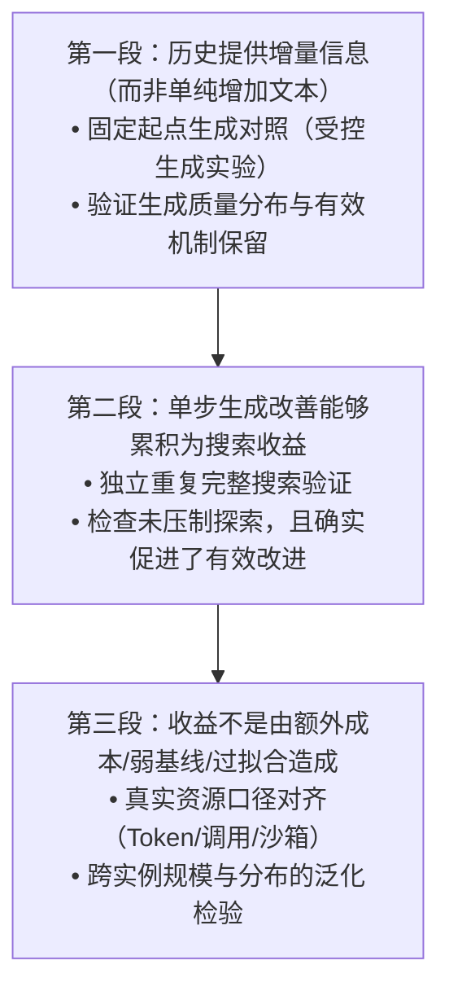

# 面向通用智能优化的自动算法设计：主线研究定位与科学问题

> **核心导引与战略判断**
>
> 自动算法设计（AAD）与 TraceAAD 研究的核心价值，需要将**“研究意义”**、**“科学问题”**和**“当前机制”**三个层面严格区分：
> - **真正值得研究的核心**：不是“再做一个带轨迹的进化框架”，而是在**有限的算法设计预算下，如何把已经付出的试错成本，转化为后续更有效的设计行为，使有价值的算法思想能够被发现、发展和重组**。
> - **总体方向定位**：在“通用智能优化”框架下，定位为**面向优化问题的大模型自动算法设计，重点研究算法改进轨迹驱动的经验利用与持续改进机制**。
> - **核心追问与审视**：问题有价值，不等于“利用历史轨迹”本身已经足以构成创新。ReEvo、PathWise、DGS 和 AlgoEvo 已经分别从反思、结构化记忆、行动选择和经验积累等角度切入。必须进一步回答：**究竟利用轨迹中的什么信息，改善哪一类设计行为，相比已有方式为什么更有效？**

---

## 一、在“通用智能优化”中的位置：研究的不是求解算法，而是算法的设计能力

### 1. 四个方向的重叠性与自动化能力层次

在通用智能优化框架下，系统“需要自动决定什么”界定了四个能力层面：

| 方向 | 自动决定的核心对象 | 主要解决的问题 |
| :--- | :--- | :--- |
| **自动优化建模** | 变量、目标、约束及其数学表达 | 如何把实际需求转化为正确、可求解的优化模型？ |
| **算法选择** | 已有算法或求解策略 | 面对当前问题，应使用哪种已有方法？ |
| **算法配置** | 参数、组件配置及运行策略 | 在既定算法框架下，如何使其表现更好？ |
| **自动算法设计 (AAD)** | 决策规则、算法组件、结构或完整程序 | 如何构造适合目标问题的新方法或新组合？ |

- **边界与层次重叠**：算法设计可以包含参数配置，也可以把“选择何种子算法”设计为内部机制。因此，它们更适合被视为**优化求解过程不同层面的自动化能力**，而非彼此孤立的割裂领域。
- **本工作定位**：主要位于最后一层——**不是只在已有求解方法中挑选，而是自动构造、修改和组合求解方法**。
- **“通用”的科学限定**：追求的是**同一套设计机制能够适配不同优化任务**（跨 TSP、CVRP、OBP 等组合优化与不同业务场景），而不是声称产出一个对所有问题都最优的算法（避免违反 No Free Lunch 定理）。

### 2. 严格区分三个研究对象

在推进研究和撰写论文时，必须始终清晰区分三个对象：

1. **第一个对象是问题实例的解**：例如为一个具体实例找到更好的可行方案。
2. **第二个对象是求解算法**：例如设计一个能够处理一类实例的构造规则或局部搜索方法。
3. **第三个对象是自动设计器**：它决定怎样生成候选、利用评价结果、继续改进和组织搜索。

**TraceAAD 的主要研究对象是第三个——自动设计器。** 组合优化任务（TSP、CVRP、OBP 等）是检验设计能力的基准实验环境（Testbeds）。

> [!IMPORTANT]
> **成功标准的确立**：
> - 不必在每个测试问题上发现人类从未想到的算法思想，才能证明研究有意义；
> - 必须证明：**你的设计器能够更有效、更稳定或以更低代价获得具有真实效用的算法**；
> - 不能用“生成了不同代码”代替“获得了不同算法”，也不能用某次偶然产生的优质程序直接证明整个设计机制更强。

---

## 二、如何理解当前前沿：不是一条替代路线，而是几个并行的科学问题

不能陷入“固定进化框架 $\to$ Agent”、“通用模型 $\to$ 专用模型”等表面叙事（误以为后出现的形式必然比前一种先进、自己必须跟随形式升级）。应按“**解决什么瓶颈 / 回答什么科学问题**”来组织领域地图：

| 前沿维度 | 背后的科学问题 | 代表工作及其着力点 | 与 TraceAAD 的关系 |
| :--- | :--- | :--- | :--- |
| **设计空间与表达能力** | 怎样扩大可设计的算法范围，同时保持可执行、可评价？ | [EoH](https://arxiv.org/abs/2401.02051) 联合演化自然语言思想与代码； A2DEPT 将设计对象扩展到完整算法程序。 | 你需要明确设计对象，但不必为了追赶前沿立即转向完整求解器。 |
| **搜索决策与经验利用** | 有限预算下，怎样根据已有试验决定下一步？ | [MCTS-AHD](https://arxiv.org/abs/2501.08603) 关注候选的持续探索； [PathWise](https://arxiv.org/html/2601.20539v3) 使用有状态规划； [DGS](https://arxiv.org/abs/2607.13911) 预测具体生成行动的结果； [AlgoEvo](https://arxiv.org/html/2609.15820v1) 积累和检索设计经验。 | **【你的主战场】** |
| **反馈与算法理解** | 怎样知道程序究竟改变了什么行为，而不只是分数变了？ | [BehaveSim](https://arxiv.org/abs/2603.02787) 比较求解行为； MLES 利用视觉执行反馈指导修改。 | 可以成为你的证据与分析工具，但不一定要成为在线核心模块。 |
| **设计能力学习** | 怎样让生成器本身从搜索经验中成长？ | [CALM](https://arxiv.org/abs/2505.12285) 将语言反馈与基于算法质量的模型训练结合起来。 | 是自然的后续延伸，不是当前研究成立的前提。 |
| **泛化与可靠性** | 找到的是可迁移算法，还是适应特定评价集的程序？ | [RAISE](https://arxiv.org/abs/2606.31801) 将受约束的对抗实例搜索纳入设计过程。 | 是你必须检验的价值边界，但当前方法不必宣称解决它。 |

> 详细维度分析参见专题文档：[AAD 领域的五个前沿方向与研究定位](AAD领域的五个前沿方向.md)。

**结论与战略定力**：
- TraceAAD 的位置非常明确：深耕**“搜索决策与经验利用”**，核心切入点是**利用算法改进过程的信息改善后续生成**。
- 不需要同时做完整求解器、世界模型、行为聚类、技能库、模型训练和鲁棒优化，这些不是单篇论文必须集齐的模块。
- **Agent 化只是控制流程的一种组织方式**。关键不在于叫 Agent 还是进化算法，而在于：**它是否真的更有效地利用了设计过程中获得的信息**。

---

## 三、从第一性原理看：面对的核心矛盾是什么？

核心矛盾可以高度凝练为：

$$\boxed{\textbf{算法评价主要反馈“这次做得怎样”，而后续算法设计需要决定“下一次应该怎样改”；两者之间存在信息缺口。}}$$

这比“程序空间很大”、“搜索容易陷入局部最优”、“探索与利用需要平衡”等通用说法更直击本质。

### 1. 当前分数不能直接指导下一次修改
- 一次修改往往同时改变了归一化方式、惩罚项或边界逻辑；哪怕分数提升，也只能说明“这份代码在当前实例上总体更好”，**无法归因是哪项改动生效、改动在其他实例上是否仍有效**。
- 一次退步也有多重解释：思想本身不行、参数未调优、语法实现有瑕疵，或是与既有逻辑冲突。
- **候选的当前质量、某项机制的价值、继续修改的价值，是完全不同的概念**。轨迹的作用是提供结构化的事实证据，而非默认包含因果结论。

### 2. 算法质量往往需要多步设计才能形成
- 发现某个算法思想与将其发展成熟，是两个不同阶段。新结构初期可能暂时不如成熟结构，但具备更大的改进潜力。
- **重要转向**：你不一定要先准确预测“哪个节点有潜力”（脆弱的显式估计器），才能研究持续改进。你可以先研究：**当系统继续开发某个程序时，怎样利用已有经验，让这次开发更容易产生有价值的修改。**
- **解耦两个问题**：“给谁机会”是搜索控制问题；“获得机会后能不能改好”是生成问题。如果后一个问题没解决，即使不断增加优质候选的开发机会，也无法兑现收益。

### 3. 历史是否有用，取决于它是否服务当前设计
- “记录更多”并不等价于“设计更好”。
- 当前程序的形成过程可能有帮助，但无关分支的长篇记录只会分散模型注意力；过去某次修改失败，也不能简单推出所有相近尝试都应被排除。
- **真正需要研究的是决策相关性**：什么历史信息对当前这一次设计具有增量价值？怎样呈现才能让模型合理使用，避免机械模仿或过度规避？

---

## 四、科学问题：一个主问题，两个层次

### 主问题定义
> **在有限评价预算与不充分反馈条件下，如何利用算法改进轨迹中的经验信息，提高后续设计的有效性，并将局部改进累积为更高质量的算法？**

- “有限预算”：限定资源现实约束；
- “不充分反馈”：解释困难的本质来源；
- “算法改进轨迹”：说明具体证据来源；
- “后续设计有效性”：是直接作用对象；
- “更高质量算法”：是最终目标。

### 第一层：轨迹如何改善“下一步怎样设计”？（当前论文的核心抓手）
设当前程序为 $P$，设计操作为 $o$，历史记录为 $H$。
- 普通直接生成：
  $$P' \sim p_\theta(\cdot \mid \text{任务}, P, o)$$
- 构造决策相关的历史上下文 $C(H, P, o)$：
  $$P' \sim p_\theta\bigl(\cdot \mid \text{任务}, P, o, C(H, P, o)\bigr)$$

**核心科学内涵**：不是公式里多了一个输入参数，而是**这个输入如何实质性地改变候选程序的生成分布**。例如：
1. 是否更容易保留已经验证有效的决策机制？
2. 是否显著减少了破坏性改写与语法失真？
3. 是否能更有针对性地完善尚未成熟的代码分支？
4. 是否让跨程序机制借鉴（Fuse）真正兑现收益？

> **可检验科学命题**：  
> **在给定相同当前程序、任务和设计操作的条件下，真实改进历史是否仍能提供有助于后续修改的增量信息？**  
> *强调*：同一份程序的客观运行性能不会因为“来时路”不同而改变；历史改变的是设计者对它的理解以及下一次修改的条件生成分布。

### 第二层：轨迹如何改善“下一次设计机会投向哪里”？（整体框架支撑与后续扩展）
- 当生成端成立后，进而研究：如何利用历史试验，决定继续深挖当前分支（Exploitation）、尝试替代结构（Exploration），还是跨分支借鉴机制？
- 这涉及长程规划，但不必提前依赖复杂的算法簇识别或节点潜力世界模型。
- **推荐策略**：当前论文集中力量将第一层做深做实，第二层保持在整体框架中作为结构支撑与延伸问题。

### 必须澄清的概念：两种“轨迹”不可混淆
1. **算法执行轨迹（Execution Trajectory）**：算法在求解问题实例时生成的中间解、动作序列或计算步骤（如 [BehaveSim](https://arxiv.org/abs/2603.02787) 研究的求解动态）。
2. **算法改进轨迹（Design / Improvement Trajectory）**：算法程序在被自动设计器修改、编译、评测和再修改的演进过程（TraceAAD 研究的核心对象）。

两者前者回答“两个算法的行为差异”，后者回答“此前如何修改、下一步如何设计”。两者可以交叉支撑，但不可混为一谈。

---

## 五、差异化空间：正面面对已有工作

| 对比基准 | 已有工作的做法 | 你的差异化空间与定位策略 |
| :--- | :--- | :--- |
| **[ReEvo](https://arxiv.org/abs/2402.01145) / [PathWise](https://arxiv.org/html/2601.20539v3)** | ReEvo 已利用短期/长期反思；PathWise 建模为连续决策，记录描述、推导理由与压缩父代元数据。 | 不能简单声称“别人没有历史，我有历史”。必须推进到：**针对具体设计意图，如何组织精炼匹配的形成证据？这种组织如何实质改变生成行为与持续改进效果？** 追求明确的“成本—效果收益”。 |
| **[DGS](https://arxiv.org/abs/2607.13911)** | 通过转移代理和效用代理，在前瞻预测“操作—父代”的行动价值。 | 避免在“行动预测代理”上正面硬碰。将重点放在**机会给定后的执行质量**：如何利用真实经验保证这一次修改能够高质量完成。 |
| **[AlgoEvo](https://arxiv.org/html/2609.15820v1)** | 将搜索轨迹转化为经验卡片，按树检索，积累跨任务技能。 | “经验积累”已是公认前沿，不能仅以“拥有经验库”作为独占创新。差异化在于回答：**在何种设计状态下，哪种历史证据能改善哪种修改行为？能否以更低代价换取可靠改进？** |

### 当前机制与主张边界（以 V10.10 为镜）
- **当前实现**：质量引导的父代选择、固定比例设计算子、当前程序的短形成路径上下文、弱互补性的供体选择。
- **科学主张定位**：现阶段应表述为**“质量引导搜索中的轨迹条件化算法生成”**，而非过度主张为“已完全解决轨迹驱动的联合预算自适应决策”。
- **客观事实边界**：形成路径中的 Idea 是生成时的意图描述，而非经过因果验证的精确解释；当前节点的直接子代尝试不进入祖先形成路径。
- **论文原则**：主张必须与当前实现的机制严格对齐，不夸大、不防御。

---

## 六、价值证据链：已有信号与缺口闭环

研究价值需要由严密的**三段证据链**进行闭环支撑：

### 1. 第一段：证明历史提供了增量信息，而不只是增加了文本
- **验证手段**：在相同当前程序、设计操作和 LLM 模型下，严格对照“无历史（Code-only）”、“随机历史”、“文本描述”与“真实匹配形成历史”。
- **已有信号**：《生成上下文经验》3 轮固定锚点实验（1,512 次生成，第 3 轮 72 个锚点中 58 个更优），表明形成历史能够显著降低崩溃失真与无效修改。
- **下一步补足**：深入分析改动是否真正保留了关键算子机制，而不仅是提升了语法合法率。

### 2. 第二段：证明单步生成变化能够累积为全局搜索收益
- **警惕现象**：如果历史让单步生成更稳，却导致全局搜索过于保守、丧失结构突变能力，最终整体分数并无优势。
- **检验标准**：在完整搜索中，证明历史不仅减少了破坏，还能支持新算法思想的纵深演进；通过独立重复实验（多种子）验证最终搜索质量的统计显著提升。

### 3. 第三段：证明收益不是由额外成本、弱基线或评价过拟合造成的
- **成本与基线严谨性**：基线应包含直接多样本生成、无历史迭代搜索等。对比外部基线（如单次 Prompt 调用 Python 沙箱等）时，必须按真实计算与执行资源公正对齐。
- **泛化与可靠性防线**：生成的算法必须在未见实例、超大测试规模（跨规模泛化）以及非同分布数据上验证，防止训练集过拟合。

---

## 七、推荐采用的最终研究定位

### 1. 层次化学术定位
- **博士研究层面**：  
  $$\textbf{面向通用智能优化的自动算法设计方法研究}$$  
  *作为顶层总方向，包容算法生成、经验利用、搜索控制和后续能力学习。*
- **当前研究主线**：  
  $$\textbf{算法改进轨迹驱动的经验利用与持续算法设计}$$  
  *回答“怎样让设计过程从已有试验中获益”，不拘泥于特定控制器名称。*
- **TraceAAD 当前聚焦证明的核心**：  
  $$\textbf{利用与当前程序匹配的改进历史，改善下一步算法生成，并研究这种生成改善如何转化为有限预算下的持续搜索收益。}$$

### 2. 经典学术立项与论文摘要表达范式
> “现有大语言模型驱动的自动算法设计方法已能通过程序生成与评价搜索获得高质量算法，但如何将设计过程中产生的修改记录及其效果，转化为后续设计的有效依据，仍是制约搜索效率的核心瓶颈。  
> 本研究面向真实评价预算受限的优化场景，研究与当前程序及设计意图相匹配的算法改进轨迹组织与利用机制，使模型能够依据已有演进过程开展更具方向性的代码生成与持续修改；进而实证检验这种经验利用机制对算法思想持续发展、搜索累积收益以及跨规模泛化的实际支撑作用。”

---

## 结语：战略定力

**这个方向具有坚实的研究价值，完全不需要因为出现 Agent、世界模型或专用模型就产生战略焦虑。**  
真正需要收紧的是科研焦距：  
**不是证明“有轨迹的系统更复杂、更智能”，而是用无可辩驳的对照实验证明——已经发生的设计试验，确实让下一次设计变得更有效，并最终让算法变得更好。**
