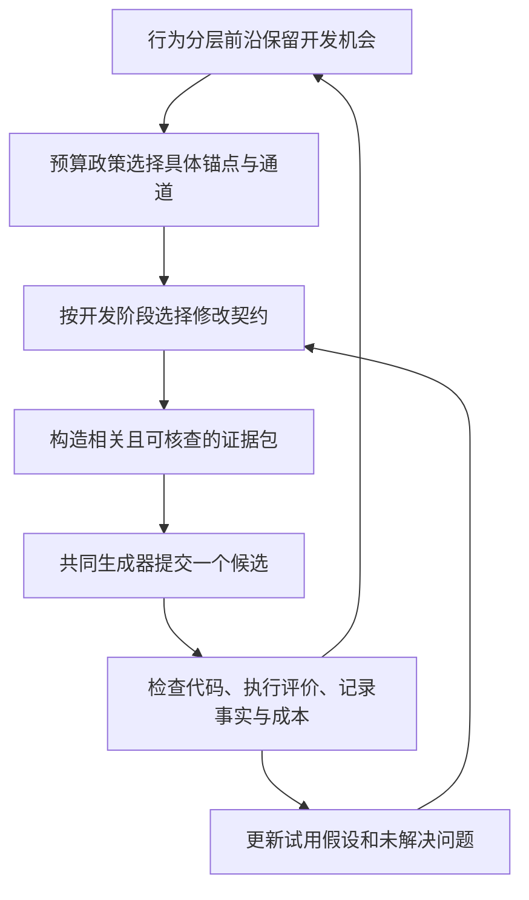

# LLM-AAD 中的算子设计与上下文组织调研：修改契约、决策证据与连续开发

**整理日期：2026-09-27**  
**文档性质：相关工作综合、机制认识、待验证设计与实现草案；不代表现行代码或新增实验结果。**

配套阅读：[种群管理、父代选择与预算分配调研](LLM-AAD中的种群管理机制调研.md)。前篇回答“保留哪些开发机会、预算实际投给谁”，本篇回答“选定状态后改什么、依据什么改，以及连续试用如何推进”。

交付层的后续细化见[输出模式与生成—执行协议调研](LLM-AAD中的输出模式与生成执行协议调研.md)，覆盖 Full/Edit/Agent、完成状态、原子重建、错误恢复与统一计费。

## 摘要

算子与上下文组织应被视为 TraceAAD 的生成决策机制。预算层选定具体历史状态，算子约束本次开放的修改自由度，上下文提供作出修改所需的证据，评价器再检验实际发生的变化。只增加几条提示、几个角色或更多历史，不能说明这一机制有效。

本轮推荐的待验证方案是：**Tune、Refine、Pivot 表示三种修改范围，Fuse 表示可选的迁移或重组方式；使用一个共同生成器，读取锚点中心、按修改模式组织的决策证据包；在有界试用内围绕一个结构假设连续修正。** 主干以 Refine 为默认，有相关参数证据时开放 Tune，有互补且兼容的参考时开放 Transfer；试用通道允许 Pivot 或 Synthesize 引入新结构，随后修正依赖、校准或检验，而非每一步都重新 Pivot。

必须分别记录请求模式、实际代码变化、行为变化与性能结果。模型声明、反思和 semantic delta 可以提出假设，但不能代替系统计算的 diff 或执行证据。形成历史、当前状态直接尝试、相同代码的其他历史以及外部参考也不能混成一条故事。

本次还补全了挑战者来源的预算语义：已有挑战者的发现费用不重复计算；若需要从有效锚点新建方向，先预留试用预算，第一次高风险生成就扣票。允许有效程序暂时低分，不放宽正确性，也不给修复免费重试。

最有辨识度的研究问题是：**形成状态、修改范围与证据类型怎样共同决定程序的实际转移，这种匹配能否在固定成本下提高最终算法质量？** 需依次检验算子是否可控且有用、证据是否提供增量、二者是否存在交互，再回到完整搜索验证。

## 1. 来源、证据边界与版本关系

### 1.1 本次整理覆盖什么

用户提供的三份附件文本完全相同，按一份材料整合，不重复计为三条独立证据。本文覆盖其中的五条相关工作主线、算子定义与契约、六类上下文内容、来源标签、失败记忆、主干与试用协作、统一生成骨架、上下文配额及全部实验对照。

附件提及《算子设计与上下文组织调研报告》和《算子契约与决策证据包：实现模板》两份下载文件，但文件正文未包含在本次附件中。因此本文没有宣称读取这两份文件；第 8 节模板根据实际提供的论述重新整理，新增细节标为建议。会话内部引用标记和不可访问的下载链接不作为可追溯文献。

本轮对照了仓库内相关工作索引、当前 V10.13 说明，以及部分本地论文源码：DeltaEvolve 的多层表示与联合生成、HiFo-Prompt 的多样性定义、MCTS-AHD 的动作和 thought alignment、AlphaEvolve 的输出形式、ShinkaEvolve 的参考与 meta-scratchpad、Controlling Mutation 的模型差异。其他具体结论沿用附件和本地资料汇总，未逐项重做原文核验或复现。

### 1.2 一处需要保留的资料冲突

附件称 HiFo-Prompt 的多样性信号是种群 fitness 标准差；本地 `templateArxiv.tex` 的 `eq:diversity_metric` 则明确采用**算法描述文本不相同的成对比例**，见第 2.4 节。本轮以本地可检查版本记录机制，同时保留来源差异；不能断言其他版本或代码实现必然相同。

无论是分数离散程度还是描述字符串差异，都不能直接视为执行行为多样性。本文因此保留附件希望强调的测量边界，但不继续无条件传播其具体指标归纳。

### 1.3 与当前 V10.13 的区别

| 事项 | 当前机制说明中的事实 | 本文待验证建议 |
|---|---|---|
| 动作选择 | Refine、Tune、Pivot、Fuse 四动作等概率 | 修改范围与参考方式分开，按资格和开发阶段选动作 |
| Refine/Tune 材料 | 最近至多 3 个形成步骤、至多 2 个同父试验 | 依问题与模式选修改—结果证据，并可加入决策现场 |
| Pivot 材料 | 父代 | 核心设计承诺、实测瓶颈与相关方向边界，减少微调细节 |
| Fuse 材料 | 父代和一份不同代码参考 | 区分 Transfer/Synthesize，明确互补依据和组件兼容性 |
| 修复 | 不安排额外模型修复回合 | 仅作为单独可消融、严格计费的可行性恢复流程 |
| 输出 | 完整代码为主，也支持精确局部修改；Idea 可选 | 保留统一输出协议，不强制新增计划调用或长篇解释 |
| 连续试用 | 当前正式机制没有本文开发票 | 接续前篇的待验证票机制，并新增假设状态与挑战者生成计费 |

来源：[V10.13 机制设计](../01-主线机制设计/TraceAAD-V10.13-机制设计.md)。本次只更新研究文档，不把设计建议写成已实现能力。研究算子时，前篇的活动前沿与父代分配也应作为固定实验条件或明确对照，不能同时自由改写所有层。

## 2. 相关工作：五条互补的研究主线

### 2.1 从展示好程序到明确修改方式

| 方法 | 算子与上下文做法 | 可吸收的认识与限制 |
|---|---|---|
| FunSearch | 从同岛取程序，按分数排序并赋递增版本名，让模型补全下一版本；材料所述设置用两份程序 | 质量排序示例可诱导改进，但“版本顺序”不一定是真实形成历史 [1] |
| EoH | thought、code、fitness 联合表示；E1 偏离已有方案，E2 提炼共同思想再扩展，M1 一般修改，M2 调参，M3 去冗余 | 修改目的已被区分；思想与代码可一次生成，不意味着必须先规划、再编码两次调用 [2] |
| ReEvo | 短期反思比较程序与成绩，形成交叉指导；长期反思整理历史反馈，指导精英变异 | verbal gradient 是语言建议，不是性能对代码机制的因果梯度 [3] |
| MCTS-AHD | 区分机制/公式修改、参数修改、交叉参考与树路径推理；代码生成后另作 thought alignment | 修改范围和材料来源是不同轴；额外描述调用需计费 [4] |
| AlphaEvolve | 任务、历史程序、评价反馈、变化的提示形式及元提示共同构成上下文；支持精确匹配 diff 或完整代码 | 语义修改、信息来源、交付格式应独立设计 [5] |
| ShinkaEvolve | 主父代配优秀与随机参考，周期性生成程序总结、全局 insight 和实现建议 | 跨路线材料不只是一组高分代码；经验整理有调用成本和适用范围 [6] |

“希望模型做什么”“模型依据什么做”“模型如何交付代码”不是同一层次。路径推理主要改变信息来源，调参主要限制修改范围，patch 主要改变表达协议，不能把三者都当作互斥的语义动作。

对 TraceAAD，所有修改模式都可以读取相关历史，只是粒度不同。若只有选择“路径推理”动作时才能看历史，就人为阻止 Tune 利用参数试验、Refine 利用局部失败或 Pivot 利用已有结构反例。

MCTS-AHD 的本地描述明确各动作先生成代码，再用第二次调用生成至多三句话的描述。它希望减少代码与说明不一致，但第二次调用也不能自动保证解释正确。AlphaEvolve 的完整代码和 diff 选项则说明输出形式可以随代码规模变化，不证明 patch 在本项目一定更好。

### 2.2 提示能否控制实际变异

*Controlling the Mutation in LLMs for Efficient Evolution of Algorithms* 比较请求修改幅度与实际代码变化。其所测 GPT-4o 比 GPT-3.5-turbo 更能遵从幅度提示；人工设计的动态变异提示与自动生成提示也不是等效条件。[7] 结论依赖具体模型和任务，不能据此假设任意当前模型都遵从语义契约。

变异幅度主要按代码差异衡量，而代码差异不等于行为差异。BehaveSim 用求解中的中间解轨迹刻画执行行为，提示完整执行日志中也可能包含大量不相关细节。[8]

因此三种判断都不充分：改动很多行就等于探索，只改常数就等于利用，模型声明 Fuse 就等于有效重组。一行阈值可能改变大量动作，整段重写也可能保持完全相同的排序。需要同时检查请求遵从、实际实现和任务行为。

### 2.3 将历史从代码快照转成修改证据

#### 2.3.1 MEMOIR：局部调试与跨分支知识分层

MEMOIR 的局部记忆记录算法描述、父子诊断、有效性、分数及逐实例反馈，代码单独存储；分支结束后压缩为跨分支全局记忆。[9] 附件所述消融支持分层和失败记录，但有重要限定：“去掉失败节点”主要涉及无效 solver 及诊断，不能外推为任何低分历史都应尽量多放。所述实验较小执行预算、可行性瓶颈明显，也不直接代表大规模进化搜索。

可迁移的是带条件的失败证据与分层记忆，而非永久累积的禁令。若错误概括一次实现失败，可能排除本来可用的思想。本文未重新核验其全部消融数据，因此不新增精确效果值，也不将此结论写成 TraceAAD 已验证事实。

#### 2.3.2 DeltaEvolve：历史按不同分辨率展示

DeltaEvolve 保留当前完整代码与历史 semantic delta，使用三级表示：[10]

| 分辨率 | 主要内容 | 能支持什么 |
|---|---|---|
| L1 | 简短 FROM/TO 方向摘要 | 快速筛选可能相关的历史变化 |
| L2 | 旧逻辑、新逻辑与修改假设 | 查看组件变化及模型预期 |
| L3 | 完整可执行代码 | 还原实现、检查依赖并运行 |

本地原文明确三级内容由 LLM 在 mutation 中共同生成，L2 的 hypothesis 也是模型预测的解释。因此 semantic delta 不是系统计算的实际 diff，更不是经验证的收益原因。

TraceAAD 可以吸收分层压缩，但必须区分：

$$
\text{声明意图}\ne\text{实际代码差异}
\ne\text{执行行为变化}\ne\text{性能变化的原因}.
$$

这里的不等号表示四类对象不能直接等同，并非声称每次声明都与实现相矛盾。声明与代码的一致性可检查，行为需执行观测，因果解释还需对照。

### 2.4 生成策略与反馈共同更新

HiFo-Prompt 结合基础指令、历史 hindsight insight 和 foresight 指令，按搜索状态切换探索、利用与折中。[11] 本地版本的多样性定义是：

$$
\Delta_p(t)=\frac{1}{|P|(|P|-1)/2}
\sum_{i=1}^{|P|}\sum_{j=i+1}^{|P|}
\mathbf 1[\operatorname{alg}_i\ne\operatorname{alg}_j],
$$

其中 $\operatorname{alg}_i$ 是算法文字描述，指标依赖字符串是否相同；单个或空种群需另外定义。附件将其描述为 fitness 标准差，与当前本地版本不符。文字不同可能只是措辞，分数不同也可能来自噪声，两者都不充分证明行为不同。

EvoPH 让提示和启发式共同进化；MeLA 通过元认知反思组织强化、保留和创新指导，并设置调试流程。[12–13] 这些方法提示生成政策本身可以学习，但首版不宜加入自由进化的全局提示控制器。高分后代可能来自更好的父代、更合适的 donor、更多上下文或更强模型，未必来自提示改进；元提示更新、反思和修复也必须计成本。

合理顺序是先固定可审计契约与证据政策，识别条件收益，再研究提示适应。动态提示可能有用，但不能仅凭“会自适应”免除归因和成本对照。

### 2.5 反馈从总分走向可核查的决策现场

LLaMEA-SAGE 从 AST、控制流等代码结构特征学习性能 surrogate，再用 SHAP 归因形成自然语言指导。[14] 附件强调这些是经验相关，不是因果结论：特征与高分共现不代表添加该特征就会提高当前程序。

Teacher-Aware Evolution 在候选自身访问的状态上取得外部策略的局部偏好，指导结构修改、参数校准和机制融合；最终部署的启发式不依赖教师。[15] 教师反馈也不是每次动作的真实最优性证明，且有额外资源成本。

对 TraceAAD，最直接的启发是让 evaluator 在总分外提供少量“在哪个状态、有哪些候选、实际选择了什么、随后观测到什么”的现场。无需首版就加入 surrogate 或教师，也不能把观测到的后续结果写成未执行替代动作的反事实结果。

## 3. 算子、实际修改与形成模式

### 3.1 三个观察层次

| 对象 | 定义 | 确定时点 |
|---|---|---|
| 请求模式 | 本轮希望改变什么、保留什么 | 生成前 |
| 实际修改 | 参数、公式、表示、控制流和组件实际发生的变化 | 生成后，通过 diff 和代码检查 |
| 形成模式 | 多次修改与结果构成的发展过程 | 一段真实轨迹产生之后 |

算子是在生成前施加先验与约束，不能保证输出就是预期模式。“结构变化→依赖修复→参数校准→超过来源最好值”是一种事后形成模式，不是一个单步动作，也不应在尚未执行时写成必然结果。

两个动作值得同时存在，需要在某些状态上产生可区分且有用的转移。名字不同、提示长度不同或代码距离不同都不够；若统一 Improve 达到同等效果且更便宜，应合并多余动作。

### 3.2 四个层次的动作不应混成一个 portfolio

| 层次 | 例子 | 管理对象 |
|---|---|---|
| 算法内部求解 | 邻域移动、接受、重启 | 被生成算法执行时的状态 |
| 程序改进 | Tune、Refine、Pivot、机制迁移 | 从一个程序形成另一个程序 |
| 外层搜索控制 | 选父代、选参考、回溯、发票 | 开发机会与预算 |
| 信息处理 | 反思、检索、压缩、摘要 | 生成时可用的材料 |

DGA²D 的图节点是被生成算法内部的功能算子，有向 walk 组成可执行 pipeline；它不是程序版本的父子形成图。[16] 两者可以结合，但图结构相似不意味着对象相同。也不能把一次检索、一次回溯与一次代码生成放进同一 portfolio 直接比较平均 reward，而不说明各自成本和影响环节。

### 3.3 算子作为条件生成约束

一次生成可写为：

$$
c\sim K_\theta\left(
\cdot\mid\operatorname{code}(a),E_t(a,o,d),o,d;\kappa_{\mathrm{gen}}
\right).
$$

$a$ 是具体历史锚点，$o$ 是修改契约，$d$ 是可选参考，$E_t$ 是实际提供的证据，$\kappa_{\mathrm{gen}}$ 是模型与采样配置。本篇加下标以区别前篇用于多步内部开发政策的符号。

契约可表达为：

$$
o=(\text{改进目标},\text{修改范围},\text{保留条件},\text{参考使用方式}).
$$

还需给出生成后的检查计划：当前观察支持什么问题、哪些自由度开放、哪些条件必须保留、本步的有效性和预期行为怎样检验。契约应具体到可检查的设计对象，而非只写“更有创造性”。

## 4. 推荐算子设计：三种修改范围与可选迁移

### 4.1 Tune、Refine、Pivot

| 模式 | 要回答的问题 | 保留条件 | 开放修改 |
|---|---|---|---|
| Tune | 当前机制可用，但参数是否匹配训练分布与边界？ | 核心特征、主要流程、状态表示 | 权重、阈值、参数、调度时间表 |
| Refine | 哪个机制、边界或冗余环节可作连贯修正？ | 无关的已工作机制与执行契约 | 一个机制假设涉及的协调改动 |
| Pivot | 哪个核心设计承诺限制了当前路线？ | 任务/接口硬约束，以及有依据继续保留的部分 | 评分原则、特征/表示、控制流程、搜索框架 |

一个机制假设不等于只改一行：Refine 可同时调整几个依赖位置。Pivot 不等于最大代码距离：改变量名、扩写等价逻辑或任意增加组件，不构成新决策原则。Tune 也可能大幅改变行为，不能把其效果先验归为“小步”。

资格需要依据当前代码和证据判断。没有可调参数或没有相关校准问题时，不为了配额强行 Tune；“不知道瓶颈”应如实记录，不能为满足契约凭空编造一个已确认错误。

### 4.2 Fuse 拆成 Transfer 与 Synthesize

Fuse 描述参考的使用方式，和修改步长不是同一维度：

- **Transfer**：在保留主结构的前提下迁移一个互补机制，通常对应 Refine 加 donor。
- **Synthesize**：允许重新组织组件与依赖，通常对应 Pivot 加 donor，适合有预算保护的试用。

建议内部表示为：

```text
edit_scope: Tune | Refine | Pivot
reference_mode: None | Transfer | Synthesize
```

对外可保留 Tune/Refine/Pivot/Fuse 四个标签，但每次 Fuse 必须记录内部范围和参考方式。不是所有笛卡尔积组合都必需：首版只开放 Tune/None、Refine/None、Pivot/None、Refine/Transfer、Pivot/Synthesize；其他组合单独验证，避免用九种形式制造没有证据支持的复杂性。

必须说明主程序弱点、donor 哪项能力有执行支持、组件与接口如何适配。donor 来源是外部参考，不把其全部历史拼成主程序亲历的形成链；被引用也不自动获得全部子代增益。

### 4.3 Simplify、Repair、Backtrack 的职责

**Simplify** 是 Refine 内的子动作，例如删除冗余、规约表达或消除组件干扰。只有有相应依据才优先。短代码可能便于理解，但不能代替质量、效率与行为结果。

**Repair** 是可行性恢复流程，读取失败代码、异常或约束违例、复现条件和需要保留的开发意图。每次修复生成都消耗候选机会；失败本身没有 fitness，不能伪造成有效父代。可用 `last_valid_anchor` 保留真实谱系，以 `failed_attempt_id` 指向待修复代码。修复后的有效程序记录为经该失败尝试形成，但仍能回溯到真实有效来源。

**Backtrack** 属于预算层选择一个真实祖先/历史锚点，然后再选择修改契约。不得在 prompt 内悄悄切换代码起点，却继续把结果统计为原状态的直接开发。票内若允许回溯，必须记录锚点变化原因并沿用剩余额度；首轮可先不开放这一额外自由度。

### 4.4 契约是引导，任务正确性是硬约束

收到 Tune 请求却产出有效结构创新时，记录请求与实现不一致，仍按既定评价与档案规则处理；不能为了提高遵从率机械拒绝好候选。

任务接口、合法输入输出、可行性、运行限制和约定的依赖才是硬约束。低分有效程序与无效程序必须分开：试用可以保护前者，后者只能作为失败事实或修复输入。

实际修改分类允许 `mixed` 和 `unknown`。分类结果用于机制诊断，不应强迫模型自报标签成为接受条件。

## 5. 决策证据包：锚点中心、模式条件化

### 5.1 六类材料各自回答什么

| 材料 | 问题 | 建议表示 |
|---|---|---|
| 任务与执行契约 | 怎样合法、怎样更好？ | 目标方向、接口语义、硬约束、资源限制、允许依赖 |
| 当前代码与表现 | 当前真实状态是什么？ | 完整代码、总分、少量实例组表现、评价版本 |
| 决策现场 | 问题具体出现在哪里？ | 状态、候选动作、实际选择、相关代码位置、观测结果 |
| 相关形成证据 | 当前机制为何变成这样？ | 真实祖先修改、实际 diff、评价结果与适用条件 |
| 当前状态直接尝试 | 从这里已经试过什么？ | 有效/无效、改善/持平/退步、重复与对应修改 |
| 按需参考与开发状态 | 能借什么、当前正在检验什么？ | donor 组件与边界、结构假设、已解决/待解决事项 |

六类不是每次必须填满的表格。缺乏相关材料可省略，缺乏确定性应标注未知；完整树、全局精英或长历史不应仅为填满上下文而加入。

决策现场优先来自训练/开发探针：注明输入、实例/状态 ID、随机条件和代码版本。若只能看到选择与后续结果，不能宣称已经知道另一个动作更优。跨程序比较最好能重放共同状态，否则行为差异同时包含各自访问状态分布的差异。

### 5.2 以修改—结果事件为最小证据单位

```text
事件来源：当前状态直接尝试 / 真实形成事件 / 同代码其他历史 / 外部参考
原始标识：anchor_id、attempt_id、artifact_id、时间和版本
当时意图：模型声明要改变什么
实际变化：系统计算的 diff、涉及组件与依赖
评价条件：evaluator 版本、训练实例组、种子、运行限制
观测结果：有效性、总分/分组表现、行为探针结果、成本
解释假设：可能的机制原因，未经因果验证
适用边界：可复核条件、反例、未检验范围
```

代码事实“接受规则从 A 改为 B”，行为观测“固定探针上的拒绝率上升、长停滞减少”，与解释“B 导致最终质量提升”是三个不同层次。前两者相容不自动证明第三者。

模型摘要、ReEvo 式反思、DeltaEvolve 的 semantic delta、SAGE 的相关反馈可以放入解释栏。若与 diff 或执行记录冲突，保留原声明用于审计，生成时以可核查事实为准，不把错误摘要悄悄覆盖历史。

### 5.3 失败记录必须带条件

“这个思想试过失败，禁止再用”信息不足。应记录哪个实现、哪些参数和组件、什么评价条件下出现何种错误或退步，当时还有哪些共同变化，哪些条件尚未检验。

至少区分思想可能不适用、实现错误、参数失配、组件不兼容、在当前实例上未见收益，以及评价噪声或流程问题。一次复合修改失败，不能把所有组成思想都标为无效。

优先保留可复现的局部诊断，再谨慎抽取跨路线经验。全局规则需要适用范围与反例，不能越积累越像不可挑战的禁止清单。MEMOIR 的失败记忆启发支持这个方向，但不能证明所有低分历史都值得进入每次 prompt。

### 5.4 来源标签与状态身份

| 标签 | 表示什么 | 不能冒充什么 |
|---|---|---|
| `formation` | 当前主链上的真实形成事件 | 从当前状态重新做过一次试验 |
| `exact_state_attempt` | 从完全相同 AnchorState 出发的实际尝试 | 相同代码下所有历史的共同经验 |
| `same_code_other_history` | 相同 artifact，但证据状态不同的开发结果 | 当前状态的直接生产力观测 |
| `external_reference` | 其他路线的程序、组件或事件 | 当前主路线的祖先或亲历步骤 |

相同程序在匹配评价版本、实例和随机条件下可按缓存协议复用执行结果；不同历史下的生成收益不能因此合并成同一状态的生产力样本。

检索后必须保留来源标识。两条不同历史若经过截断后给模型相同请求，不能仅凭数据库中的谱系差异宣称生成条件不同。

### 5.5 证据应随模式改变

| 模式 | 优先提供 | 减少提供 |
|---|---|---|
| Tune | 参数—结果对照、阈值附近现场、已试范围及相关失败 | 大量新结构示例和无关远祖 |
| Refine | 当前机制的形成修改、直接正反尝试、问题现场 | 全树统计与无关历史 |
| Pivot | 当前核心承诺、实测瓶颈、已探索方向的边界 | 大量微调细节、要求保留全部旧结构的指令 |
| Fuse/Transfer | 主程序弱点、donor 有效组件、依赖与适配边界 | donor 全部历史和所有全局最好代码 |
| Fuse/Synthesize | 互补组件、各自假设与冲突、可重组的结构自由度 | 机械拼接要求和未经核验的兼容性结论 |
| Repair | 精确失败代码、异常、复现条件、需保留的开发意图 | 新颖性要求、多种竞争目标和无关反思 |

Tune 需要校准证据，Pivot 需要重新考虑设计承诺的依据。把同一长历史发给所有模式不能检验这种匹配的价值。

首轮证据筛选可用透明规则：先评价条件兼容，再按问题组件与动作匹配，再选少量互补正反事件，去掉重复，最后才按新近程度排序。规则属于本文实现建议，需要与固定短历史对照；不额外引入未经验证的综合潜力分。

## 6. 与种群和预算机制共同运行

### 6.1 三层分工与闭环



闭环每次经过生成都扣相应预算；图中返回契约选择不表示免费重试。种群提供不同起点，预算让起点真正获得机会，上下文维持各路线自身问题和试错信息。

如果所有区域都读取同一全局精英和统一经验，存储分层仍可能生成同质化。主干默认使用本路线与当前状态证据，只有明确迁移时引入少量外部材料。

### 6.2 主干：默认 Refine，其他动作按资格开放

对预算层选定的区域精英：默认围绕一个真实问题 Refine；存在明确参数自由度与相关证据时开放 Tune；有互补且兼容 donor 时开放 Transfer。

一个可复现起点是 Refine:Tune:Transfer = 2:1:1，移除不合格动作后归一化。可写为：

$$
P(o\mid a,E)=\frac{w_o\,\mathbf 1[o\in\mathcal O_{\mathrm{eligible}}(a,E)]}
{\sum_jw_j\,\mathbf 1[j\in\mathcal O_{\mathrm{eligible}}(a,E)]}.
$$

$w=(2,1,1)$ 只是示例，不是最佳比例。Refine 是默认改进请求，不要求先验已有被证明的故障；若没有定位到问题，可声明一个可检验假设。若任务或预算使所有生成都不合格，应明确停止或恢复合法状态，不对空集合抽样。

同时保留统一 Improve、合格动作等概率、模型自行选择模式等对照；模型自行选择若新增一次调用也计成本。资格过滤本身也改变了分布，比较时应单独记录资格、选择概率与实际请求，不能把收益全部归因于提示内容。

不立即按全局平均增益学算子信用。Tune 通常作用于强程序，Pivot 常作用于停滞状态，直接平均混入起点差异。应先做匹配状态下的随机动作实验，再谈条件信用。

### 6.3 试用：保护一个结构假设

假设 Pivot 改变状态表示，首次有效实现分数下降；下一步可能需要修复依赖、调整机制或校准参数，不是再次要求完全不同的方案。

在前篇开发票字段上补充：

```text
起始有效锚点与来源预算账户
当前工作锚点、最近有效锚点
目前最好程序
正在检验的结构假设及依据
已解决的问题及支持它的记录
仍未解决的问题、反证和待验证事项
失败尝试引用（如需修复）
剩余候选额度、停止条件
```

可能出现“提出结构变化→相关修正→校准/检验”，但不是强制三步流程。明确不可行时可提前结束，已有效时可继续精炼，额度耗尽则停止。`resolved` 需要执行或代码检查证据，不能由模型声称“已修复”直接写入。

假设稳定不等于禁止更新认识。新的执行反例可以促使修订或放弃，必须记录何种证据导致改变，且不能因为换假设自动续票。主要因果对照是同预算每步 Pivot 与围绕同一假设推进，不是更长 token 与更短 token 的混合比较。

### 6.4 挑战者来源：首次高风险生成也计费

前篇主要处理已有挑战者如何获得试用，本篇补充一个**可单独启用的方向发现政策**：

| 状态 | 操作 | 计费 |
|---|---|---|
| 已有合格挑战者 | 从它和已有结构假设开始，不必再次 Pivot | 发现成本已在过去支付；续试从新票扣额 |
| 无合格挑战者，但明确决定探索 | 从真实有效锚点预留票后执行 Pivot 或 Synthesize | 首次生成就是票的第一步，有效与否都计成本 |
| 首次输出无效或重复 | 保存失败事实；按预设策略修复、原锚点续试或终止 | 剩余步骤照常扣额，不免费重抽到成功 |
| 预算不足兑现票或发现政策未启用 | 回到主干或按协议结束 | 不产生未兑现承诺 |

不能先无限生成到“足够新颖且有效”，再开始计开发票。这会隐藏探索中最昂贵的一部分。

新增方向发现政策与前篇“无合格挑战者时回主干”的基础协议是两个不同实验条件，应明确配置。为避免容量和身份套利，发现阶段使用独立的待定机会记录并占用预定容量；只有有效候选通过准入后才分配行为区域，原票 ID、来源账户与已耗额度保持不变。新行为不自动产生第二张票。

若总票长为 $h=3$，从无挑战者起步时首次发现已经占一步，最多只剩两步续试；从已有挑战者起步才有三步新开发。比较时需要分开报告发现成本和续试成本，不能都称作“相同三步结构开发”而忽略起点差异。

### 6.5 修复、停止与收益归属

Repair 每次只提交一个修复候选，消耗生成机会；是否调用评价器仍依解析与执行协议。不可行状态本身不获得有效质量，也不进入成熟精英集合。实际修复费用、无效响应和 API 重试分别记录。

任务硬约束失败与有噪声的性能退步不同：前者可能触发修复或停止，后者不能立即被宣称思想不可行。提前终止依据要预先固定，否则人工或模型可选择性保留看起来有希望的票。

本篇沿用前篇冻结参照的票级净收益和单独全局纪录账本；算子、主父代、donor 与祖先不同时获得完整独立收益。中途换工作锚点只继承剩余额度，不重置票。未执行承诺可按规则释放，已发生的生成、诊断和反思成本不能退回。

## 7. 共同生成器与上下文预算

### 7.1 一套共同骨架

```text
任务与执行契约
当前完整代码与可比较的训练表现
少量与当前问题相关的决策现场
相关形成事件 + 当前状态直接尝试
可选 donor 组件、支持证据与兼容条件
当前开发假设、未解决问题和剩余试用状态
本次修改契约
输出：一份候选，简短可选 Idea + 完整可执行代码
```

共享骨架有利于保持各模式的任务描述、输出协议和事实边界一致。模式差异只体现在明确契约与相关证据，避免四套独立提示逐渐漂移、同时改变太多因素。

Idea 是简短公开设计注记，说明拟改机制、依据和保留条件；不要求长篇推理，也不要求模型自行填写实际提升、已证明结论或不存在的执行结果。真实 diff、有效性、行为与分数由系统检查和 evaluator 写回。

代码可解析但 Idea 缺失，不宜仅因此丢弃候选；兼容现行实现的宽容表达。模型返回多份候选则按预先固定的解析协议处理并记录，不能借格式歧义获得免费多候选搜索。

### 7.2 输出协议独立于语义动作

短函数默认完整代码。长代码可另行比较精确匹配补丁：指明基准 artifact/hash，匹配失败记为失败尝试，不模糊猜测应用到另一版本。完整代码和 patch 都可以用于 Tune、Refine 或 Pivot，不由模式名强行决定。

格式修复、代码调试和语义修改是不同环节；引入额外模型调用必须单列费用。AlphaEvolve 支持不同输出方式，只说明其设计空间可用，不能证明补丁在本项目成本更低或收益更高。

### 7.3 上下文容量与降级顺序

短函数首轮可用以下工程起点：额外证据 2,000–4,000 token、4–6 条去重合并事件、最多一个 donor。它们不含必要任务说明、当前代码与输出预留，不是最优窗口，也不意味着必须填满。

先检查总上下文容量：

$$
L_{\mathrm{task}}+L_{\mathrm{code}}+L_{\mathrm{evidence}}
+L_{\mathrm{contract}}+L_{\mathrm{output\ reserve}}
\le L_{\mathrm{model}}.
$$

证据预算包含行为现场、事件、参考与开发状态，不能把 donor 另算成不受约束的附加材料。合并事件仍保留每个原始来源 ID，不能压缩成无法检查的集体结论。

超限时先移除无关、重复和低适用性证据，再降低旧事件分辨率；必要时减少 donor 材料及非关键历史。不得悄悄截掉当前代码依赖、接口约束或关键错误。若删除 donor 后参考已不足以支持 Fuse，应降级为无参考契约并记录，而非继续宣称执行了迁移。

任务与完整代码本身仍放不下时，记录请求构造失败，或进入事先定义的长代码协议；不能把截断代码当作合法主锚点。检索、压缩和再摘要若调用模型也计成本。

### 7.4 保存实际请求，建立可核查写回

至少保存实际渲染消息或可复原请求、材料来源和版本、被省略/截断的项目、模式及资格、主锚点和 donor、模型/采样配置、token 与费用、原始响应、最终代码、实际 diff 和评价记录。

“档案中存在历史”不等于历史进入 prompt，“引用了 donor”不等于相应组件进入代码。检验应沿着材料被检索、进入请求、进入实现、改变行为、影响质量的链条逐项观察。

事实层追加新记录，不因后续解释变化改写旧执行结果。模型假设可以更新，但需要版本与证据来源；错误摘要纠正后仍保留其曾经进入哪些请求的信息。

## 8. 算子契约与证据包模板草案

本节根据已提供材料重新整理，补全一些可审计字段，**不是附件所指未提供模板文件的原文，也不是现有接口定义**。五类对外契约为 Tune、Refine、Pivot、Fuse、Repair，其中 Fuse 再区分两种使用方式；Simplify 为 Refine 子动作，Backtrack 为预算决策。

### 8.1 统一输入与记录对象

```yaml
GenerationRequest:
  request_id: "由系统生成"
  anchor_state_id: "真实历史状态"
  artifact_id: "当前完整代码的不可变标识"
  channel: "main | trial"
  ticket_id: "有票时填写，否则为空"
  task_contract:
    objective_direction: "越大越好或越小越好，含训练指标定义"
    interface: "签名、输入输出语义"
    hard_constraints: []
    runtime_limits: {}
    allowed_dependencies: []
  current_program:
    full_code: "完整代码或受控引用"
    evaluation_version: "实际版本"
    observed_scores: {}
  evidence:
    decision_cases: []
    formation_events: []
    exact_state_attempts: []
    same_code_other_history: []
    external_reference: null
  development_state:
    hypothesis: "待检验解释，允许未知"
    hypothesis_evidence_ids: []
    resolved_issues: []
    open_issues: []
    last_valid_anchor: "仅在修复等情形需要"
    failed_attempt_id: null
    remaining_candidate_budget: null
  edit_contract:
    requested_label: "Tune | Refine | Pivot | Fuse | Repair"
    edit_scope: "Tune | Refine | Pivot；Repair 单独走恢复流程"
    reference_mode: "None | Transfer | Synthesize"
    target_problem: "观察或明确标记的假设"
    allowed_changes: []
    preservation_conditions: []
    post_generation_checks: []
  generation_config:
    model_version: "固定或记录实际版本"
    sampling: {}
    output_mode: "full_code | exact_patch"
    output_token_limit: "预先设置"
  provenance_manifest:
    selected_evidence_ids: []
    omitted_evidence_with_reasons: []
    rendered_request_hash: "实际请求生成后由系统填写"
```

该模板用于说明字段职责，不要求全部变成暴露给模型的机械表单。完整程序、任务契约与来源信息需要可还原；没有相应证据时填空或省略，不制造数据。`rendered_request_hash` 必须配套请求内容或可复原记录，单独 hash 不足以复现。

### 8.2 修改—结果证据事件模板

```yaml
EvidenceEvent:
  event_id: "不可变事实引用"
  source_type: "formation | exact_state_attempt | same_code_other_history | external_reference"
  source_anchor_id: "真实来源"
  source_attempt_id: "实际尝试"
  parent_artifact_id: "修改前程序"
  resulting_artifact_id: "有效代码存在时填写，否则为空"
  declared_intent: "原始模型声明，不当作执行结果"
  actual_diff: "系统计算的差异或引用"
  affected_components: []
  evaluation_conditions:
    evaluator_version: "实际版本"
    instance_groups: []
    seeds: []
    runtime_limits: {}
  observations:
    status: "valid | invalid | parse_failure | duplicate | no_op"
    overall_score: null
    group_scores: {}
    behavior_observations: []
    error_or_violation: null
    measured_cost: {}
  interpretation:
    hypothesis: "可选解释，明确未证实"
    supporting_evidence_ids: []
    counterexamples: []
    applicability: "仅陈述已知条件"
```

状态分类实际可拆成多个字段，因为重复代码仍可能有效。示例枚举只是简化展示，不应把有效性、重复性和行为变化压成互斥单标签后丢失事实。失败时的分数应为空或使用明确独立的失败标记，不能伪造一个可比较的已测 fitness。

### 8.3 Tune 契约

> 根据提供的参数—结果证据或明确标注的校准假设，调整影响决策的权重、阈值或时间表。保留核心特征、状态表示和主要流程，避免引入无关结构。说明准备调整的参数及依据，提交一份完整可执行候选；实际行为和收益由评价器确定。

输入优先是参数位置、合法范围、已试值、阈值附近现场。检查实际改动是否主要属于参数；同时执行行为探针，避免假设调参必然只带来小行为变化。若实际产生结构修改，标注偏离，不因模式不一致单独拒绝。

### 8.4 Refine 契约与 Simplify 子动作

> 围绕当前观察到的问题或明确的待检验假设，提出一项连贯机制修正。保留无关的已工作部分与执行契约，必要时协调修改多个依赖位置。区分执行事实与解释假设，不把一次失败推广为整类思想无效。提交一份完整候选，简短说明拟改机制，不声称未经验证的收益。

若是 Simplify，再说明冗余或干扰证据、准备删除什么、哪些决策不应受损。检查删减是否改变效率、可行性或行为，而非仅统计代码长度下降。

### 8.5 Pivot 契约

> 重新考虑当前明确的一项核心设计承诺，例如评分原则、状态表示或控制流程。利用给出的瓶颈、反例与已探索边界提出替代假设，保留任务接口和硬约束。不要用重命名、等价扩写或无目的增大代码距离代替新的决策原则。只提交一份候选，并标注需要后续检验的核心假设。

生成后检查设计承诺是否真的变化及依赖是否闭合。若候选有效但初分下降，按既定试用资格处理；若无效，进入有预算约束的恢复或终止协议，不宣称结构假设已被性能证伪。

### 8.6 Fuse 契约：Transfer 与 Synthesize

**Transfer：**

> 从主程序出发，针对指定弱点吸收参考中有证据支持的机制。保留主结构，适配参考组件所需输入、尺度和依赖，避免机械复制。说明使用了哪份参考和哪个组件，提交一个完整候选，不把参考的独立成绩当作迁移成功证明。

**Synthesize：**

> 以主锚点为明确来源，围绕一个重组假设重新组织互补组件。指出各组件的条件、冲突与拟采用的适配方式，允许改变主结构但保持任务硬约束。只提交一个候选，将未解决的依赖和需要检验的结构假设留给本票后续步骤。

两个模式都记录 donor 及实际进入 prompt 的内容，不把 donor 历史变成主 lineage。参考没有互补或兼容依据时，移除 Fuse 资格；不为满足动作配额选任意参考。

### 8.7 Repair 契约

> 根据提供的失败代码、异常或约束违例及复现条件，恢复任务可行性，尽量保留本票正在检验的开发意图。避免无关创新与全局重写。只提交一份修复候选；不要声称已通过未运行的测试，实际有效性由执行器确认。

必要字段为失败尝试 ID、失败代码、错误上下文、最近有效锚点和剩余额度。若需要改变原结构假设，明确记录，不隐藏成“纯修复”。关闭 Repair 的对照同样保留失败记录与成本，只是不继续付费修复。

### 8.8 参数与控制器草案

| 参数/规则 | 首轮示例 | 需要独立验证的内容 |
|---|---|---|
| 生成器 | 同一模型、共同骨架、每次一候选 | 专用模型或多代理不在首版一起加入 |
| 主干合格动作权重 | Refine:Tune:Transfer = 2:1:1 | 与统一 Improve、均匀和自行选模式比较 |
| 额外证据上限 | 2,000–4,000 token | 不是含代码的总窗口，也不要求填满 |
| 事件数 | 4–6 条合并后相关事件 | 去重是否丢失条件或反例 |
| donor | 最多一份 | 互补、兼容与仅高分/仅距离的区别 |
| 输出 | 短函数完整代码；Idea 可选 | patch 单独比较，不增加无偿修复 |
| 开发票 | 沿用前篇，例如 $h=3$ | 从发现开始计票与已有挑战者续试分开报告 |
| 每步额外反思 | 默认无独立反思调用 | 无、按需和每步反思做等成本对照 |
| 动态全局提示演化 | 首轮不启用 | 有收益归因与成本证据后再研究 |

```text
预算层选定真实锚点和用途，必要时先预留开发票
读取代码、任务契约与当前开发状态
判断本步合格修改范围和参考方式
按固定政策选择契约，检索相应证据并执行容量降级
保存实际请求、来源、资格、版本与生成配置
生成一个候选，记录响应与费用
解析并计算实际代码差异；可评价时执行既定评价
写回有效性、行为观测、分数、重复状态和成本
对照请求与实现，允许 mixed/unknown
更新当前假设、未解决问题、工作锚点和剩余票额
按预定规则继续、晋升、休眠或停止；不自动续票
```

## 9. 验证：可控性、信息增量与条件匹配

### 9.1 算子是否产生不同且有用的转移

固定一组预先选定的父代状态、模型、证据政策、生成预算和评价条件，对不同请求模式重复采样。父代应覆盖质量、结构与开发阶段，避免 Tune 只在强父代上测、Pivot 只在失败状态上测。

记录请求模式、实际修改分类、可执行率、重复率、行为变化、局部超父收益、冻结参照净收益及成本。实际分类依据系统 diff、代码审查和必要执行，允许 mixed/unknown；对盲化样本做人工审计，不能用生成模型自称“完成 Pivot”作为机制证据。

若行为探针不稳定，先报告测量限制。模式只改变代码形式却无条件收益或互补性，不能支持保留该动作。反过来，偶尔偏离请求但产生好程序不应被排除出总体收益统计。

### 9.2 上下文是否超出当前代码的信息

对相同 `ProgramArtifact` 设置以下条件，尽量保持任务、动作、输出预算和参考政策一致：

| 条件 | 要检验的信息 |
|---|---|
| 当前代码与当前表现 | 基础起点 |
| 加真实相关形成事件 | 来时路是否有增量 |
| 形成事件＋当前状态直接尝试 | 出生后开发事实是否有额外价值 |
| 模式匹配决策证据包 | 筛选、现场与组织是否有效 |
| 等长度无关材料 | 是否只是多 token 或一般建议的作用 |
| 仅数值 | 表现变化本身能解释多少收益 |
| 仅摘要 | 语言压缩是否已经足够 |
| 摘要＋实际 diff | 可检查的实现变化是否提供增量 |

不相关材料必须真实且明确标为外部资料，不能伪造当前程序历史；若探索性实验需要扰乱标签，仅在隔离实验副本中进行，不能污染事实档案。长度匹配之外，还需尽可能匹配质量信息、格式和生成成本，避免无关条件额外包含更多负面或高分示例。

保持“当前代码相同”并不意味着当前历史状态相同，这正是干预对象；但材料是否真正进入请求必须核查，否则只有数据库 ID 改变而无实际处理差异。

### 9.3 算子与证据是否存在交互

设 $J$ 是预先固定的收益指标，可比较：

$$
I=[J(o,E)-J(o,E_0)]-[J(o_0,E)-J(o_0,E_0)].
$$

$o$ 为目标模式，$o_0$ 为统一 Improve 或另一模式，$E$ 为特定证据，$E_0$ 为基线证据。这个差中差检验某类证据是否特别适合某模式，而非对所有请求都提供同等帮助。

在同一锚点上形成模式×证据的随机化对照，固定模型、评价和预算，按锚点配对估计并报告区间。$J$ 可以预先指定为有限票长的净增益或成功率，但不能看完数据再挑最显著者；无效和重复计入分母，不能只比较存活子代。

交互可受指标尺度影响，且复杂多因素设计需要足够样本。先选少量有明确预测的组合，例如 Tune×参数证据、Refine×直接失败、Pivot×核心瓶颈，不一次穷举所有文本版本。若区间很宽，应报告证据不足，不称为已证明没有交互。

### 9.4 完整搜索的关键消融

| 对照 | 识别的问题 | 应控制的混杂 |
|---|---|---|
| 统一 Improve vs 明确修改契约 | 多模式是否必要 | 同一父代政策、模型和基本材料 |
| 无差别历史 vs 模式匹配证据 | 检索与组织是否必要 | 相近 token、相同事实来源池 |
| 每步 Pivot vs 假设稳定续试 | 连续试用保护了什么 | 相同发现成本、票额、修复政策 |
| 高分 donor vs 最远 donor vs 互补兼容 donor | 迁移价值来自哪里 | donor 质量、资格与参考 token |
| 每步反思 vs 不额外反思/按需反思 | 额外调用是否值得 | 等候选和等真实成本分别比较 |
| 有/无显式 Repair | 可行性恢复是否值得 | 失败成本、重试上限与票长 |
| 等候选预算 vs 等成本 | 收益是否依赖更多输入或诊断 | 模型调用、token、探针、评价和耗时 |

先固定种群结构与父代分配，只改契约或证据；确认局部机制后再和前篇调度联合。新增挑战者发现政策也单独消融，不能把多产生了探索起点的收益全部归给上下文。

### 9.5 竞争假设、反例与收缩标准

| 主假设 | 最强替代解释之一 | 会削弱主假设的结果 |
|---|---|---|
| 修改契约形成有用转移 | 模式只是不同长度或强度的措辞 | 统一 Improve 等效且更省成本 |
| 真实形成事件有特异信息 | 多 token、分数标签或一般建议已经足够 | 等长度无关材料或仅数值同样有效 |
| 模式匹配证据存在交互 | 任意额外证据都一般性改善生成 | 匹配与不匹配在足够精度下无增量 |
| 稳定结构假设支持跨越退步 | 只是更多修复或更多连续调用 | 配平修复与成本后不优于分散/重提方案 |
| 失败记忆减少无效重复 | 过度禁令删除了可用方向 | 无效率下降但终点质量和覆盖受损 |
| 互补参考支持有效迁移 | donor 只是本身更强 | 匹配质量后互补检索无优势 |
| 决策现场帮助定位机制 | 模型过拟合少数探针 | 开发探针改善但独立测试或跨规模退步 |

归因失败时先收缩复杂性，而非用更多自由提示修补所有反例。新增字段和过程也有实现成本，若不能改变决策或解释机制，优先删除。

### 9.6 评价、成本与停止条件

主要结果仍是按预定搜索规则选出的程序的独立测试表现、固定成本下训练侧最好值曲线和多次运行稳定性。独立测试不回流检索、提示、描述器或资格判断；不能用最终测试选最佳提示或 donor。

条件收益、行为覆盖、模式遵从率、票内恢复和晋升率用于解释，不能替代终点质量。反复产生低分程序或“修好但仍未超过来源”的候选不算突破。

分别报告生成尝试/响应、模型调用、输入输出 token、evaluator 调用与计算、额外探针、检索/摘要/反思、Repair 和 API 重试。等候选和等真实成本是两种实验口径，不能只报告前者后声称成本更优。

在运行前固定锚点抽样、重复数、主要指标、模式和证据政策、实例隔离、试用长度、修复上限、早停和质量门槛。当前 2:1:1、2,000–4,000 token 等只是起点，不是已注册协议。预算耗尽停止，确定的接口/资源问题按预定流程处理；历史记录不足或干预未进入 prompt 时先认定设计执行失败，不当作理论无效。

统计单位以独立锚点或独立运行为主，同一路的很多子代不是很多独立重复。旧日志可做分类、检索和预算诊断，无法生成未选动作的反事实后代；收益仍需随机分叉试验和完整搜索重跑。

## 10. 当前判断与下一步

三层机制可概括为：行为分层保留机会，质量主导分配预算，开发阶段选择修改契约，相关证据形成具体请求，真实生成与执行更新事实和机会。

算子规定本步开放哪些设计自由度，上下文说明这些自由度有哪些证据，试用机制限定一个尚未成熟的结构假设能获得多少连续验证。四个固定角色或不断增长的全局经验不是必要前提，也不能自动证明机制成立。

优先做固定锚点的模式×证据小规模随机对照，检查实际请求、修改和行为；再比较相同总成本下的假设稳定开发与每步重新 Pivot，并把发现和修复费用计入。只有出现可重复的条件收益，再联合完整种群和预算机制。

尚未解决的问题包括：核心设计承诺如何可靠标注、决策现场是否覆盖真正瓶颈、自动修改分类的误差、失败摘要是否过度概括、票内何时应修订假设，以及多任务下额外证据的成本能否兑现。本文将这些保留为研究问题，不以模板完整代替实验结果。

## 参考文献与资料

1. FunSearch：*Mathematical discoveries from program search with large language models*. [Nature](https://www.nature.com/articles/s41586-023-06924-6)；[本地梳理](程序进化与算子设计.md#paper-04)。两程序及版本排序细节沿用输入材料，本轮未重新核验选择器源码。
2. EoH：*Evolution of Heuristics: Towards Efficient Automatic Algorithm Design Using Large Language Model*. [arXiv:2401.02051](https://arxiv.org/abs/2401.02051)；[本地梳理](程序进化与算子设计.md#paper-05)。
3. ReEvo：*Large Language Models as Hyper-Heuristics with Reflective Evolution*. [arXiv:2402.01145](https://arxiv.org/abs/2402.01145)；[本地梳理](经验记忆与条件生成.md#paper-15)。
4. MCTS-AHD：*Monte Carlo Tree Search for Comprehensive Exploration in LLM-Based Automatic Heuristic Design*. [arXiv:2501.08603](https://arxiv.org/abs/2501.08603)。本轮对照本地 `papers/MCTS-AHD/icml2025.tex` 的动作定义与 thought alignment。
5. AlphaEvolve：*A coding agent for scientific and algorithmic discovery*. [arXiv:2506.13131](https://arxiv.org/abs/2506.13131)；[本地梳理](程序进化与算子设计.md#paper-12)。本轮对照本地 `methods.tex` 的 prompt、diff 和完整代码协议。
6. ShinkaEvolve. [arXiv:2509.19349](https://arxiv.org/abs/2509.19349)；[本地梳理](程序进化与算子设计.md#paper-13)。本轮对照本地 `sections/03_method.tex` 的参考和 meta-scratchpad。
7. *Controlling the Mutation in LLMs for Efficient Evolution of Algorithms*. [arXiv:2412.03250](https://arxiv.org/abs/2412.03250)；[本地梳理](程序进化与算子设计.md#paper-11)。本轮对照本地 `samplepaper.tex` 的提示遵从与模型差异。
8. BehaveSim：*Rethinking Code Similarity for Automated Algorithm Design with LLMs*. [arXiv:2603.02787](https://arxiv.org/abs/2603.02787)；[本地梳理](多样性与搜索行为.md#paper-54)。
9. MEMOIR：*Memory-Guided Tree Search with Cross-Branch Knowledge Transfer for LLM Solver Synthesis*. [arXiv:2605.17539](https://arxiv.org/abs/2605.17539)；[本地梳理](经验记忆与条件生成.md#paper-47)。失败节点消融范围与预算限制沿用输入材料，未重新复核全部实验。
10. DeltaEvolve：*Accelerating Scientific Discovery through Momentum-Driven Evolution*. [arXiv:2602.02919](https://arxiv.org/abs/2602.02919)；[本地梳理](经验记忆与条件生成.md#paper-20)。本轮对照本地 `sections/4_methods.tex` 的 L1/L2/L3 及联合生成声明。
11. HiFo-Prompt：*Prompting with Hindsight and Foresight for LLM-based Automatic Heuristic Design*. [arXiv:2508.13333](https://arxiv.org/abs/2508.13333)；[本地梳理](经验记忆与条件生成.md#paper-16)；[本轮核验的本地论文源码](../../../papers/HiFo_Prompt_Prompting_with_Hindsight_and_Foresight_for_LLM_based_Automatic_Heuristic_Des/templateArxiv.tex)。输入与本地版本的多样性定义冲突见第 1.2、2.4 节。
12. EvoPH / *Experience-Guided Reflective Co-Evolution of Prompts and Heuristics*. [arXiv:2509.24509](https://arxiv.org/abs/2509.24509)；[本地梳理](经验记忆与条件生成.md#paper-17)。
13. MeLA：*Metacognitive LLM-Driven Architecture for Automatic Heuristic Design*. [arXiv:2507.20541](https://arxiv.org/abs/2507.20541)；[本地梳理](经验记忆与条件生成.md#paper-18)。
14. LLaMEA-SAGE：*Guiding Automated Algorithm Design with Structural Feedback from Explainable AI*. [arXiv:2601.21511](https://arxiv.org/abs/2601.21511)；[本地梳理](搜索经验与模型学习.md#paper-44)。
15. *Teacher-Aware Evolution of Heuristic Programs from Learned Optimization Policies*. [arXiv:2605.10634](https://arxiv.org/abs/2605.10634)；[本地梳理](搜索经验与模型学习.md#paper-57)。
16. DGA²D：*Directed Graph-Guided Automated Algorithm Design*. [arXiv:2608.00700](https://arxiv.org/abs/2608.00700)；[本地梳理](高层算法与求解器设计.md#paper-51)。

项目衔接：[种群、父代与预算调研](LLM-AAD中的种群管理机制调研.md)、[当前 V10.13](../01-主线机制设计/TraceAAD-V10.13-机制设计.md)、[轨迹状态与算子响应](../03-机制探索与验证/2026-09-07-轨迹状态与算子响应.md)、[本周周报](../06-总结与周报/2026-W39.md)。
